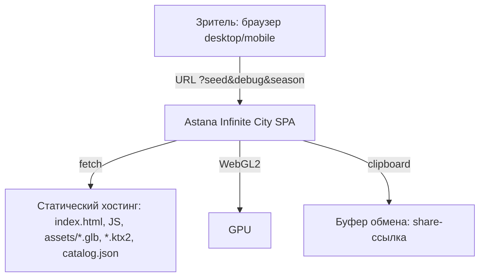
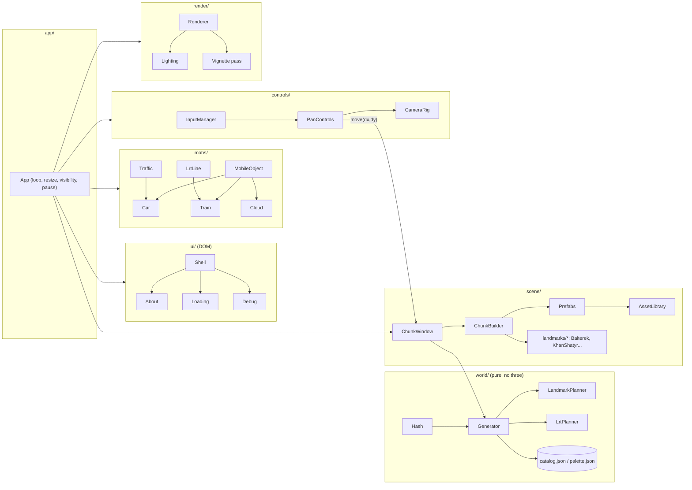
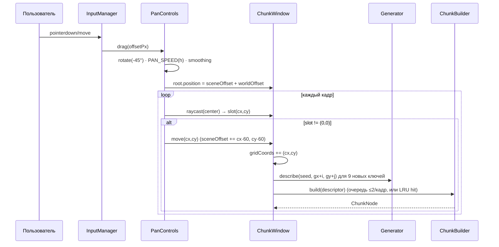
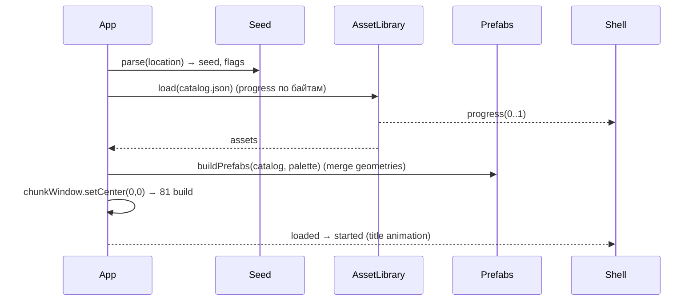

# Design: Astana Infinite City

## Document Information

- **Feature Name**: Astana Infinite City
- **Version**: 1.0 (Draft)
- **Date**: 2026-09-17
- **Author**: r.madiyev
- **Related Documents**: `requirements.md` (FR/NFR), `.kiro/steering/reference-infinitown.md` (референс), `.kiro/steering/context.md`

## Overview

Клиентское WebGL-приложение (TypeScript + Vite + three.js r184+) без бэкенда. Мир — бесконечная сетка чанков 60×60, генерируемых **детерминированно из (seed, gx, gy)** целочисленным хешем. Видимая часть — **скользящее окно** 9×9 слотов: при сдвиге на чанк сцена «перепрыгивает» назад на 60 юнитов, слоты переназначаются на новые дескрипторы (как в Infinitown), но вместо стола-тора 9×9 используется бесконечная функция генерации с LRU-кэшем собранных чанков. Статика чанка собирается из **префабов** (объединённая геометрия на общий палитровый материал → 1–3 draw call на чанк), мобильные объекты (машины, поезда ЛРТ, облака) рисуются через `InstancedMesh`-пулы. Ландмарки — **процедурная геометрия** в коде на той же палитре.

### Design Goals
- Первый кадр узнаваем как Астана: Байтерек, Хан Шатыр и ЛРТ-коридор гарантированно в стартовом окне (FR-4, FR-5).
- Детерминизм и шаринг по seed (FR-2, NFR-3).
- Бюджет: ≤ 300 draw calls, ≥ 50 FPS desktop (NFR-1) при 81 чанке и 100+ мобах.
- Чистая архитектура: генерация (pure, тестируемая) отделена от сборки сцены и рендера.

### Key Design Decisions
- **Скользящее окно + хеш-генерация** вместо тора (D1): мир действительно бесконечен, кэш ограничен.
- **Префабы из CC0 glTF (Kenney City Kit / Car Kit) + процедурные ландмарки** (D2, D3): без Unity, без лицензионных рисков.
- **Штатные материалы и свет three.js** (`MeshStandardMaterial`, `DirectionalLight` + `HemisphereLight`/`LightProbe`, PCFSoft shadows, `Fog`) вместо кастомного PBR-шейдера (D4).
- **Единая страница без iframe** (D5): UI — DOM-оверлей над канвасом.
- **WebGL 2 сейчас, WebGPU за флагом** (D6).
- **dt-based симуляция** (D8).

---

## Architecture

### System Context



### High-Level Architecture



### Technology Stack

| Слой | Технология | Обоснование |
|---|---|---|
| Язык/сборка | TypeScript 5 strict, Vite | быстрый dev-сервер, tree-shaking three, простой static build |
| 3D | three.js ≥ r184 (`WebGLRenderer`; `three/webgpu` за флагом) | актуальная стабильная версия (апрель 2026), InstancedMesh/BatchedMesh ускорены, WebGPU production-ready с r171 |
| Ассеты | glTF 2.0 (.glb) + Draco/Meshopt, текстуры-палитры PNG/KTX2; `@gltf-transform/cli` для оптимизации | стандарт, есть в наборах Kenney (CC0), лёгкий пайплайн без Unity |
| Генерация | собственный `hash32`/`mulberry32` (целочисленный) | детерминизм между платформами (NFR-3) |
| UI | нативный DOM + CSS (без фреймворка), шрифты self-hosted | UI маленький; экономия бандла (NFR-1) |
| Тесты | Vitest (unit), Playwright (e2e + visual regression) | быстрые pure-тесты генератора; скриншоты при фиксированном seed |
| Хостинг | GitHub Pages (или любой CDN) | статический, бесплатный |

---

## Components and Interfaces

### C1: `app/App`
**Purpose:** Точка входа и главный цикл.
**Responsibilities:** создать Renderer, CameraRig, ChunkWindow, Mobs, Controls, Shell; rAF-цикл с `dt = min(clock.delta, 0.05)`; пауза при `visibilitychange` и открытом About; resize.
**Interfaces:** `start(): Promise<void>`, `pause()`, `resume()`, события `progress(0..1)`, `loaded`, `started`, `error(e)`.
**Notes:** порядок кадра: `controls.update(dt)` → `chunkWindow.update()` (ребилд при `move`) → `mobs.update(dt)` → `camera.update(dt)` → `renderer.render()`.

### C2: `world/Hash` (pure)
**Purpose:** Детерминированные числа.
**API:**
```ts
hash32(...ints: number[]): number            // 32-bit, xxhash/murmur3-подобный, целочисленный
seedToInt(seed: string): number              // FNV-1a по UTF-8
rng(seed: number, gx: number, gy: number, salt: number): () => number // mulberry32 в [0,1)
```
**Notes:** никаких float в состоянии; `salt` — константы по назначению (`BLOCK`, `ROT`, `LANDMARK`, `CARS`, `CLOUD`, `LRT`).

### C3: `world/Generator` (pure)
**Purpose:** `(seed, gx, gy) → ChunkDescriptor` без побочных эффектов и без three.js.
**Алгоритм:**
1. `zone = LandmarkPlanner.fixed(gx, gy)` — стартовые фиксированные ландмарки: Байтерек в `(0,-1)` (вверху-справа кадра), Хан Шатыр в `(0, 1)` (внизу-слева): при h = 140 и fov 30 в кадр целиком попадают только 4 ортогональных соседа центрального чанка, диагональные — за краем. Если чанк фиксированный — дескриптор ландмарка.
2. `lrt = LrtPlanner.describe(gx, gy)` — коридор: `gy mod 8 == 0` (проходит через стартовое окно по `gy=0`), станция: `gx mod 3 == 0`.
3. `landmark = LandmarkPlanner.pick(seed, gx, gy)` (см. C4) — если есть, квартал = ландмарк.
4. Иначе стадион по правилу редкости (`world/Rare`, P = 1/45, R = 4), иначе регулярный тип по классам чётности: класс 0 — «сырой» хеш-тип, классы 1–3 исключают финальные типы соседей младших классов (см. D9; 9 регулярных типов → кандидаты всегда есть).
5. Поворот `rot = rng(ROT)() * 4 | 0`.
6. Машины: для каждой из 4 полос `rng(CARS)() < P_CAR` → `{lane, modelIdx, dir}`; облако: `rng(CLOUD)() < P_CLOUD`.
7. Возврат `ChunkDescriptor`.
**API:** `new Generator(seed: string | number)`, `describe(gx, gy): ChunkDescriptor`, `describeWindow(cx, cy, size)`, `blockType(gx, gy)`, `rawBlockType(gx, gy)`; счётчик `errors` и `lastError` для NFR-7.
**Тесты:** детерминизм, соседство (AC-3.1), частоты, стартовое окно (AC-4.1, AC-5.1).

### C4: `world/LandmarkPlanner` (pure)
**Purpose:** Редкие ландмарки без хранения состояния.
**Алгоритм («побеждает минимальный хеш в окрестности», по типам):**
```
u_t(x,y)   = hash32(seed, x, y, LANDMARK_BASE + index(t)) / 2^32          // index — в глобальном списке LANDMARK_IDS
cand_t     = u_t(x,y) < P                                                 // P = 1/74 на тип
win_t(x,y) = cand_t && ∀(x',y') ≠ (x,y) в квадрате Чебышёва радиуса R=5: !cand_t(x',y') || u_t(x,y) < u_t(x',y')
landmark(x,y) = argmin_t u_t среди t ∈ enabled с win_t(x,y)               // разные типы в одной клетке: побеждает меньший u
suppress      = ∃ соседняя клетка (радиус 1) с win_t' другого типа и меньшим u   → null
```
Гарантирует дистанцию ≥ 6 между одинаковыми ландмарками и отсутствие соседних ландмарков разных типов; плотность ≈ N·(1−e^(−121P))/121 ≈ N/150 (при 5 типах ≈ 1/30). Проверка окрестности выполняется только для кандидатов (u < P), поэтому средняя стоимость — несколько хешей на чанк. Стартовая зона радиуса 4 (всё стартовое окно) вокруг `(0,0)` исключена из случайных ландмарков (там фиксированные); вне зоны случайный ландмарк дополнительно не ставится ближе 6 к фиксированному того же типа и ближе 2 к любому фиксированному. Тот же механизм (`world/Rare`) используется для стадиона (P = 1/45, R = 4).
**API:** `fixed(gx, gy): LandmarkId | null`, `pick(seed, gx, gy): LandmarkId | null`.

### C5: `world/LrtPlanner` (pure)
**Purpose:** Коридоры и станции ЛРТ.
**Правила:** коридор E–W вдоль **северной** дороги чанков ряда `gy ≡ 0 (mod 8)`; станция на `gx ≡ 0 (mod 3)`; N–S коридоры (Could) — `gx ≡ 4 (mod 8)` с развязкой на пересечении (за рамками Must).
**API:** `describe(gx, gy): { corridor: 'EW' | null; station: boolean }`, `isCorridorRow(gy)`, `stationX(gx): number | null`.

### C6: `scene/ChunkWindow`
**Purpose:** Окно W×W слотов, подмена содержимого, сдвиг сцены.
**State:** `slots[W][W]: Slot`, `gridCoords: Vector2`, `root: Group` (позиция = `sceneOffset + smoothed pan`), `built: LRU<key, ChunkNode>` (ёмкость 169).
**Flow при `move(dx, dy)`:** `gridCoords += (dx,dy)`; `root.position -= (dx*60, 0, dy*60)`; для каждого слота — `key = (gx,gy)`; если `built.has(key)` → reuse, иначе `ChunkBuilder.build(descriptor)` (очередь сборки: ≤ 2 чанка на кадр, приоритет — ближе к центру; пока не собран — показывается «greybox»-плейсхолдер, что допустимо ≤ 3 кадров; кэш обычно покрывает 100 %, т.к. при сдвиге на 1 чанк новых только 9). Слоты, чьи чанки вышли из окна, отдают ноды в LRU; вытесненные из LRU — `dispose()` мобов (геометрии префабов общие, не освобождаются).
**API:** `setCenter(gx, gy)`, `move(dx, dy)`, `forEachSlot(fn)`, `getPickables(): Mesh[]`, `chunkAt(gx, gy): ChunkNode | undefined`, `emptySlots(): number`.

### C7: `scene/ChunkBuilder` + `scene/Prefabs`
**Purpose:** `ChunkDescriptor → ChunkNode (Group)`.
**Prefabs:** при загрузке каталога для каждого `BlockType × rotation` и каждого road-варианта строится **объединённая геометрия** (`BufferGeometryUtils.mergeGeometries`) из размещённых glTF-мешей на единый палитровый материал (Kenney: одна текстура-палитра на набор → 1 материал). Прозрачное стекло — второй материал (второй меш). Итого чанк = 1–3 `Mesh` (общие геометрии) + ЛРТ-сегмент (1 меш) + ландмарк (2–4 меша).
**Chunk layout (локальные координаты, чанк 60×60, центр (0,0)):** квартал — квадрат 50×50 в центре; дорога N–S вдоль западной кромки `x ∈ [-30,-20]` (две полосы `x=-27.5` и `x=-22.5`), дорога E–W вдоль северной кромки `z ∈ [-30,-20]`, перекрёсток в углу `(-25, -25)`; тротуары 1.5; эстакада ЛРТ — по оси северной дороги `z=-25`, высота балки `y=9`, опоры каждые 15 юнитов; станция — платформа 20×4 на `y=9` по центру чанка `x=0`.
**API:** `build(d: ChunkDescriptor): ChunkNode`, `buildPlaceholder(d)`, `dispose(node)`.

### C8: `scene/landmarks/*`
**Purpose:** Процедурные ландмарки (без внешних моделей), масштаб относительно города: жилой дом ≈ 12–20 юнитов высотой.

| Ландмарк | Геометрия | Высота (юниты) | Цвета палитры |
|---|---|---|---|
| Байтерек | ствол: `CylinderGeometry` r 2.5→1.5 + «крона»: `LatheGeometry` из 16 рёбер (расширение к вершине), решётка из тонких `CylinderGeometry`; шар `SphereGeometry` r=7 на вершине; постамент + фонтаны | 50 (реальный 97 м: пропорция ≈ 1:2) | белый, золото |
| Хан Шатыр | `LatheGeometry` профиль шатра (эллиптическое основание 46×36, вершина смещена), наклон 10°; мачта `CylinderGeometry`; материал стекла `MeshPhysicalMaterial{transmission 0.35, opacity 0.8}` или просто `transparent` голубой | 42 (реальный 90 м крыша / 150 м шпиль) | голубое стекло, белый |
| Нур Алем (Should) | сфера r=14 на подиуме 24×24×6 | 34 | синее стекло |
| Пирамида (Should) | `ConeGeometry(radius=20, height=30, 4 сегмента)`, верхняя треть — стекло | 30 | бежевый камень, стекло |
| Ак Орда (Should) | корпус 40×24×14 + купол `SphereGeometry` (половина) r=8 + шпиль | 30 | белый, синий, золото |

**Notes:** каждый ландмарк — `LandmarkNode` с `build(): Group` и `footprint: 'block'`; окружение (площадь, аллея, деревья) — из тех же префабов пропсов.

### C9: `assets/AssetLibrary`
**Purpose:** Загрузка каталога, кэш геометрий/материалов, прогресс.
**Flow:** `catalog.json` → `GLTFLoader` (+DRACOLoader/MeshoptDecoder) для каждого `.glb` → нормализация (центрирование по XZ, приведение к единицам чанка: 1 Kenney-юнит ≈ 1 наш юнит, масштаб из каталога) → `Map<AssetId, {geometry, materialKey, bounds}>`. Прогресс = `loadedBytes/totalBytes` (размеры в каталоге) — честный прогресс (FR-11.1).
**API:** `load(onProgress): Promise<void>`, `get(id): AssetEntry`, `material(key): Material`, `retry policy: 2 повтора с backoff 500/1500 мс`.

### C10: `mobs/MobileObject`, `Car`, `Train`, `Cloud`, `Traffic`, `LrtLine`
**MobileObject:** `Object3D` внутри `ChunkNode`; `update(dt)` → движение → `worldPos = chunkOrigin + local`; если `local` вышла за `[-30,30)` по x/z — reparent в соседний `ChunkNode` (через `ChunkWindow.chunkAt`) с `local = euclideanModulo(local+30, 60) - 30`. Если сосед ещё не собран/вне окна — моб деактивируется (скрыт) и уничтожается при выходе из LRU.
**Car:** скорость `maxSpeed = 15 юн/с`, ускорение `±0.45 юн/с²·60` (эквивалент 0.0075/кадр при 60 FPS); радар: радиус 20, сектор `dot(rot(dir,-45°), toOther) > 0.5`; точки коллизии — 2 (перед/зад bbox); anti-deadlock: 2 с стоянки → `minSpeed = 0.25·max`; правило перекрёстка как в референсе. Пул моделей ≥ 8 (Kenney Car Kit: sedan, hatchback, SUV, taxi, police, ambulance, bus, truck, van).
**Train:** живёт на коридоре; состояние `moving | braking | dwell(3–5 с) | accelerating`; скорость 20 юн/с; торможение начинается за 30 юн до центра станции; интервал: `LrtLine` при сборке коридора спавнит поезда с шагом 4–6 чанков (детерминированно от `gx`), направление чередуется по полосе (две нитки эстакады: `z=-26.5` вост., `z=-23.5` зап.).
**Cloud:** `y=60`, `dir=(-1,0,0.3)`, скорость 3 юн/с × (1..1.25), масштаб ±5 % по `sin`.
**Рендер мобов:** `InstancedMesh` на модель (машины: до 256 инстансов/модель; поезда: вагон ×64; облака ×32); каждый кадр `setMatrixAt` из world-матриц активных мобов; `castShadow` включён, `receiveShadow` — только машины.

### C11: `controls/InputManager`, `PanControls`, `CameraRig`
**InputManager:** Pointer Events (mouse+touch единообразно), `wheel`, пинч по двум указателям, клавиатура; `touch-action: none` на канвасе (NFR-2).
**PanControls:** `offsetPx` → поворот на −45° → `worldOffset = offset * PAN_SPEED(h)` (скорость масштабируется от высоты камеры, чтобы соблюсти «1:1 под курсором», AC-8.1: `PAN_SPEED = k · h / h0`); инерция после отпускания (экспоненциальное затухание 250 мс); каждый кадр raycast из центра экрана по пикерам слотов → если не центральный слот → `sceneOffset += (cx·60, cy·60)`, `emit('move', cx, cy)`.
**CameraRig:** `PerspectiveCamera(fov 30, near 10, far 400)`, позиция `(80, h, 80)`, `lookAt(0,0,0)`, `h ∈ [30, 140]`, целевая высота через колесо/пинч, лерп 0.05·60·dt. Клавиши → виртуальный drag.

### C12: `render/Renderer`, `Lighting`, `Post`
- `WebGLRenderer({antialias: true, powerPreference: 'high-performance'})`, `outputColorSpace = SRGB`, `toneMapping = NoToneMapping` (плоские цвета палитры должны совпадать с `palette.json`), `setPixelRatio(min(dpr, 1.25 desktop / 1.5 mobile))`, `shadowMap.type = PCFShadowMap` (PCFSoftShadowMap удалён в three r186; мягкость — `shadow.radius`), `setClearColor(SKY)`.
- Свет: `DirectionalLight(#fff2d6, 2.2)` в `(100, 150, -40)`, тень 2048 (mobile 1024), `bias -0.0005`, `normalBias 0.02`, ортофрустум как в референсе (`75·max(aspect, 1.25)`, `left -0.9i / right 1.3i / top i / bottom -i`, near 50, far 300); `HemisphereLight(SKY, GROUND, 0.9)` как рассеянный свет (альтернатива — `LightProbe` из SH; оставлено как опция D4).
- `scene.fog = new Fog(SKY, 225, 325)`; `SKY = #a9dcf5` (летнее астанинское небо; в зиме `#cfd8e3`).
- Пост: виньетка — полноэкранный quad с текстурой/шейдером `smoothstep` по радиусу, `opacity 0.25`, поверх через второй `render` с `autoClear=false` (без EffectComposer — дёшево). Опционально `RenderPipeline` WebGPU за флагом `?gpu=1`.

### C13: `ui/Shell`, `About`, `Loading`, `Debug`, `api/Seed`
- DOM-оверлей над `<canvas>`: `#title` (анимация: ширина → буквы → fade, `prefers-reduced-motion` → без анимации), `#about-button`, `#about` (popup, blur/brightness на канвасе через CSS-фильтр, `App.pause()`), `#loading` (бар 8 px), `#share` (кнопка/тост), `#error` (оверлей WebGL/загрузка/контекст), `#debug`.
- `Seed`: парсинг `?seed`, нормализация (`[a-z0-9_-]{1,64}`, иначе `fnv1a(seed).toString(36)`), генерация 8-символьного seed, `history.replaceState`, `navigator.clipboard.writeText` с фолбэком на `<input readonly>`.
- Тексты — `ui/strings.ru.ts` (готовность к локализации).
- Реализация (2026-09-17): `ui/Shell` собирает `Title`, `Toast`, `Share`, `About`, подписывается на `renderer.onContext` (потеря контекста → пауза + полупрозрачный `ErrorOverlay`, через `ASSETS.CONTEXT_RESTORE_TIMEOUT_MS` — «Перезагрузить»); `ui/Loading` — полоса из `index.html`; цвета UI — CSS-переменные `--c-*`, которые `ui/theme.ts` подставляет из `palette.json`; шрифты — системный стек (`system-ui`), self-hosted шрифты не подключены; CSP задана мета-тегом (`connect-src` дополнен `ws:`/`wss:` для dev-сервера).

---

## Data Models

### ChunkDescriptor (pure, сериализуемый — используется в тестах и debug-дампах)

| Поле | Тип | Обяз. | Описание |
|---|---|---|---|
| gx, gy | int | да | координаты чанка в мире |
| key | string | да | `"${gx},${gy}"` |
| block | BlockTypeId | да | тип квартала или `'landmark'` |
| landmark | LandmarkId \| null | да | `'baiterek' \| 'khan-shatyr' \| 'nur-alem' \| 'pyramid' \| 'ak-orda'` |
| rotation | 0 \| 1 \| 2 \| 3 | да | поворот квартала ×90° |
| roads | { ns: RoadVariantId; ew: RoadVariantId; corner: IntersectionId } | да | варианты префабов дорог |
| lrt | { corridor: 'EW' \| null; station: boolean } | да | ЛРТ в чанке |
| cars | CarSpawn[] | да | `{ lane: 0..3, model: int, dir: 1 \| -1 }` |
| cloud | CloudSpawn \| null | да | `{ model: int, x, z, phase, speedMul }` |
| fallback | boolean | нет | чанк собран как fallback после ошибки (NFR-7) |

**Валидация:** `rotation ∈ 0..3`; `cars.length ≤ 4`; при `landmark != null` → `block = 'landmark'`; типы соседей ≠ `block` (кроме документированного исключения).

### BlockType (catalog.json)

| Поле | Тип | Описание |
|---|---|---|
| id | string | `'residential-panel' \| 'residential-new' \| 'business-glass' \| 'commercial' \| 'park' \| 'square' \| 'campus' \| 'stadium'` |
| category | string | для правил палитры и ЛРТ-совместимости |
| unique | boolean | редкий тип (стадион): применяется правило редкости |
| placements | PlacedAsset[] | `{ asset: AssetId, x, z, rotY, scale? }` в локальных координатах квартала 50×50 |
| variants | number | сколько детерминированных вариаций (перестановки зданий по `rng`) |

### AssetCatalog (catalog.json)

| Поле | Тип | Описание |
|---|---|---|
| id | string | `'kenney/building-a'`, `'kenney/car-taxi'` … |
| file | string | путь к `.glb` |
| bytes | int | размер для честного прогресса |
| kind | `'building' \| 'road' \| 'prop' \| 'vehicle' \| 'train' \| 'cloud'` | |
| materialKey | string | `'palette' \| 'glass'` |
| license | string | `'CC0'` + источник (для CREDITS) |

### Palette (palette.json)
До 24 именованных цветов: `stone-light #e8e2d6`, `white #f4f4f2`, `glass-blue #7fb8e6`, `glass-teal #67c3c9`, `gold #d9a441`, `flag-blue #00afca`, `grass #7bc043`, `asphalt #5c6166`, `marking #f2f2f2`, `roof-red #b5563f`, `brick #b98a6d`, `panel-grey #bfc3c7`, `sky #a9dcf5`, `ground #8a9a5b` … Зимняя палитра — отдельный файл с теми же ключами.

### Config (config.ts)

| Ключ | Значение | Источник |
|---|---|---|
| CHUNK_SIZE | 60 | референс |
| WINDOW_SIZE | 9 | референс/NFR-1 |
| CACHE_CHUNKS | 169 (13×13) | возврат назад без пересборки |
| BUILD_PER_FRAME | 2 | NFR-1 (≤ 8 мс) |
| LRT_PERIOD / LRT_STATION_PERIOD | 8 / 3 | FR-5 |
| P_CAR desktop/mobile | 0.35 / 0.20 | FR-6 |
| P_CLOUD | 0.30 | FR-7 |
| P_LANDMARK (на тип) / LANDMARK_RADIUS | 1/74 / 5 (дистанция ≥ 6) | FR-4, AC-4.2 |
| CAMERA h min/max, fov | 30 / 140, 30 | FR-8 |
| FOG near/far | 225 / 325 | FR-9 |
| SHADOW_RES desktop/mobile | 2048 / 1024 | NFR-1 |
| MAX_DPR desktop/mobile | 1.25 / 1.5 | NFR-1 |

### Data Flow: панорамирование и сдвиг окна



### Data Flow: загрузка



---

## API Design (внутренние контракты и URL)

### URL-параметры
| Параметр | Значения | Эффект |
|---|---|---|
| `seed` | `[a-z0-9_-]{1,64}` | детерминированный город; отсутствие → случайный + replaceState |
| `debug` | `1` | оверлей статистики, границы чанков, `window.__app` |
| `season` | `summer` (default) / `winter` | палитра (Could) |
| `gpu` | `1` | попытка WebGPURenderer (Could) |
| `quality` | `low/medium/high` | принудительный профиль (тени, DPR, P_CAR) |

### `window.__app` (только debug)
```ts
interface DebugApi {
  seed: string;
  gridCoords: { x: number; y: number };
  describe(gx: number, gy: number): ChunkDescriptor;
  dumpWindow(): ChunkDescriptor[];         // для AC-1.1/AC-2.1
  stats(): { fps: number; drawCalls: number; triangles: number; meshes: number; cars: number; trains: number; clouds: number; emptySlots: number };
  pan(dxPx: number, dyPx: number): void;   // для e2e
}
```

### События App → Shell
`progress(p)`, `loaded`, `started`, `error({ kind: 'webgl' | 'asset' | 'context' | 'generator', message, retry?: () => void })`, `pause`, `resume`.

---

## Error Handling

| Категория | Условие | Поведение | Пользователь видит |
|---|---|---|---|
| Нет WebGL2 | `canvas.getContext('webgl2') === null` | не грузим ассеты; статичная заставка | текст + ссылка на браузеры |
| Ошибка ассета | HTTP ≠ 2xx / сеть | retry ×2 (500/1500 мс), затем `error('asset')` | оверлей «Не удалось загрузить», кнопка «Повторить» (перезапуск `load`) |
| Ошибка генератора | исключение в `describe/build` | чанк → fallback `park` с `fallback: true`, `console.error`, счётчик в debug | ничего (NFR-7) |
| Потеря контекста | `webglcontextlost` | пауза, ожидание `webglcontextrestored` ≤ 5 с → пересоздание префабов/инстансов | при таймауте — оверлей «Перезагрузить» |
| Clipboard недоступен | `navigator.clipboard` нет / отказ | fallback на `<input readonly>` с выделением | поле со ссылкой |
| Низкий FPS | медиана < 25 за 5 с (desktop) | автопонижение профиля: тени 1024 → DPR 1 → P_CAR 0.2 | ничего; в debug — пометка |

**Логирование:** только `console` (нет бэкенда); в debug — на оверлей. Никаких персональных данных.

---

## Security Considerations
- Нет аутентификации/данных пользователя; `seed` — единственный ввод: строгая нормализация (regex), никакого `innerHTML` с пользовательскими строками (только `textContent`).
- Ассеты грузятся с того же origin (или CDN с CORS); `crossorigin="anonymous"` для шрифтов.
- CSP: `default-src 'self'; img-src 'self' data:; style-src 'self' 'unsafe-inline'` (inline-стили анимаций) — задаётся мета-тегом.

---

## Performance Considerations

### Бюджет кадра (desktop 1080p, окно 9×9)
| Статья | Оценка | Предел |
|---|---|---|
| Статика чанков: 81 × (1 палитра + 1 стекло + 1 дороги) | ≈ 240 draw calls | 300 всего (с тенями — shadow pass рисует только `castShadow` объекты, дороги не кастят) |
| Мобы (InstancedMesh): ~10 моделей машин + 1 вагон + 2 облака | ≈ 13 | |
| Ландмарки в окне: ≤ 4 × 3 | ≤ 12 | |
| Треугольники | ≈ 81 × 3 000 (Kenney low-poly) ≈ 250 k | 400 k |
| Сборка при сдвиге | 9 чанков, из LRU обычно 100 % | ≤ 8 мс/кадр |

### Стратегии
- Префабы: слияние геометрий по материалу на этапе загрузки (один раз на `BlockType × rot`), чанки шарят геометрию → память ≈ 8 типов × 4 rot × 2 материала.
- `frustumCulled` для слотов; `matrixAutoUpdate = false` для статики.
- Тени: `shadow.camera` подгоняется под окно, `light.shadow.autoUpdate` каждый кадр (мобы движутся) — при мобильном профиле `needsUpdate` через кадр.
- Профили качества `high/medium/low` (тени, DPR, P_CAR, облака) + автопонижение.
- Ассеты: Draco/Meshopt, палитра 256×256 PNG (или KTX2), `preload` каталога; общий вес первого экрана ≤ 8 МБ.
- Мониторинг: `renderer.info` в debug, `PerformanceObserver` не требуется.

---

## Testing Strategy

### Unit (Vitest, `world/`, `mobs/` логика без three-рендера)
- `Hash`: детерминизм, распределение (χ² на 100 k), отсутствие корреляции соседних `gx`.
- `Generator`: AC-1.1, AC-2.1 (снапшот дампа 21×21 для seed `astana`), AC-3.1 (10 k чанков), частоты типов, `rotation ∈ 0..3`.
- `LandmarkPlanner`: AC-4.1 (100 seed → фиксированные в окне), AC-4.2 (доля и минимальная дистанция на 10 k чанков).
- `LrtPlanner`: AC-5.1 (ровно один коридор в 9×9), станции каждые 3.
- `MobileObject` (математика переноса): AC-6.3; `Traffic` (радар/торможение на синтетических позициях): AC-6.1; `Train` (профиль скорости): AC-5.3.
- `Seed`: нормализация, генерация, replaceState (jsdom).
- Покрытие ≥ 80 % для `world/`, `mobs/`, `api/`.

### Integration (Vitest + three без WebGL / `@react-three/test-renderer` не нужен — используем `three` headless для геометрии)
- `Prefabs`: слияние даёт ожидаемое число мешей/материалов; стыковка дорог (AC-3.2) — сравнение концов осевых линий соседних префабов; ЛРТ-балка непрерывна (AC-5.2).
- `ChunkWindow`: `move` переназначает 9 новых ключей, LRU-хиты при возврате, `emptySlots() === 0` (AC-1.2).

### E2E (Playwright, Chromium + WebKit, `?debug=1&seed=astana`)
- Загрузка: прогресс монотонен и заканчивается 100 % (AC-11.1); ошибка ассета → оверлей → Повторить (AC-11.2, через route mock); нет WebGL2 → заставка (AC-11.3, инъекция мока).
- Управление: `__app.pan(300,0)` → `gridCoords` меняется, объект под курсором остаётся ±30 px (AC-8.1, через `__app` и `unproject`); колесо до минимума/максимума (AC-8.2).
- About: пауза/blur/возврат (AC-10.2); адаптив 320×568 и 3840×2160 (AC-10.3).
- Visual regression: скриншот стартового кадра `seed=astana` (`toHaveScreenshot`, `maxDiffPixelRatio 0.01`) (AC-9.1); зимний режим — отдельный эталон.
- Симуляция: 60 с в ускоренном времени (`__app.step(dt)` в debug) → 0 пересечений bbox и 0 «замёрзших» машин (AC-6.1, AC-6.2); поезда ≥ 1 и ≤ 4 в окне (AC-5.4).

### Performance
- Скрипт Playwright + `stats()`: медианный FPS на референсной машине автора (документируется в QA-evidence), `drawCalls ≤ 300`, `triangles ≤ 400 k`; Lighthouse: вес первого экрана ≤ 8 МБ.
- Ручной прогон на телефоне (Android/iOS) с профилем `medium`.

### Ручной/пользовательский
- AC-4.3: узнаваемость ландмарков (5 респондентов).

---

## Deployment and Operations
- `vite build` → `dist/` → GitHub Pages (Actions: lint → unit → build → e2e smoke → deploy). Кэширование ассетов по хешу в имени файла.
- Конфигурация — только `config.ts`/`palette.json`/`catalog.json`, секретов нет.
- Мониторинг: отсутствует (статика); ошибки видны в debug-оверлее.

## Migration and Compatibility
- Новый проект, миграций нет. Версия каталога `catalog.json.version` — при несовпадении с кодом показывается ошибка загрузки (защита от кэша CDN).
- Изменение генератора меняет города для старых seed — версия генератора `GEN_VERSION` добавляется в URL-шаринг (`?seed=astana&v=1`), при несовпадении показывается предупреждение «город обновился».

---

## Technical Decisions

### D1: Скользящее окно + хеш-генерация vs тор N×N
**Context:** Infinitown хранит стол 9×9 и заворачивает его тором; мир повторяется каждые 9 чанков.
**Options:** (1) Тор 9×9 — просто, но повторяемость заметна и нет шаринга «места»; (2) Бесконечная детерминированная функция `(seed,gx,gy)` + окно + LRU — чуть сложнее (нужна детерминированная редкость ландмарков), зато мир бесконечен, seed-шаринг честный, память ограничена.
**Decision:** (2). **Rationale:** FR-1.3, FR-2, FR-4.2 требуют бесконечности и детерминизма. **Implications:** правило «минимальный хеш в окрестности» для редких объектов (C4), тесты на 10 k чанков.

### D2: Процедурные ландмарки vs моделирование в Blender
**Options:** (1) Blender → glTF — точнее, но требует навыков/времени и отдельного пайплайна; (2) Параметрическая геометрия three.js — быстро итерируется, масштабируется под палитру, ноль внешних файлов.
**Decision:** (2) для Must/Should; при желании заменить на glTF через тот же интерфейс `LandmarkNode`. **Rationale:** low-poly стиль прощает упрощение; узнаваемость даёт силуэт (шар на «кроне», наклонный шатёр).

### D3: Источник ассетов застройки — Kenney CC0 glTF + собственные префабы
**Options:** (1) Kenney City Kit (Roads/Commercial/Suburban) + Car Kit — CC0, glTF, единая палитра, ~150 моделей; (2) Покупные паки — лицензионные ограничения на редистрибуцию; (3) Всё процедурно — однообразно.
**Decision (обновлено 2026-09-17 при реализации):** **процедурно-первый** подход — вся застройка, дороги, пропсы, ЛРТ и ландмарки генерируются кодом (`scene/procedural/*`, `GeometryBatch` с вершинными цветами палитры, слияние в 1 непрозрачный + 1 стеклянный меш на чанк). Kenney CC0 glTF остаются опцией для обогащения (тот же интерфейс `ChunkBuilder`), но не требуются: нет сетевой загрузки ассетов, нулевой вес первого экрана, полный контроль палитры (AC-9.3) и детерминизм. **Implications:** TSK-030/031 переориентированы на процедурную библиотеку и прогресс загрузки палитры/шрифтов; `CREDITS.md` — только шрифты.

### D4: Штатные материалы/свет three.js vs кастомный PBR (как в референсе)
**Options:** (1) `MeshStandardMaterial` + `DirectionalLight` + `HemisphereLight` (или `LightProbe` SH) + встроенные тени/туман; (2) Собственный шейдер (SH + GGX в VS) — быстрее на 10–20 %, но много кода и поддержки.
**Decision:** (1); при нехватке FPS на мобильных — `MeshLambertMaterial` как «low» профиль. **Rationale:** NFR-4 (простота), r184 материалы достаточно быстры для 250 k треугольников.

### D5: Одна страница без iframe
**Decision:** UI как DOM-оверлей; `App.pause()` вместо межфреймового `api`. **Rationale:** iframe в референсе нужен был для мульти-демо шелла; здесь одно демо.

### D6: WebGL 2 сейчас, WebGPU за флагом
**Decision:** `WebGLRenderer` по умолчанию, `three/webgpu` за `?gpu=1` (Could). **Rationale:** NFR-2 (Safari/мобильные), минимизация риска; переход позже без изменения архитектуры.

### D7: TypeScript + Vite, без UI-фреймворка
**Rationale:** бандл ≤ 700 КБ gzip (three ≈ 160 КБ gzip), простота.

### D8: dt-based движение
**Decision:** скорости в юнитах/с, `dt` ограничен 50 мс; референс двигал «на кадр». **Rationale:** NFR-3, AC-8.3.

---

## Итерация 2 (2026-09-17): уточнения дизайна по обратной связи пользователя

Связанные требования: FR-14 (Must), FR-15, FR-16; баги — `bugfix.md`.

### C6 (дополнение): префетч кольца
`ChunkWindow.update` после очереди видимых слотов тратит остаток бюджета кадра на сборку кольца Chebyshev = half + 1 (40 чанков) в LRU; при сдвиге окна новые слоты берутся из кэша → плейсхолдеров в кадре нет (AC-1.2). Ёмкость LRU 169 ≥ 81 + 40.

### C10 (дополнение): тор и перекрёстки
- **Тор.** Объект, чей соседний чанк вне окна, входит с противоположного края (`torusWrap`); машина — только если место входа свободно (`carBlocked`, зазор `ENTRY_GAP`), иначе ждёт у края; поезд — если на нитке нет поезда ближе `TRAIN_SEPARATION` (4,5 чанка). Чанк, покинувший окно: машины удаляются (входящие чанки приносят свои), поезда/облака переезжают.
- **Перекрёсток.** `zoneAhead` — зона впереди по полосе (для +x/+z — следующего чанка, для −x/−z — своего); `yieldDistance` — стоп-линия, если в зоне есть поперечная машина или справа одновременно подъезжает другая (правило правой руки); таймаут 2 с → въезд (анти-дедлок). `freeDistanceAhead` — скорость ограничена свободным зазором до ближайшего чужого bbox в коридоре движения (bbox цели «заметён» на её сдвиг за кадр): въезд в чужой bbox невозможен по построению (AC-6.1).
- **Спавн** машин — вне зоны перекрёстка (`SPAWN_FROM…SPAWN_TO` = −14…24).

### C11 (изменение): диапазон высот камеры
`CAMERA.HEIGHT_MIN` 30 → 60: точка обзора выше любой застройки (регулярные здания ≤ 12 этажей ≈ 32 юн, ландмарки ≤ 50; near 10). `WHEEL_UNITS_PER_PX` 0.12: 10 щелчков покрывают диапазон (AC-8.2).

### C7 (изменение): типы кварталов
`industrial` удалён (FR-15.1); добавлен `mall` — ТЦ: корпус 36×26×12 с вывеской (золото/синий), стеклянный портал входа, парковка с размеченными местами и припаркованными машинами, деревья по периметру. Классы чётности не меняются (9 регулярных типов).

### C7 (дополнение): детали крыш и флаг
- `Buildings.roofDetails(f, h, rng)`: детерминированно по `rng` — антенна (штырь + перекладины), блок кондиционера, бак на опорах, спутниковая тарелка (sphereLow-сегмент), вентиляционный короб; ≥ 40 % крыш (счётчик `roofsWithDetails / roofs` для AC-15.4).
- `Props.flagpole`: полотно голубое 3.2×2, солнце — золотой диск r 0.45 + 8 лучей-клиньев, орёл — 3 золотых бокса-силуэта под солнцем, орнамент — вертикальная золотая полоса у древка с зубцами.

### C8 (дополнение): новые ландмарки и детализация
| Ландмарк | Геометрия (процедурно) | Высота | Приоритет |
|---|---|---|---|
| Абу-Даби Плаза | башня 75 (усечённая в масштабе: 16×16, 20 «этажей» стекла) + 3 корпуса 30–40, подиум-ТЦ | 56 (ландмарк-максимум поднимается до 56; `HEIGHT_MIN` 60 остаётся выше) | Must |
| Астана Опера | классический корпус 40×28×16, портик с 8 колоннами, фронтон, лестница, фонтаны | 20 | Must |
| Хазрет Султан | корпус 36×36×14, центральный купол r 9 (белый/бирюзовый), 4 минарета h 40 с балконами | 40 | Must |
| Mega Silk Way | длинный корпус 46×30×12 с волнистой крышей (segments), вывеска, парковка | 14 | Must |
| Северное сияние | 3 башни-«волны» (сегменты со сдвигом) 30–40, стекло | 40 | Should |
| Транспортная башня | башня 12×12×40 с наклонной вершиной-«крышкой» («Зажигалка») | 42 | Should |
| КазМунайГаз | два корпуса-крыла + арка-«ворота» между ними, стекло/камень | 34 | Should |

Детализация существующих: Байтерек — орнаментный круг площади (кольца), пояса ствола; Хан Шатыр — 16 рёбер шатра, арка входа, 4 флагштока; Нур Алем — «панели» (кольца), 2 павильона Expo и 3 робота (тело-цилиндр, голова-сфера, руки, синий/белый); Пирамида — подиум с 4 лестницами, вершина-шпиль; Ак Орда — 8-колонная колоннада, ворота, 2 флага. Все новые ландмарки — в `LANDMARKS.ENABLED`, правило редкости per-type как в C4.

### Vehicles (изменение, FR-16)
`CAR_MODELS` (индекс = `spawn.model`, `TRAFFIC.MODEL_POOL` 8 → 12): sedan-red, hatchback-white, suv-grey, yandex-econom (белая, жёлтая полоса дверей, жёлтый знак на крыше), bus-astana (светлый кузов, синяя/зелёная/жёлтая полосы-ромбы, табло), truck, van, police, yandex-business (чёрный седан), yandex-premier (чёрный длинный седан), suv-white, sedan-blue. Изменение пула меняет дескрипторы → `GEN.VERSION` 2, снапшоты обновляются.

### D10: Река и берега (FR-14, FR-15.6)
- `RiverPlanner`: ряд русла `gy ≡ RIVER.OFFSET (mod RIVER.PERIOD)` = 6 (mod 12); ряды ЛРТ `0 (mod 8)` никогда не совпадают (6 + 12k ≠ 8m: чётность); стартовая зона R = 4 не задевается.
- Чанк русла: `block = 'river'`; вода — плоскость на y = −2 по всей ширине чанка (кроме полосы дороги E–W, которая остаётся набережной с парапетом и фонарями), берега — откосы; дорога N–S — мост: полотно на y 0 (машины едут как обычно), перила, опоры до воды. ЛРТ, если коридор совпал бы — исключено планировщиком.
- Берега: для чанка `gy` ближайшее русло `r`; `gy < r` → «правый берег» (веса типов: панельные ×3, стекло ×0.3), `gy > r` → «левый берег» (стекло ×3, mall ×2, панельные ×0.3). Веса применяются в `rawBlockType` через взвешенный выбор; классы чётности сохраняют неповторяемость соседей.

### D11: Отсылки к Астане (собрано для FR-15)
Байтерек, Хан Шатыр, Нур Алем (Expo-2017, роботы-гиды у сферы), Пирамида (Дворец мира), Ак Орда, Абу-Даби Плаза, Астана Опера, Хазрет Султан, Mega Silk Way, «Северное сияние», Транспортная башня («Зажигалка»), КазМунайГаз, река Есиль с мостами, деление на правый (старый) и левый (новый) берег, флаг Казахстана, автобусы CTS, Яндекс Go; климат — степь и ветер (облака дрейфуют быстрее: `CLOUD.SPEED` 3 → 4), зима (FR-13, Could).

### D9: Правило соседства через классы чётности
**Context:** «тип ≠ типов 8 соседей» при детерминированной генерации создаёт зависимость от соседей, а те — от своих соседей; наивная рекурсия бесконечна.
**Decision:** король-граф сетки 4-дольный: класс `c = (gx mod 2) + 2·(gy mod 2)`; любые два 8-соседа имеют разные классы. Класс 0 берёт «сырой» тип `rawType = hash % 9`; класс `c > 0` исключает финальные типы соседей с классом `< c` (они уже определены), берёт `rawType`, если он свободен, иначе детерминированно выбирает из свободных. Глубина зависимости ≤ 3, результат чисто функциональный. При 9 регулярных типах и ≤ 8 соседях множество кандидатов никогда не пусто → 0 нарушений AC-3.1 по построению (стадион и ландмарки — не регулярные типы, конфликтов нет). Регулярные типы: residential-panel, residential-new, business-glass, commercial, park, square, campus, industrial, market; редкий — stadium.
**Implications:** генератор мемоизирует `blockType` в пределах экземпляра; тест на 10 000 чанков ожидает ровно 0 совпадений с соседями.
