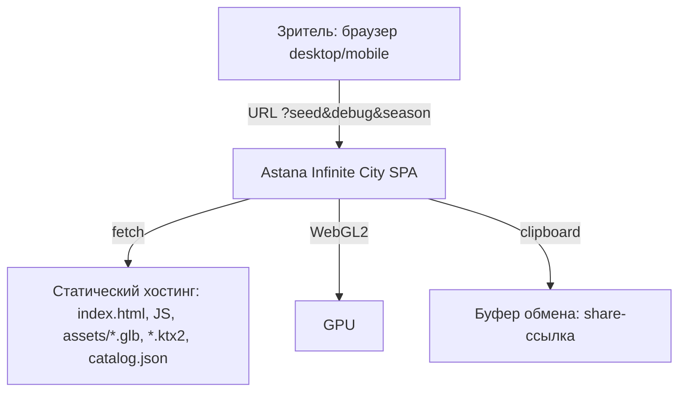
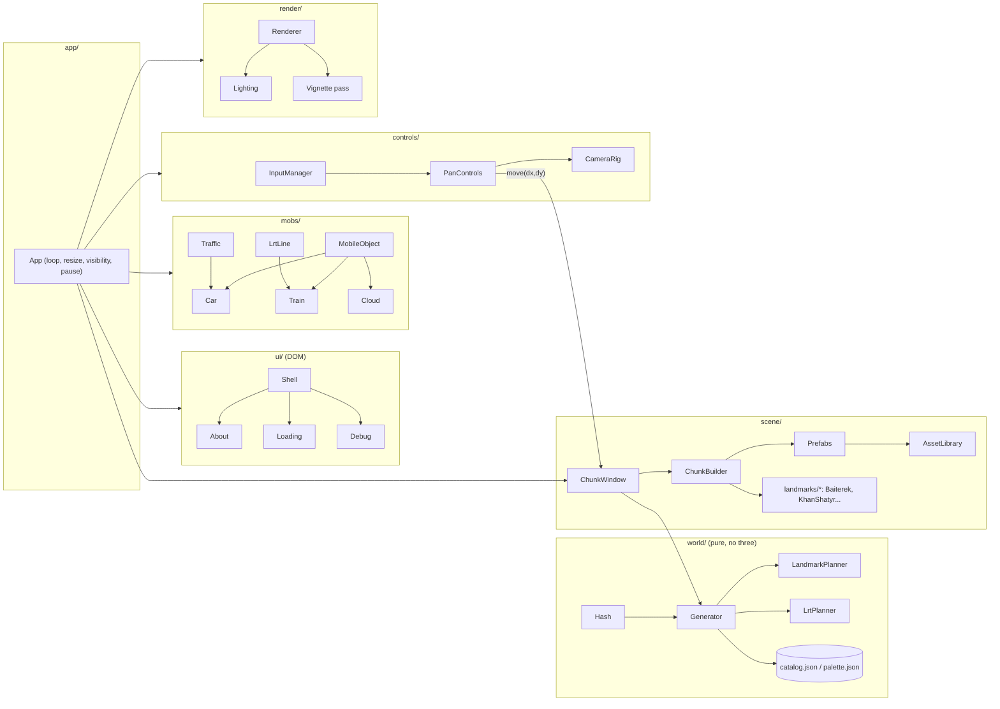
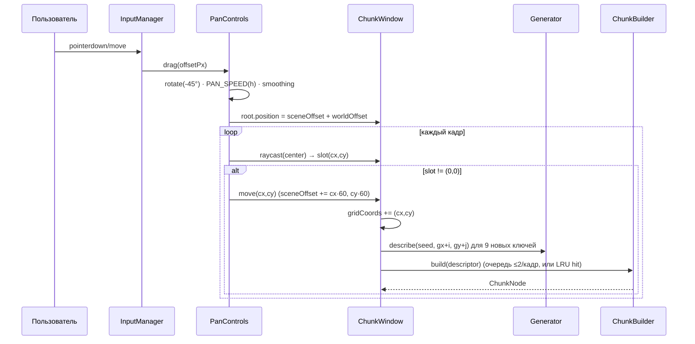
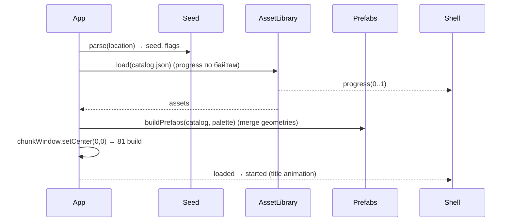

# Design: Astana Infinite City

## Document Information

- **Feature Name**: Astana Infinite City
- **Version**: 1.0 (Draft)
- **Date**: 2026-09-17
- **Author**: Dex719
- **Related Documents**: `requirements.md` (FR/NFR), `.kiro/steering/reference-infinitown.md` (референс), `.kiro/steering/context.md`

## Overview

Клиентское WebGL-приложение (TypeScript + Vite + three.js r184+) без бэкенда. Мир — бесконечная сетка чанков 60×60, генерируемых **детерминированно из (seed, gx, gy)** целочисленным хешем. Видимая часть — **скользящее окно** 9×9 слотов: при сдвиге на чанк сцена «перепрыгивает» назад на 60 юнитов, слоты переназначаются на новые дескрипторы (как в Infinitown), но вместо стола-тора 9×9 используется бесконечная функция генерации с LRU-кэшем собранных чанков. Статика чанка собирается из **префабов** (объединённая геометрия на общий палитровый материал → 1–3 draw call на чанк), мобильные объекты (машины, поезда ЛРТ, облака) рисуются через `InstancedMesh`-пулы. Ландмарки — **процедурная геометрия** в коде на той же палитре.

### Design Goals
- Первый кадр узнаваем как Астана: Байтерек, Хан Шатыр и ЛРТ-коридор гарантированно в стартовом окне (FR-4, FR-5).
- Детерминизм и шаринг по seed (FR-2, NFR-3).
- Бюджет: ≤ 300 draw calls, ≥ 50 FPS desktop (NFR-1) при 81 чанке и 100+ мобах.
- Чистая архитектура: генерация (pure, тестируемая) отделена от сборки сцены и рендера.

### Key Design Decisions
- **Скользящее окно + хеш-генерация** вместо тора (D1): мир действительно бесконечен, кэш ограничен.
- **Префабы из CC0 glTF (Kenney City Kit / Car Kit) + процедурные ландмарки** (D2, D3): без Unity, без лицензионных рисков.
- **Штатные материалы и свет three.js** (`MeshStandardMaterial`, `DirectionalLight` + `HemisphereLight`/`LightProbe`, PCFSoft shadows, `Fog`) вместо кастомного PBR-шейдера (D4).
- **Единая страница без iframe** (D5): UI — DOM-оверлей над канвасом.
- **WebGL 2 сейчас, WebGPU за флагом** (D6).
- **dt-based симуляция** (D8).

---

## Architecture

### System Context



### High-Level Architecture



### Technology Stack

| Слой | Технология | Обоснование |
|---|---|---|
| Язык/сборка | TypeScript 5 strict, Vite | быстрый dev-сервер, tree-shaking three, простой static build |
| 3D | three.js ≥ r184 (`WebGLRenderer`; `three/webgpu` за флагом) | актуальная стабильная версия (апрель 2026), InstancedMesh/BatchedMesh ускорены, WebGPU production-ready с r171 |
| Ассеты | glTF 2.0 (.glb) + Draco/Meshopt, текстуры-палитры PNG/KTX2; `@gltf-transform/cli` для оптимизации | стандарт, есть в наборах Kenney (CC0), лёгкий пайплайн без Unity |
| Генерация | собственный `hash32`/`mulberry32` (целочисленный) | детерминизм между платформами (NFR-3) |
| UI | нативный DOM + CSS (без фреймворка), шрифты self-hosted | UI маленький; экономия бандла (NFR-1) |
| Тесты | Vitest (unit), Playwright (e2e + visual regression) | быстрые pure-тесты генератора; скриншоты при фиксированном seed |
| Хостинг | GitHub Pages (или любой CDN) | статический, бесплатный |

---

## Components and Interfaces

### C1: `app/App`
**Purpose:** Точка входа и главный цикл.
**Responsibilities:** создать Renderer, CameraRig, ChunkWindow, Mobs, Controls, Shell; rAF-цикл с `dt = min(clock.delta, 0.05)`; пауза при `visibilitychange` и открытом About; resize.
**Interfaces:** `start(): Promise<void>`, `pause()`, `resume()`, события `progress(0..1)`, `loaded`, `started`, `error(e)`.
**Notes:** порядок кадра: `controls.update(dt)` → `chunkWindow.update()` (ребилд при `move`) → `mobs.update(dt)` → `camera.update(dt)` → `renderer.render()`.

### C2: `world/Hash` (pure)
**Purpose:** Детерминированные числа.
**API:**
```ts
hash32(...ints: number[]): number            // 32-bit, xxhash/murmur3-подобный, целочисленный
seedToInt(seed: string): number              // FNV-1a по UTF-8
rng(seed: number, gx: number, gy: number, salt: number): () => number // mulberry32 в [0,1)
```
**Notes:** никаких float в состоянии; `salt` — константы по назначению (`BLOCK`, `ROT`, `LANDMARK`, `CARS`, `CLOUD`, `LRT`).

### C3: `world/Generator` (pure)
**Purpose:** `(seed, gx, gy) → ChunkDescriptor` без побочных эффектов и без three.js.
**Алгоритм:**
1. `zone = LandmarkPlanner.fixed(gx, gy)` — стартовые фиксированные ландмарки: Байтерек в `(0,-1)` (вверху-справа кадра), Хан Шатыр в `(0, 1)` (внизу-слева): при h = 140 и fov 30 в кадр целиком попадают только 4 ортогональных соседа центрального чанка, диагональные — за краем. Если чанк фиксированный — дескриптор ландмарка.
2. `lrt = LrtPlanner.describe(gx, gy)` — коридор: `gy mod 8 == 0` (проходит через стартовое окно по `gy=0`), станция: `gx mod 3 == 0`.
3. `landmark = LandmarkPlanner.pick(seed, gx, gy)` (см. C4) — если есть, квартал = ландмарк.
4. Иначе стадион по правилу редкости (`world/Rare`, P = 1/45, R = 4), иначе регулярный тип по классам чётности: класс 0 — «сырой» хеш-тип, классы 1–3 исключают финальные типы соседей младших классов (см. D9; 9 регулярных типов → кандидаты всегда есть).
5. Поворот `rot = rng(ROT)() * 4 | 0`.
6. Машины: для каждой из 4 полос `rng(CARS)() < P_CAR` → `{lane, modelIdx, dir}`; облако: `rng(CLOUD)() < P_CLOUD`.
7. Возврат `ChunkDescriptor`.
**API:** `new Generator(seed: string | number)`, `describe(gx, gy): ChunkDescriptor`, `describeWindow(cx, cy, size)`, `blockType(gx, gy)`, `rawBlockType(gx, gy)`; счётчик `errors` и `lastError` для NFR-7.
**Тесты:** детерминизм, соседство (AC-3.1), частоты, стартовое окно (AC-4.1, AC-5.1).

### C4: `world/LandmarkPlanner` (pure)
**Purpose:** Редкие ландмарки без хранения состояния.
**Алгоритм («побеждает минимальный хеш в окрестности», по типам):**
```
u_t(x,y)   = hash32(seed, x, y, LANDMARK_BASE + index(t)) / 2^32          // index — в глобальном списке LANDMARK_IDS
cand_t     = u_t(x,y) < P                                                 // P = 1/74 на тип
win_t(x,y) = cand_t && ∀(x',y') ≠ (x,y) в квадрате Чебышёва радиуса R=5: !cand_t(x',y') || u_t(x,y) < u_t(x',y')
landmark(x,y) = argmin_t u_t среди t ∈ enabled с win_t(x,y)               // разные типы в одной клетке: побеждает меньший u
suppress      = ∃ соседняя клетка (радиус 1) с win_t' другого типа и меньшим u   → null
```
Гарантирует дистанцию ≥ 6 между одинаковыми ландмарками и отсутствие соседних ландмарков разных типов; плотность ≈ N·(1−e^(−121P))/121 ≈ N/150 (при 5 типах ≈ 1/30). Проверка окрестности выполняется только для кандидатов (u < P), поэтому средняя стоимость — несколько хешей на чанк. Стартовая зона радиуса 4 (всё стартовое окно) вокруг `(0,0)` исключена из случайных ландмарков (там фиксированные); вне зоны случайный ландмарк дополнительно не ставится ближе 6 к фиксированному того же типа и ближе 2 к любому фиксированному. Тот же механизм (`world/Rare`) используется для стадиона (P = 1/45, R = 4).
**API:** `fixed(gx, gy): LandmarkId | null`, `pick(seed, gx, gy): LandmarkId | null`.

### C5: `world/LrtPlanner` (pure)
**Purpose:** Коридоры и станции ЛРТ.
**Правила:** коридор E–W вдоль **северной** дороги чанков ряда `gy ≡ 0 (mod 8)`; станция на `gx ≡ 0 (mod 3)`; N–S коридоры (Could) — `gx ≡ 4 (mod 8)` с развязкой на пересечении (за рамками Must).
**API:** `describe(gx, gy): { corridor: 'EW' | null; station: boolean }`, `isCorridorRow(gy)`, `stationX(gx): number | null`.

### C6: `scene/ChunkWindow`
**Purpose:** Окно W×W слотов, подмена содержимого, сдвиг сцены.
**State:** `slots[W][W]: Slot`, `gridCoords: Vector2`, `root: Group` (позиция = `sceneOffset + smoothed pan`), `built: LRU<key, ChunkNode>` (ёмкость 169).
**Flow при `move(dx, dy)`:** `gridCoords += (dx,dy)`; `root.position -= (dx*60, 0, dy*60)`; для каждого слота — `key = (gx,gy)`; если `built.has(key)` → reuse, иначе `ChunkBuilder.build(descriptor)` (очередь сборки: ≤ 2 чанка на кадр, приоритет — ближе к центру; пока не собран — показывается «greybox»-плейсхолдер, что допустимо ≤ 3 кадров; кэш обычно покрывает 100 %, т.к. при сдвиге на 1 чанк новых только 9). Слоты, чьи чанки вышли из окна, отдают ноды в LRU; вытесненные из LRU — `dispose()` мобов (геометрии префабов общие, не освобождаются).
**API:** `setCenter(gx, gy)`, `move(dx, dy)`, `forEachSlot(fn)`, `getPickables(): Mesh[]`, `chunkAt(gx, gy): ChunkNode | undefined`, `emptySlots(): number`.

### C7: `scene/ChunkBuilder` + `scene/Prefabs`
**Purpose:** `ChunkDescriptor → ChunkNode (Group)`.
**Prefabs:** при загрузке каталога для каждого `BlockType × rotation` и каждого road-варианта строится **объединённая геометрия** (`BufferGeometryUtils.mergeGeometries`) из размещённых glTF-мешей на единый палитровый материал (Kenney: одна текстура-палитра на набор → 1 материал). Прозрачное стекло — второй материал (второй меш). Итого чанк = 1–3 `Mesh` (общие геометрии) + ЛРТ-сегмент (1 меш) + ландмарк (2–4 меша).
**Chunk layout (локальные координаты, чанк 60×60, центр (0,0)):** квартал — квадрат 50×50 в центре; дорога N–S вдоль западной кромки `x ∈ [-30,-20]` (две полосы `x=-27.5` и `x=-22.5`), дорога E–W вдоль северной кромки `z ∈ [-30,-20]`, перекрёсток в углу `(-25, -25)`; тротуары 1.5; эстакада ЛРТ — по оси северной дороги `z=-25`, высота балки `y=9`, опоры каждые 15 юнитов; станция — платформа 20×4 на `y=9` по центру чанка `x=0`.
**API:** `build(d: ChunkDescriptor): ChunkNode`, `buildPlaceholder(d)`, `dispose(node)`.

### C8: `scene/landmarks/*`
**Purpose:** Процедурные ландмарки (без внешних моделей), масштаб относительно города: жилой дом ≈ 12–20 юнитов высотой.

| Ландмарк | Геометрия | Высота (юниты) | Цвета палитры |
|---|---|---|---|
| Байтерек | ствол: `CylinderGeometry` r 2.5→1.5 + «крона»: `LatheGeometry` из 16 рёбер (расширение к вершине), решётка из тонких `CylinderGeometry`; шар `SphereGeometry` r=7 на вершине; постамент + фонтаны | 50 (реальный 97 м: пропорция ≈ 1:2) | белый, золото |
| Хан Шатыр | `LatheGeometry` профиль шатра (эллиптическое основание 46×36, вершина смещена), наклон 10°; мачта `CylinderGeometry`; материал стекла `MeshPhysicalMaterial{transmission 0.35, opacity 0.8}` или просто `transparent` голубой | 42 (реальный 90 м крыша / 150 м шпиль) | голубое стекло, белый |
| Нур Алем (Should) | сфера r=14 на подиуме 24×24×6 | 34 | синее стекло |
| Пирамида (Should) | `ConeGeometry(radius=20, height=30, 4 сегмента)`, верхняя треть — стекло | 30 | бежевый камень, стекло |
| Ак Орда (Should) | корпус 40×24×14 + купол `SphereGeometry` (половина) r=8 + шпиль | 30 | белый, синий, золото |

**Notes:** каждый ландмарк — `LandmarkNode` с `build(): Group` и `footprint: 'block'`; окружение (площадь, аллея, деревья) — из тех же префабов пропсов.

### C9: `assets/AssetLibrary`
**Purpose:** Загрузка каталога, кэш геометрий/материалов, прогресс.
**Flow:** `catalog.json` → `GLTFLoader` (+DRACOLoader/MeshoptDecoder) для каждого `.glb` → нормализация (центрирование по XZ, приведение к единицам чанка: 1 Kenney-юнит ≈ 1 наш юнит, масштаб из каталога) → `Map<AssetId, {geometry, materialKey, bounds}>`. Прогресс = `loadedBytes/totalBytes` (размеры в каталоге) — честный прогресс (FR-11.1).
**API:** `load(onProgress): Promise<void>`, `get(id): AssetEntry`, `material(key): Material`, `retry policy: 2 повтора с backoff 500/1500 мс`.

### C10: `mobs/MobileObject`, `Car`, `Train`, `Cloud`, `Traffic`, `LrtLine`
**MobileObject:** `Object3D` внутри `ChunkNode`; `update(dt)` → движение → `worldPos = chunkOrigin + local`; если `local` вышла за `[-30,30)` по x/z — reparent в соседний `ChunkNode` (через `ChunkWindow.chunkAt`) с `local = euclideanModulo(local+30, 60) - 30`. Если сосед ещё не собран/вне окна — моб деактивируется (скрыт) и уничтожается при выходе из LRU.
**Car:** скорость `maxSpeed = 15 юн/с`, ускорение `±0.45 юн/с²·60` (эквивалент 0.0075/кадр при 60 FPS); радар: радиус 20, сектор `dot(rot(dir,-45°), toOther) > 0.5`; цели радара — попутные машины везде и поперечные только внутри зоны перекрёстка (поперечную вне зоны ведут стоп-линия и фазы, иначе две машины у своих стоп-линий ждут друг друга — BUG-8); точки коллизии — 2 (перед/зад bbox); anti-deadlock: 2 с стоянки → `minSpeed = 0.25·max`; перекрёсток: стоп-линия, фазы приоритета осей по 5 с, правило «не занимай перекрёсток». Пул моделей ≥ 8 (Kenney Car Kit: sedan, hatchback, SUV, taxi, police, ambulance, bus, truck, van).
**Train:** живёт на коридоре; состояние `moving | braking | dwell(3–5 с) | accelerating`; скорость 20 юн/с; торможение начинается за 30 юн до центра станции; интервал: `LrtLine` при сборке коридора спавнит поезда с шагом 4–6 чанков (детерминированно от `gx`), направление чередуется по полосе (две нитки эстакады: `z=-26.5` вост., `z=-23.5` зап.).
**Cloud:** `y=60`, `dir=(-1,0,0.3)`, скорость 3 юн/с × (1..1.25), масштаб ±5 % по `sin`.
**Рендер мобов:** `InstancedMesh` на модель (машины: до 256 инстансов/модель; поезда: вагон ×64; облака ×32); каждый кадр `setMatrixAt` из world-матриц активных мобов; `castShadow` включён, `receiveShadow` — только машины.

### C11: `controls/InputManager`, `PanControls`, `CameraRig`
**InputManager:** Pointer Events (mouse+touch единообразно), `wheel`, пинч по двум указателям, клавиатура; `touch-action: none` на канвасе (NFR-2).
**PanControls:** `offsetPx` → поворот на −45° → `worldOffset = offset * PAN_SPEED(h)` (скорость масштабируется от высоты камеры, чтобы соблюсти «1:1 под курсором», AC-8.1: `PAN_SPEED = k · h / h0`); инерция после отпускания (экспоненциальное затухание 250 мс); каждый кадр raycast из центра экрана по пикерам слотов → если не центральный слот → `sceneOffset += (cx·60, cy·60)`, `emit('move', cx, cy)`.
**CameraRig:** `PerspectiveCamera(fov 30, near 10, far 400)`, позиция `(80, h, 80)`, `lookAt(0,0,0)`, `h ∈ [30, 140]`, целевая высота через колесо/пинч, лерп 0.05·60·dt. Клавиши → виртуальный drag.

### C12: `render/Renderer`, `Lighting`, `Post`
- `WebGLRenderer({antialias: true, powerPreference: 'high-performance'})`, `outputColorSpace = SRGB`, `toneMapping = NoToneMapping` (плоские цвета палитры должны совпадать с `palette.json`), `setPixelRatio(min(dpr, 1.25 desktop / 1.5 mobile))`, `shadowMap.type = PCFShadowMap` (PCFSoftShadowMap удалён в three r186; мягкость — `shadow.radius`), `setClearColor(SKY)`.
- Свет: `DirectionalLight(#fff2d6, 2.2)` в `(100, 150, -40)`, тень 2048 (mobile 1024), `bias -0.0005`, `normalBias 0.02`, ортофрустум как в референсе (`75·max(aspect, 1.25)`, `left -0.9i / right 1.3i / top i / bottom -i`, near 50, far 300); `HemisphereLight(SKY, GROUND, 0.9)` как рассеянный свет (альтернатива — `LightProbe` из SH; оставлено как опция D4).
- `scene.fog = new Fog(SKY, 225, 325)`; `SKY = #a9dcf5` (летнее астанинское небо; в зиме `#cfd8e3`).
- Пост: виньетка — полноэкранный quad с текстурой/шейдером `smoothstep` по радиусу, `opacity 0.25`, поверх через второй `render` с `autoClear=false` (без EffectComposer — дёшево). Опционально `RenderPipeline` WebGPU за флагом `?gpu=1`.

### C13: `ui/Shell`, `About`, `Loading`, `Debug`, `api/Seed`
- DOM-оверлей над `<canvas>`: `#title` (анимация: ширина → буквы → fade, `prefers-reduced-motion` → без анимации), `#about-button`, `#about` (popup, blur/brightness на канвасе через CSS-фильтр, `App.pause()`), `#loading` (бар 8 px), `#share` (кнопка/тост), `#error` (оверлей WebGL/загрузка/контекст), `#debug`.
- `Seed`: парсинг `?seed`, нормализация (`[a-z0-9_-]{1,64}`, иначе `fnv1a(seed).toString(36)`), генерация 8-символьного seed, `history.replaceState`, `navigator.clipboard.writeText` с фолбэком на `<input readonly>`.
- Тексты — `ui/strings.ru.ts` (готовность к локализации).
- Изменение 2026-09-18 (запрос пользователя «убери кнопки справа сверху»): экранного HUD нет; About открывается клавишей `?`, кнопка «Поделиться» и поле-фолбэк живут внутри About (`About.actions`); подсказка о клавише — в подзаголовке заставки и в тексте About.
- Реализация (2026-09-17): `ui/Shell` собирает `Title`, `Toast`, `Share`, `About`, подписывается на `renderer.onContext` (потеря контекста → пауза + полупрозрачный `ErrorOverlay`, через `ASSETS.CONTEXT_RESTORE_TIMEOUT_MS` — «Перезагрузить»); `ui/Loading` — полоса из `index.html`; цвета UI — CSS-переменные `--c-*`, которые `ui/theme.ts` подставляет из `palette.json`; шрифты — системный стек (`system-ui`), self-hosted шрифты не подключены; CSP задана мета-тегом (`connect-src` дополнен `ws:`/`wss:` для dev-сервера).

---

## Data Models

### ChunkDescriptor (pure, сериализуемый — используется в тестах и debug-дампах)

| Поле | Тип | Обяз. | Описание |
|---|---|---|---|
| gx, gy | int | да | координаты чанка в мире |
| key | string | да | `"${gx},${gy}"` |
| block | BlockTypeId | да | тип квартала или `'landmark'` |
| landmark | LandmarkId \| null | да | `'baiterek' \| 'khan-shatyr' \| 'nur-alem' \| 'pyramid' \| 'ak-orda'` |
| rotation | 0 \| 1 \| 2 \| 3 | да | поворот квартала ×90° |
| roads | { ns: RoadVariantId; ew: RoadVariantId; corner: IntersectionId } | да | варианты префабов дорог |
| lrt | { corridor: 'EW' \| null; station: boolean } | да | ЛРТ в чанке |
| cars | CarSpawn[] | да | `{ lane: 0..3, model: int, dir: 1 \| -1 }` |
| cloud | CloudSpawn \| null | да | `{ model: int, x, z, phase, speedMul }` |
| fallback | boolean | нет | чанк собран как fallback после ошибки (NFR-7) |

**Валидация:** `rotation ∈ 0..3`; `cars.length ≤ 4`; при `landmark != null` → `block = 'landmark'`; типы соседей ≠ `block` (кроме документированного исключения).

### BlockType (catalog.json)

| Поле | Тип | Описание |
|---|---|---|
| id | string | `'residential-panel' \| 'residential-new' \| 'business-glass' \| 'commercial' \| 'park' \| 'square' \| 'campus' \| 'stadium'` |
| category | string | для правил палитры и ЛРТ-совместимости |
| unique | boolean | редкий тип (стадион): применяется правило редкости |
| placements | PlacedAsset[] | `{ asset: AssetId, x, z, rotY, scale? }` в локальных координатах квартала 50×50 |
| variants | number | сколько детерминированных вариаций (перестановки зданий по `rng`) |

### AssetCatalog (catalog.json)

| Поле | Тип | Описание |
|---|---|---|
| id | string | `'kenney/building-a'`, `'kenney/car-taxi'` … |
| file | string | путь к `.glb` |
| bytes | int | размер для честного прогресса |
| kind | `'building' \| 'road' \| 'prop' \| 'vehicle' \| 'train' \| 'cloud'` | |
| materialKey | string | `'palette' \| 'glass'` |
| license | string | `'CC0'` + источник (для CREDITS) |

### Palette (palette.json)
До 24 именованных цветов: `stone-light #e8e2d6`, `white #f4f4f2`, `glass-blue #7fb8e6`, `glass-teal #67c3c9`, `gold #d9a441`, `flag-blue #00afca`, `grass #7bc043`, `asphalt #5c6166`, `marking #f2f2f2`, `roof-red #b5563f`, `brick #b98a6d`, `panel-grey #bfc3c7`, `sky #a9dcf5`, `ground #8a9a5b` … Зимняя палитра — отдельный файл с теми же ключами.

### Config (config.ts)

| Ключ | Значение | Источник |
|---|---|---|
| CHUNK_SIZE | 60 | референс |
| WINDOW_SIZE | 9 | референс/NFR-1 |
| CACHE_CHUNKS | 169 (13×13) | возврат назад без пересборки |
| BUILD_PER_FRAME | 2 | NFR-1 (≤ 8 мс) |
| LRT_PERIOD / LRT_STATION_PERIOD | 8 / 3 | FR-5 |
| P_CAR desktop/mobile | 0.35 / 0.20 | FR-6 |
| P_CLOUD | 0.30 | FR-7 |
| P_LANDMARK (на тип) / LANDMARK_RADIUS | 1/74 / 5 (дистанция ≥ 6) | FR-4, AC-4.2 |
| CAMERA h min/max, fov | 30 / 140, 30 | FR-8 |
| FOG near/far | 225 / 325 | FR-9 |
| SHADOW_RES desktop/mobile | 2048 / 1024 | NFR-1 |
| MAX_DPR desktop/mobile | 1.25 / 1.5 | NFR-1 |

### Data Flow: панорамирование и сдвиг окна



### Data Flow: загрузка



---

## API Design (внутренние контракты и URL)

### URL-параметры
| Параметр | Значения | Эффект |
|---|---|---|
| `seed` | `[a-z0-9_-]{1,64}` | детерминированный город; отсутствие → случайный + replaceState |
| `debug` | `1` | оверлей статистики, границы чанков, `window.__app` |
| `season` | `summer` (default) / `winter` | палитра (Could) |
| `gpu` | `1` | попытка WebGPURenderer (Could) |
| `quality` | `low/medium/high` | принудительный профиль (тени, DPR, P_CAR) |

### `window.__app` (только debug)
```ts
interface DebugApi {
  seed: string;
  gridCoords: { x: number; y: number };
  describe(gx: number, gy: number): ChunkDescriptor;
  dumpWindow(): ChunkDescriptor[];         // для AC-1.1/AC-2.1
  stats(): { fps: number; drawCalls: number; triangles: number; meshes: number; cars: number; trains: number; clouds: number; emptySlots: number };
  pan(dxPx: number, dyPx: number): void;   // для e2e
}
```

### События App → Shell
`progress(p)`, `loaded`, `started`, `error({ kind: 'webgl' | 'asset' | 'context' | 'generator', message, retry?: () => void })`, `pause`, `resume`.

---

## Error Handling

| Категория | Условие | Поведение | Пользователь видит |
|---|---|---|---|
| Нет WebGL2 | `canvas.getContext('webgl2') === null` | не грузим ассеты; статичная заставка | текст + ссылка на браузеры |
| Ошибка ассета | HTTP ≠ 2xx / сеть | retry ×2 (500/1500 мс), затем `error('asset')` | оверлей «Не удалось загрузить», кнопка «Повторить» (перезапуск `load`) |
| Ошибка генератора | исключение в `describe/build` | чанк → fallback `park` с `fallback: true`, `console.error`, счётчик в debug | ничего (NFR-7) |
| Потеря контекста | `webglcontextlost` | пауза, ожидание `webglcontextrestored` ≤ 5 с → пересоздание префабов/инстансов | при таймауте — оверлей «Перезагрузить» |
| Clipboard недоступен | `navigator.clipboard` нет / отказ | fallback на `<input readonly>` с выделением | поле со ссылкой |
| Низкий FPS | медиана < 25 за 5 с (desktop) | автопонижение профиля: тени 1024 → DPR 1 → P_CAR 0.2 | ничего; в debug — пометка |

**Логирование:** только `console` (нет бэкенда); в debug — на оверлей. Никаких персональных данных.

---

## Security Considerations
- Нет аутентификации/данных пользователя; `seed` — единственный ввод: строгая нормализация (regex), никакого `innerHTML` с пользовательскими строками (только `textContent`).
- Ассеты грузятся с того же origin (или CDN с CORS); `crossorigin="anonymous"` для шрифтов.
- CSP: `default-src 'self'; img-src 'self' data:; style-src 'self' 'unsafe-inline'` (inline-стили анимаций) — задаётся мета-тегом.

---

## Performance Considerations

### Бюджет кадра (desktop 1080p, окно 9×9)
| Статья | Оценка | Предел |
|---|---|---|
| Статика чанков: 81 × (1 палитра + 1 стекло + 1 дороги) | ≈ 240 draw calls | 300 всего (с тенями — shadow pass рисует только `castShadow` объекты, дороги не кастят) |
| Мобы (InstancedMesh): ~10 моделей машин + 1 вагон + 2 облака | ≈ 13 | |
| Ландмарки в окне: ≤ 4 × 3 | ≤ 12 | |
| Треугольники | ≈ 81 × 3 000 (Kenney low-poly) ≈ 250 k | 400 k |
| Сборка при сдвиге | 9 чанков, из LRU обычно 100 % | ≤ 8 мс/кадр |

### Стратегии
- Префабы: слияние геометрий по материалу на этапе загрузки (один раз на `BlockType × rot`), чанки шарят геометрию → память ≈ 8 типов × 4 rot × 2 материала.
- `frustumCulled` для слотов; `matrixAutoUpdate = false` для статики.
- Тени: `shadow.camera` подгоняется под окно, `light.shadow.autoUpdate` каждый кадр (мобы движутся) — при мобильном профиле `needsUpdate` через кадр.
- Профили качества `high/medium/low` (тени, DPR, P_CAR, облака) + автопонижение.
- Ассеты: Draco/Meshopt, палитра 256×256 PNG (или KTX2), `preload` каталога; общий вес первого экрана ≤ 8 МБ.
- Мониторинг: `renderer.info` в debug, `PerformanceObserver` не требуется.

---

## Testing Strategy

### Unit (Vitest, `world/`, `mobs/` логика без three-рендера)
- `Hash`: детерминизм, распределение (χ² на 100 k), отсутствие корреляции соседних `gx`.
- `Generator`: AC-1.1, AC-2.1 (снапшот дампа 21×21 для seed `astana`), AC-3.1 (10 k чанков), частоты типов, `rotation ∈ 0..3`.
- `LandmarkPlanner`: AC-4.1 (100 seed → фиксированные в окне), AC-4.2 (доля и минимальная дистанция на 10 k чанков).
- `LrtPlanner`: AC-5.1 (ровно один коридор в 9×9), станции каждые 3.
- `MobileObject` (математика переноса): AC-6.3; `Traffic` (радар/торможение на синтетических позициях): AC-6.1; `Train` (профиль скорости): AC-5.3.
- `Seed`: нормализация, генерация, replaceState (jsdom).
- Покрытие ≥ 80 % для `world/`, `mobs/`, `api/`.

### Integration (Vitest + three без WebGL / `@react-three/test-renderer` не нужен — используем `three` headless для геометрии)
- `Prefabs`: слияние даёт ожидаемое число мешей/материалов; стыковка дорог (AC-3.2) — сравнение концов осевых линий соседних префабов; ЛРТ-балка непрерывна (AC-5.2).
- `ChunkWindow`: `move` переназначает 9 новых ключей, LRU-хиты при возврате, `emptySlots() === 0` (AC-1.2).

### E2E (Playwright, Chromium + WebKit, `?debug=1&seed=astana`)
- Загрузка: прогресс монотонен и заканчивается 100 % (AC-11.1); ошибка ассета → оверлей → Повторить (AC-11.2, через route mock); нет WebGL2 → заставка (AC-11.3, инъекция мока).
- Управление: `__app.pan(300,0)` → `gridCoords` меняется, объект под курсором остаётся ±30 px (AC-8.1, через `__app` и `unproject`); колесо до минимума/максимума (AC-8.2).
- About: пауза/blur/возврат (AC-10.2); адаптив 320×568 и 3840×2160 (AC-10.3).
- Visual regression: скриншот стартового кадра `seed=astana` (`toHaveScreenshot`, `maxDiffPixelRatio 0.01`) (AC-9.1); зимний режим — отдельный эталон.
- Симуляция: 60 с в ускоренном времени (`__app.step(dt)` в debug) → 0 пересечений bbox и 0 «замёрзших» машин (AC-6.1, AC-6.2); поезда ≥ 1 и ≤ 4 в окне (AC-5.4).

### Performance
- Скрипт Playwright + `stats()`: медианный FPS на референсной машине автора (документируется в QA-evidence), `drawCalls ≤ 300`, `triangles ≤ 400 k`; Lighthouse: вес первого экрана ≤ 8 МБ.
- Ручной прогон на телефоне (Android/iOS) с профилем `medium`.

### Ручной/пользовательский
- AC-4.3: узнаваемость ландмарков (5 респондентов).

---

## Deployment and Operations
- `vite build` → `dist/` → GitHub Pages (Actions: lint → unit → build → e2e smoke → deploy). Кэширование ассетов по хешу в имени файла.
- Конфигурация — только `config.ts`/`palette.json`/`catalog.json`, секретов нет.
- Мониторинг: отсутствует (статика); ошибки видны в debug-оверлее.

## Migration and Compatibility
- Новый проект, миграций нет. Версия каталога `catalog.json.version` — при несовпадении с кодом показывается ошибка загрузки (защита от кэша CDN).
- Изменение генератора меняет города для старых seed — версия генератора `GEN_VERSION` добавляется в URL-шаринг (`?seed=astana&v=1`), при несовпадении показывается предупреждение «город обновился».

---

## Technical Decisions

### D1: Скользящее окно + хеш-генерация vs тор N×N
**Context:** Infinitown хранит стол 9×9 и заворачивает его тором; мир повторяется каждые 9 чанков.
**Options:** (1) Тор 9×9 — просто, но повторяемость заметна и нет шаринга «места»; (2) Бесконечная детерминированная функция `(seed,gx,gy)` + окно + LRU — чуть сложнее (нужна детерминированная редкость ландмарков), зато мир бесконечен, seed-шаринг честный, память ограничена.
**Decision:** (2). **Rationale:** FR-1.3, FR-2, FR-4.2 требуют бесконечности и детерминизма. **Implications:** правило «минимальный хеш в окрестности» для редких объектов (C4), тесты на 10 k чанков.

### D2: Процедурные ландмарки vs моделирование в Blender
**Options:** (1) Blender → glTF — точнее, но требует навыков/времени и отдельного пайплайна; (2) Параметрическая геометрия three.js — быстро итерируется, масштабируется под палитру, ноль внешних файлов.
**Decision:** (2) для Must/Should; при желании заменить на glTF через тот же интерфейс `LandmarkNode`. **Rationale:** low-poly стиль прощает упрощение; узнаваемость даёт силуэт (шар на «кроне», наклонный шатёр).

### D3: Источник ассетов застройки — Kenney CC0 glTF + собственные префабы
**Options:** (1) Kenney City Kit (Roads/Commercial/Suburban) + Car Kit — CC0, glTF, единая палитра, ~150 моделей; (2) Покупные паки — лицензионные ограничения на редистрибуцию; (3) Всё процедурно — однообразно.
**Decision (обновлено 2026-09-17 при реализации):** **процедурно-первый** подход — вся застройка, дороги, пропсы, ЛРТ и ландмарки генерируются кодом (`scene/procedural/*`, `GeometryBatch` с вершинными цветами палитры, слияние в 1 непрозрачный + 1 стеклянный меш на чанк). Kenney CC0 glTF остаются опцией для обогащения (тот же интерфейс `ChunkBuilder`), но не требуются: нет сетевой загрузки ассетов, нулевой вес первого экрана, полный контроль палитры (AC-9.3) и детерминизм. **Implications:** TSK-030/031 переориентированы на процедурную библиотеку и прогресс загрузки палитры/шрифтов; `CREDITS.md` — только шрифты.

### D4: Штатные материалы/свет three.js vs кастомный PBR (как в референсе)
**Options:** (1) `MeshStandardMaterial` + `DirectionalLight` + `HemisphereLight` (или `LightProbe` SH) + встроенные тени/туман; (2) Собственный шейдер (SH + GGX в VS) — быстрее на 10–20 %, но много кода и поддержки.
**Decision:** (1); при нехватке FPS на мобильных — `MeshLambertMaterial` как «low» профиль. **Rationale:** NFR-4 (простота), r184 материалы достаточно быстры для 250 k треугольников.

### D5: Одна страница без iframe
**Decision:** UI как DOM-оверлей; `App.pause()` вместо межфреймового `api`. **Rationale:** iframe в референсе нужен был для мульти-демо шелла; здесь одно демо.

### D6: WebGL 2 сейчас, WebGPU за флагом
**Decision:** `WebGLRenderer` по умолчанию, `three/webgpu` за `?gpu=1` (Could). **Rationale:** NFR-2 (Safari/мобильные), минимизация риска; переход позже без изменения архитектуры.

### D7: TypeScript + Vite, без UI-фреймворка
**Rationale:** бандл ≤ 700 КБ gzip (three ≈ 160 КБ gzip), простота.

### D8: dt-based движение
**Decision:** скорости в юнитах/с, `dt` ограничен 50 мс; референс двигал «на кадр». **Rationale:** NFR-3, AC-8.3.

---

## Итерация 2 (2026-09-17): уточнения дизайна по обратной связи пользователя

Связанные требования: FR-14 (Must), FR-15, FR-16; баги — `bugfix.md`.

### C6 (дополнение): префетч кольца
`ChunkWindow.update` после очереди видимых слотов тратит остаток бюджета кадра на сборку кольца Chebyshev = half + 1 (40 чанков) в LRU; при сдвиге окна новые слоты берутся из кэша → плейсхолдеров в кадре нет (AC-1.2). Ёмкость LRU 169 ≥ 81 + 40.

### C10 (дополнение): тор и перекрёстки
- **Тор.** Объект, чей соседний чанк вне окна, входит с противоположного края (`torusWrap`); машина — только если место входа свободно (`carBlocked`, зазор `ENTRY_GAP`), иначе ждёт у края; поезд — если на нитке нет поезда ближе `TRAIN_SEPARATION` (4,5 чанка). Чанк, покинувший окно: машины удаляются (входящие чанки приносят свои), поезда/облака переезжают.
- **Перекрёсток.** `zoneAhead` — зона впереди по полосе (для +x/+z — следующего чанка, для −x/−z — своего); `yieldDistance` — стоп-линия, если в зоне есть поперечная машина или справа одновременно подъезжает другая (правило правой руки); таймаут 2 с → въезд (анти-дедлок). `freeDistanceAhead` — скорость ограничена свободным зазором до ближайшего чужого bbox в коридоре движения (bbox цели «заметён» на её сдвиг за кадр): въезд в чужой bbox невозможен по построению (AC-6.1).
- **Спавн** машин — вне зоны перекрёстка (`SPAWN_FROM…SPAWN_TO` = −14…24).

### C11 (изменение): диапазон высот камеры
`CAMERA.HEIGHT_MIN` 30 → 60: точка обзора выше любой застройки (регулярные здания ≤ 12 этажей ≈ 32 юн, ландмарки ≤ 50; near 10). `WHEEL_UNITS_PER_PX` 0.12: 10 щелчков покрывают диапазон (AC-8.2).

### C7 (изменение): типы кварталов
`industrial` удалён (FR-15.1); добавлен `mall` — ТЦ: корпус 36×26×12 с вывеской (золото/синий), стеклянный портал входа, парковка с размеченными местами и припаркованными машинами, деревья по периметру. Классы чётности не меняются (9 регулярных типов).

### C7 (дополнение): детали крыш и флаг
- `Buildings.roofDetails(f, h, rng)`: детерминированно по `rng` — антенна (штырь + перекладины), блок кондиционера, бак на опорах, спутниковая тарелка (sphereLow-сегмент), вентиляционный короб; ≥ 40 % крыш (счётчик `roofsWithDetails / roofs` для AC-15.4).
- `Props.flagpole`: полотно голубое 3.2×2, солнце — золотой диск r 0.45 + 8 лучей-клиньев, орёл — 3 золотых бокса-силуэта под солнцем, орнамент — вертикальная золотая полоса у древка с зубцами.

### C8 (дополнение): новые ландмарки и детализация
| Ландмарк | Геометрия (процедурно) | Высота | Приоритет |
|---|---|---|---|
| Абу-Даби Плаза | башня 75 (усечённая в масштабе: 16×16, 20 «этажей» стекла) + 3 корпуса 30–40, подиум-ТЦ | 56 (ландмарк-максимум поднимается до 56; `HEIGHT_MIN` 60 остаётся выше) | Must |
| Астана Опера | классический корпус 40×28×16, портик с 8 колоннами, фронтон, лестница, фонтаны | 20 | Must |
| Хазрет Султан | корпус 36×36×14, центральный купол r 9 (белый/бирюзовый), 4 минарета h 40 с балконами | 40 | Must |
| Mega Silk Way | длинный корпус 46×30×12 с волнистой крышей (segments), вывеска, парковка | 14 | Must |
| Северное сияние | 3 башни-«волны» (сегменты со сдвигом) 30–40, стекло | 40 | Should |
| Транспортная башня | башня 12×12×40 с наклонной вершиной-«крышкой» («Зажигалка») | 42 | Should |
| КазМунайГаз | два корпуса-крыла + арка-«ворота» между ними, стекло/камень | 34 | Should |

Детализация существующих: Байтерек — орнаментный круг площади (кольца), пояса ствола; Хан Шатыр — 16 рёбер шатра, арка входа, 4 флагштока; Нур Алем — «панели» (кольца), 2 павильона Expo и 3 робота (тело-цилиндр, голова-сфера, руки, синий/белый); Пирамида — подиум с 4 лестницами, вершина-шпиль; Ак Орда — 8-колонная колоннада, ворота, 2 флага. Все новые ландмарки — в `LANDMARKS.ENABLED`, правило редкости per-type как в C4.

### Vehicles (изменение, FR-16)
`CAR_MODELS` (индекс = `spawn.model`, `TRAFFIC.MODEL_POOL` 8 → 12): sedan-red, hatchback-white, suv-grey, yandex-econom (белая, жёлтая полоса дверей, жёлтый знак на крыше), bus-astana (светлый кузов, синяя/зелёная/жёлтая полосы-ромбы, табло), truck, van, police, yandex-business (чёрный седан), yandex-premier (чёрный длинный седан), suv-white, sedan-blue. Изменение пула меняет дескрипторы → `GEN.VERSION` 2, снапшоты обновляются.

### D10: Река и берега (FR-14, FR-15.6)
- `RiverPlanner`: ряд русла `gy ≡ RIVER.OFFSET (mod RIVER.PERIOD)` = 6 (mod 12); ряды ЛРТ `0 (mod 8)` никогда не совпадают (6 + 12k ≠ 8m: чётность); стартовая зона R = 4 не задевается.
- Чанк русла: `block = 'river'`; вода — плоскость на y = −2 по всей ширине чанка (кроме полосы дороги E–W, которая остаётся набережной с парапетом и фонарями), берега — откосы; дорога N–S — мост: полотно на y 0 (машины едут как обычно), перила, опоры до воды. ЛРТ, если коридор совпал бы — исключено планировщиком.
- Берега: для чанка `gy` ближайшее русло `r`; `gy < r` → «правый берег» (веса типов: панельные ×3, стекло ×0.3), `gy > r` → «левый берег» (стекло ×3, mall ×2, панельные ×0.3). Веса применяются в `rawBlockType` через взвешенный выбор; классы чётности сохраняют неповторяемость соседей.

### D11: Отсылки к Астане (собрано для FR-15)
Байтерек, Хан Шатыр, Нур Алем (Expo-2017, роботы-гиды у сферы), Пирамида (Дворец мира), Ак Орда, Абу-Даби Плаза, Астана Опера, Хазрет Султан, Mega Silk Way, «Северное сияние», Транспортная башня («Зажигалка»), КазМунайГаз, река Есиль с мостами, деление на правый (старый) и левый (новый) берег, флаг Казахстана, автобусы CTS, Яндекс Go; климат — степь и ветер (облака дрейфуют быстрее: `CLOUD.SPEED` 3 → 4), зима (FR-13, Could).

### C12 (изменение, TSK-073): рендерер и виньетка
- `Renderer.create(canvas, profile, preferWebGpu)`: при `?gpu=1` и `navigator.gpu` — `WebGPURenderer` из `three/webgpu` (динамический импорт, отдельный чанк), `await init()`; любая ошибка → WebGL 2. Статистика: WebGL `info.render.calls`, WebGPU `info.render.drawCalls`.
- Виньетка — CSS-оверлей `#vignette` (radial-gradient, `--vignette-opacity` из `RENDER.VIGNETTE_OPACITY`) вместо GLSL-прохода: одинакова для обоих бэкендов, ноль draw calls. `render/Post.ts` удалён.

### C5/C7/C10 (дополнение, TSK-072): коридоры N–S
`LrtInfo { corridor, station, ns, nsStation }`; N–S — столбцы `gx ≡ 8 (mod 16)`, эстакада та же, повёрнутая на +90° и поднятая до `NS_BEAM_HEIGHT = 14` (балка выше крыш поездов E–W); на развязке опора у балки E–W пропускается; станции N–S в рядах `gy ≡ 0 (mod 3)`. `Train.axis` (`x`/`z`), интервал и спавн — вдоль оси коридора; AC-5.4 считается на коридор.

### FR-13 (реализация, TSK-070)
`ASSETS.PALETTE_FILES[season]`, `RENDER.WINTER` (солнце `(120, 70, −70)`, интенсивность 2.0, hemisphere 0.75); геометрия не меняется. Чернила UI — `black` палитры (roof-dark зимой белый).

### D9: Правило соседства через классы чётности
**Context:** «тип ≠ типов 8 соседей» при детерминированной генерации создаёт зависимость от соседей, а те — от своих соседей; наивная рекурсия бесконечна.
**Decision:** король-граф сетки 4-дольный: класс `c = (gx mod 2) + 2·(gy mod 2)`; любые два 8-соседа имеют разные классы. Класс 0 берёт «сырой» тип `rawType = hash % 9`; класс `c > 0` исключает финальные типы соседей с классом `< c` (они уже определены), берёт `rawType`, если он свободен, иначе детерминированно выбирает из свободных. Глубина зависимости ≤ 3, результат чисто функциональный. При 9 регулярных типах и ≤ 8 соседях множество кандидатов никогда не пусто → 0 нарушений AC-3.1 по построению (стадион и ландмарки — не регулярные типы, конфликтов нет). Регулярные типы: residential-panel, residential-new, business-glass, commercial, park, square, campus, industrial, market; редкий — stadium.
**Implications:** генератор мемоизирует `blockType` в пределах экземпляра; тест на 10 000 чанков ожидает ровно 0 совпадений с соседями.

## Итерация 3 (2026-09-18): детализация ландмарков, деревьев и облаков

Связанное требование: FR-17. Принцип: детали — статическая геометрия в батче чанка (без новых draw calls); бюджет вершин контролируется unit-порогами и `e2e/perf.spec.ts`.

### C7 (дополнение): деревья
- `Templates.blob` — сфера 7×5 (48 вершин, 56 треугольников) для главных объёмов крон и облаков, `Templates.blobLow` — 6×4 (35 вершин, 36 треугольников) для боковых объёмов и подложек, `Templates.taper8` — ствол на 8 гранях: дерево на высоте камеры ≥ 60 занимает единицы пикселей, поэтому три дешёвых объёма выразительнее одной плотной сферы при том же бюджете.
- `Props.tree(x, z, scale, kind)`: ствол — `taper8` (комель шире), приствольный круг — плоскость `shade('ground', 0.72)` на y 0.28 (выше любого покрытия квартала); **kind 0 лиственное** — главный `blob` `grass` и два смещённых `blobLow` оттенков `shade('grass', 0.85)` и `shade('grass', 1.12)`; **kind 1 хвойное** — 3 конуса-яруса (`tree-dark`, верхний — `shade('tree-dark', 1.15)`); **kind 2 тополь** — вытянутый эллипсоид (высота кроны ≥ 2,5 ширины) из `blob` + верхний `blobLow`. Угол раскладки объёмов детерминирован от `(x, z)` целочисленным хешем — rng префабов не расходуется.
- Выбор вида в `BlockPrefabs`: прежний один бросок `r = rng()`: `r < 0.25` → хвойное, `r < 0.4` → тополь, иначе лиственное (последовательность rng не меняется).
- Бюджет: лиственное ≈ 56 + 2·36 + 32 + 2 ≈ 162 треугольника (в итерации 2 — 172: сфера 10×7 + цилиндр). Первый вариант с `blob` на всех объёмах и `taper` (16 граней) для ствола дал 390 k треугольников на пике панорамирования (98 % лимита) — заменён на `blobLow`/`taper8` (AC-17.4).

### C10 / Vehicles (дополнение): облака
`buildCloud(b, m, variant)` — три силуэта: 0 кучевое (8 объёмов), 1 крупное кучевое (9), 2 вытянутое слоистое (7, ширина ≈ 2,5 высоты); каждый — верхний слой `white` + подложка из 3–4 сплющенных объёмов `shade('white', 0.82)` на 0.6 ниже (тень/плоское основание). `CLOUD.MODELS` 3 → `cloud.model` ∈ {0,1,2}, `GEN.VERSION` 3 (снапшоты). Облака — InstancedMesh, draw calls +1.

### C8 (дополнение): детали ландмарков (≥ 3 на каждый)
Общие помощники `Props`: `hedge(x, z, w, d)` — низкий зелёный бокс 0.9 h с тёмной подложкой; `flowerBed(x, z, r, colorKey)` — круглая клумба (бордюр `stone-light` + цветной диск); `canopy(x, z, w, d, h)` — козырёк на 4 стойках; `bollards(x1, z1, x2, z2, n)` — ряд столбиков; `spotlight(x, z, facingY)` — прожектор на низкой стойке.

| Ландмарк | Новые детали |
|---|---|
| Байтерек | стеклянная шахта лифта вдоль ствола; 8 клумб-«лепестков» вокруг площади; прожекторы у постамента; изгороди по краю газонов |
| Хан Шатыр | ленточное остекление подиума; козырёк над входом; изгородь и клумбы вдоль парковки; кольцо-«корона» у вершины мачты |
| Нур Алем | 8 меридианных рёбер сферы; козырёк входа на подиум; ряд из 6 флагов Expo; окна павильонов; клумбы у лестницы |
| Пирамида | стеклянные «ромбы» на гранях (по 3 на грань); изгороди вокруг подиума; столбики у лестниц; прожекторы по углам |
| Ак Орда | 2 ряда окон корпуса и крыльев; золотое кольцо у основания купола; балюстрада крыши; клумбы у фонтана |
| Абу-Даби Плаза | вертикальные ламели главной башни; вертолётная площадка на подиуме; козырёк входа; изгороди-планеры |
| Астана Опера | скульптуры на фронтоне (3 золотых силуэта); окна сценической коробки; фонари по лестнице; изгороди газонов |
| Хазрет Султан | арочные окна корпуса (по 5 на сторону); полумесяцы на куполах; сад с изгородями и клумбами; столбики у портала |
| Mega Silk Way | световые фонари на волнах крыши (стекло); буквы-вывеска «MEGA» из боксов; остановка у парковки; изгороди |
| Северное сияние | окна подиума; шпили-«короны» на башнях; клумбы во дворе; прожекторы |
| Транспортная башня | окна подиума; вертикальная стеклянная вставка-«ребро»; козырёк входа; изгороди |
| КазМунайГаз | пилястры крыльев; золотой парапет арки; козырёк входа; планеры с клумбами |

### Волна 2 (2026-09-18): «ещё больше деталей»

**C7 — деревья и благоустройство.** `Props.tree` kind 3 «цветущее»: главный `blob` `shade('accent-red', 1.6)` (розовый), верхний `blobLow` `white` (цветы), боковой `blobLow` `shade('grass', 0.85)`; выбор в `scatterTrees` из того же броска: `< 0.25` хвойное, `< 0.4` тополь, `< 0.5` цветущее, иначе лиственное. `Props.bush(x, z, scale, baseY)` — один `blobLow` `shade('grass', 0.8)`. `hedge(..., baseY)` для садов на подиумах; столбики — боксы 0.28×0.9 (12 треугольников вместо 32); бордюр клумбы — `cylinder8`. Детали регулярных кварталов (бюджет ≈ 200–400 треугольников на квартал):

| Тип | Детали (волна 2) |
|---|---|
| residential-panel | кусты у подъездов (4), изгороди у площадки (2), столбики у въезда (4) |
| residential-new | изгороди вдоль газона (2), кусты (3), клумба (1) |
| business-glass | клумбы-планеры у входа (2), ряд столбиков (5), кусты (2) |
| commercial | столбики парковки (2 ряда по 4), изгородь (1), кусты (2) |
| park | кусты (5), клумбы (2), столбики у входов (4) |
| square | клумбы вокруг памятника (4), столбики (2 ряда по 4) |
| campus | изгороди (2), клумбы (2), кусты (3) |
| mall | изгороди у парковки (2), клумбы у входа (2), столбики (4) |
| market | ряд столбиков (5), кусты (2), клумба (1) |
| stadium | изгороди (2), столбики (2 ряда по 4), флагштоки (2) |

**C10 — облака.** Три тона: верх `white`, объёмы с индексом ≥ 5 — `shade('white', 0.93)`, подложка `shade('white', 0.82)`; по краям 2–3 «клочка» `blobLow` r 1.3–1.8. Не менее 10 объёмов на модель.

**C8 — ландмарки (волна 2, ≥ 3 детали на каждый).**

| Ландмарк | Детали волны 2 |
|---|---|
| Байтерек | 4 мачты освещения по диагоналям; 8 скамеек кольцом; два кольца мощения |
| Хан Шатыр | вывеска на портале (4 золотых блока); 8 сегментов изгороди вокруг подиума; 2 фонаря парковки |
| Нур Алем | 3 кольца мощения площади; 8 фонарей вокруг подиума; 2 киоска |
| Пирамида | 4 обелиска по углам (`monument`); 4 клумбы у лестниц; 8 фонарей |
| Ак Орда | регулярный сад: 6 изгородей; 4 фонаря; 2 будки охраны у ворот |
| Абу-Даби Плаза | сад на подиуме (4 изгороди, 2 клумбы с `baseY`); 4 фонаря; столбики у входа |
| Астана Опера | 4 скульптуры на углах крыши; 4 фонаря; изгороди у фонтанов |
| Хазрет Султан | окна-щели минаретов (по 3); 4 клумбы двора; 4 фонаря дорожки |
| Mega Silk Way | 3 мачты освещения парковки; 2 ряда столбиков (тележки); 6 блоков вентиляции на крыше |
| Северное сияние | сад на подиуме (4 изгороди, 2 куста с `baseY`); 4 фонаря; велопарковка (столбики) |
| Транспортная башня | антенная группа (3 мачты на крыше); 4 фонаря; 2 клумбы |
| КазМунайГаз | 4 флага у арки; 4 фонаря; изгороди под аркой (2); столбики (2 ряда) |

Порог AC-17.3 после двух волн — ×1,35 вершин итерации 2 (минимум у Mega Silk Way: 2 656 → ≥ 3 586). Регулярные типы — абсолютный потолок 7 000 вершин (FR-17.4 уточнён).

**Волна 3 — гранёный шар Байтерека (FR-17.8).** `Templates.icoFlat` — икосаэдр detail 3 (20 × 4² = 320 треугольных граней, 960 вершин) с плоскими нормалями (`computeVertexNormals` на неиндексированной геометрии). `GeometryBatch.addFacets/placeFacets(template, …, colorA, colorB)` красит грани попеременно (индекс грани % 2) — соседние треугольники читаются как отдельные панели при любом освещении. Байтерек: `placeFacets(icoFlat, gold, shade('gold', 0.78))` + два обода `shade('gold', 0.6)` (экватор и меридиан — тонкие диски `cylinder16`, скрытые внутри шара кроме кромки). Стоимость: +740 вершин относительно `sphere16`; чтобы остаться в потолке 9 000, снято одно кольцо мощения волны 2 (Байтерек — 8 954 вершины).

### D12: детали батчем, а не инстансами
**Context:** детали можно рисовать InstancedMesh-пулами (как машины) или класть в батч чанка.
**Decision:** батч чанка — ноль новых draw calls, детали кэшируются вместе с чанком (LRU); пулы оставлены только мобам. Порог вершин на тип чанка — unit-тест (AC-17.3), общий бюджет — perf e2e (AC-17.4).


---

## Итерация 4 (2026-09-19): бюджет кадра, улицы, фасады

Связанное требование: FR-18. Исходная точка: пик 377 596 треугольников из 400 000 (94 %), draw calls 104 из 300, потолки вершин — 7 000 на регулярный квартал и 9 000 на ландмарк. Итерация состоит из двух частей: сначала **освобождение бюджета** (D13), затем **детали улиц и фасадов** в освобождённом объёме.

### D13: отсечение сторон, невидимых при фиксированной камере

**Context.** Бюджет треугольников выбран на 94 %, дальнейшая детализация «в лоб» упирается в NFR-1. Нужен источник бюджета.

**Options Considered:**

1. **Поднять `RENDER.BUDGET.triangles` до 600 k** — Pros: ноль работы. Cons: NFR-1 требует 30 FPS на телефоне, а мобильный замер до сих пор не сделан; порог перестаёт что-либо защищать. Effort: Low.
2. **LOD по высоте камеры** — Pros: даёт запас надолго. Cons: чанк кэшируется по (gx, gy) в LRU; LOD означает второй набор геометрии и перестройку окна при смене высоты — риск рывков при зуме, который сейчас бесплатный. Effort: High.
3. **Удешевление шаблонов (blob → blobLow, cylinder16 → cylinder8)** — Pros: просто и локально. Cons: выигрыш около 5–8 % и достигается ухудшением уже принятых пользователем форм. Effort: Medium.
4. **Отсечение сторон, невидимых при фиксированном направлении камеры** — Pros: выигрыш около 40 % вершин зданий при нулевом визуальном изменении (проверяется прежними эталонами); правило простое и переносится на все последующие волны. Cons: требует пробросить `descriptor.rotation` в сборку квартала; накладывает на авторов деталей дисциплину «плоское — только на видимые стороны». Effort: Medium.

**Decision:** вариант 4. Вариант 1 остаётся резервом, если после итерации 4 бюджет снова закончится (тогда — вместе с мобильным замером); вариант 2 — кандидат в итерацию 5, если понадобится ещё запас.

**Rationale.** Камера не вращается: `CameraRig` ставит её в `target + CAMERA.OFFSET (80, h, 80)` и смотрит в `target`; ни `PanControls`, ни колесо, ни клавиатура направление не меняют. Направление взгляда в плоскости XZ — 225°, горизонтальный полуугол при `FOV` 30 и типичном аспекте около 26°, то есть все лучи кадра лежат в секторе 199°…251°, где **обе** компоненты (x, z) отрицательны. Грань с нормалью −X даёт `ray · n = −ray.x > 0` — всегда задняя; то же для −Z. Значит геометрия, прижатая к сторонам −X и −Z, не видна ни при какой позиции и высоте камеры.

**Implications.**

- Квартал строится в локальной системе и поворачивается на `descriptor.rotation × 90°` (`PrefabBuilder`), поэтому скрытые **локальные** стороны зависят от поворота:

| `rotation` | скрытая локальная сторона по X | скрытая локальная сторона по Z |
|---|---|---|
| 0 | −X | −Z |
| 1 | +X | −Z |
| 2 | +X | +Z |
| 3 | −X | +Z |

Формула: `hiddenX = (rotation === 1 || rotation === 2) ? +1 : -1`, `hiddenZ = (rotation === 2 || rotation === 3) ? +1 : -1`. Дороги и ЛРТ строятся в системе чанка без поворота — для них скрытые стороны всегда −X и −Z.

- Скрытая сторона передаётся в сборку как `HiddenSides { x: 1 | -1; z: 1 | -1 }` в `Ctx` (`BlockPrefabs`) и в конструктор `Buildings`; `buildBlock(descriptor, m)` вычисляет её из `descriptor.rotation`.
- **Правило для авторов деталей:** не строить на скрытой стороне разрешается только элементы, прижатые к плоскости фасада (выступ ≤ 0,3 юнита): оконные полосы, накладки, ленты остекления, плоская разметка стен. Всё, что выступает дальше (козырьки, балконы, крыльца, пилястры, мачты), строится всегда — такие объёмы видны в силуэте сбоку, даже когда смотрят «от камеры».
- Тени: солнце в `(100, 150, −40)`, то есть светит на стороны +X и −Z; снятые полосы лежат в плоскости стены и отбрасывают тень только на саму стену — силуэт тени не меняется. Контроль — прежние visual-эталоны (AC-18.1).

### Измеренная стоимость примитивов (2026-09-19, замер на текущем коде)

Таблица нужна, чтобы автор детали считал бюджет до реализации, а не после прогона perf.

| Шаблон / помощник | Вершин | Треугольников |
|---|---|---|
| `box` | 24 | 12 |
| `planeXZ` | 4 | 2 |
| `pyramid4` | 19 | 8 |
| `cone8` | 35 | 16 |
| `blobLow` | 35 | 36 |
| `blob` | 48 | 56 |
| `cylinder8`, `taper8` | 52 | 32 |
| `sphereLow` | 88 | 120 |
| `cone24`, `cylinder16`, `taper`, `flare` | 99…100 | 48…64 |
| `sphere16` | 221 | 352 |
| `icoFlat` | 960 | 320 |
| `Props.hedge`, `lamp`, `bench`, `parkedCar` | 48 | 24 |
| `Props.bush` | 35 | 36 |
| `Props.flowerBed(r = 2)` | 104 | 64 |
| `Props.bollards ×4`, `busStop`, `spotlight` | 96 | 48 |
| `Props.tree` лиственное / хвойное | 174 / 161 | 162 / 82 |
| `Buildings.panelHouse` 16×12, 9 этажей | 1 032 | 516 |
| `Buildings.modernTower` 14×14, 12 этажей | 1 320 | 660 |
| `Buildings.glassTower` 14×14, 12 этажей | 312 | 156 |
| `Buildings.shopRow` 20×10, 2 этажа | 384 | 192 |
| `Buildings.mall` 40×24 | 528 | 264 |

Ключевое наблюдение: у жилых домов 80–87 % вершин — это `windowRows` (4 бокса на этаж: 9 этажей = 36 боксов = 864 из 1 032 вершин). Отсечение двух скрытых сторон снимает половину этой массы.

**Проверено замером (2026-09-19, после реализации D13):** `residential-panel` 5 802 → 4 852 вершины (−16 %), `residential-new` 5 485 → 4 516 (−18 %); пик треугольников 377 596 → 367 108 (**всего −2,8 %**). Первоначальная оценка «−15…25 % треугольников» оказалась завышенной: бокс оконной полосы стоит 24 вершины, но всего 12 треугольников, тогда как крона дерева — 48 вершин и 56 треугольников. **Вывод: D13 освобождает память и время сборки, но не бюджет треугольников.** Его освобождает LOD (D14).

### C7 (дополнение): улицы

Новые помощники `Props` (общие, вызываются и из `Roads`, и из кварталов):

| Помощник | Геометрия | Вершин |
|---|---|---|
| `roadSign(x, z, kind, facing)` | стойка `box` 0.12×2.6×0.12 `steel` (центр y 1.3) + щит на y 2.5, повёрнутый на `facing`: `kind 0` — круг `cylinder8` r 0.45 `accent-red` + `cylinder8` r 0.3 `white` (диски «на ребре», `placeRotated` с `rx = π/2`); `kind 1` — `box` 0.7×0.7×0.06 `flag-blue` + `box` 0.45×0.45×0.02 `white`; `kind 2` — `cylinder8` r 0.45 `accent-red` + полоса `box` 0.5×0.12×0.02 `white` | ≤ 128 |
| `trashBin(x, z)` | `cylinder8` r 0.3 h 0.9 `roof-dark` + крышка `cylinder8` r 0.34 h 0.12 `steel` | 104 |
| `bikeRack(x, z, rot)` | перекладина `box` 2.4×0.08×0.08 `steel` (y 0.75) + 4 стойки `box` 0.08×0.75×0.08 | 120 |
| `pedestrianLight(x, z, facing)` | стойка `box` 0.12×2.4×0.12 `steel` + корпус `box` 0.34×0.7×0.26 `roof-dark` + две секции `box` 0.2×0.2×0.02 (`accent-red`, `grass`) на видимой стороне | 96 |

Разметка (всё на `MARK_Y` = 0.03, толщина 0.02 — как существующие линии, без z-fighting):

| Элемент | Раскладка | Вершин на чанк |
|---|---|---|
| Стоп-линия | перед каждой из 4 зебр, `box` 4.4 × 0.5. **Уточнено по рецензии 2026-09-19:** линия центрируется на оси ПОЛОСЫ, которая перед ней останавливается (`CHUNK_LAYOUT.LANE_OFFSETS`, направления — `mobs/Lanes.ts`), а не на оси дороги; линии у кромки чанка прижаты внутрь, чтобы не уезжать на территорию соседа | 96 |
| Стрелка направления | 2 шт.: стержень `box` 0.25×2.0 + два пера `box` 0.9×0.22 под ±45°. **Уточнено:** остриё смотрит ПО ХОДУ своей полосы (южная полоса E–W едет на восток, восточная полоса N–S — на север), перья отодвинуты назад от острия на половину длины — иначе получается косой крест | 144 |
| ~~Кромка тротуара~~ | **удалена по рецензии 2026-09-19:** линия на `MARK_Y` = 0.03 у края квартала лежала внутри приподнятой тротуарной плиты (верх 0.15) и не была видна ни при каком положении камеры; кромка проезжей части уже строится сплошными краевыми линиями по обеим сторонам обеих дорог | — |

Мебель тротуара — по варианту дорог из дескриптора (`roads.ew`, `roads.ns` ∈ {a, b}, `roads.corner` ∈ {lights, plaza}), без новых обращений к `rng` (FR-18.7):

Мебель ставится только на тротуары: квартальный `[−20, 30]` (приподнят на `CURB_Y`) и внешние полосы `[−30, −28.5]` шириной `SIDEWALK_WIDTH`. Ставить её по формуле «кромка чанка + 1.6» нельзя — это уже асфальт (рецензия 2026-09-19), как и радиус 2.2 от центра перекрёстка: там проходят полосы движения `−22.5` и `−27.5`, и машины проезжают сквозь предметы. Все щиты и секции разворачиваются на камеру (`SIGN_FACING` = π/4): камера не вращается, и щит, поставленный к ней ребром (`facing` = −π/4), не читается вовсе.

| Условие | Что ставим |
|---|---|
| `corner = 'lights'` | 2 знака `roadSign` (один у стойки светофора на квартальном тротуаре, второй на внешнем), 2 `pedestrianLight` на внешних тротуарах, урна |
| `corner = 'plaza'` | 1 знак-указатель (`kind 1`), урна, скамейка — все на внешнем тротуаре у перекрёстка |
| `roads.ew = 'b'` | урна рядом с `busStop`, скамейка в 3 юнитах от неё |
| `roads.ns = 'b'` | велопарковка у тротуара |
| квартал `business-glass`, `campus`, `mall` | велопарковка у входа (в `BlockPrefabs`, не в `Roads`) |

Парковки (`commercial`, `mall`, `business-glass`, `stadium`): линии машино-мест — `box` 0.12 × 2.4 с шагом 2.6 вдоль края парковки (по 4–6 линий), на каждое второе место — `Props.parkedCar` с индексом цвета из `variant` (без `rng`).

### C7 (дополнение): фасады

Новые методы `Buildings` (все учитывают `hidden` и правило выступа):

| Метод | Геометрия | Бюджет |
|---|---|---|
| `balconies(f, floors, color)` | на одной видимой стороне, каждый 2-й этаж начиная со 2-го, 2 балкона в ряд: плита `box` 2.2×0.12×0.9 `concrete` + ограждение `box` 2.2×0.7×0.08 `color` | **2 яруса = 4 балкона = 192 вершины на дом** (уточнено 2026-09-19: при 4 и 3 ярусах сплошной перебор 56 388 кварталов находил превышения потолка 7 000 на плотных раскладках с четырьмя домами; на 2 ярусах максимум 6 664) |
| `entrance(f, side)` | крыльцо `box` 3.0×0.3×1.6 `concrete` + 2 ступени `box` + козырёк `box` 3.4×0.2×1.8 `white` на 2 стойках `box` 0.12×2.6×0.12 `steel`; строится **всегда** (выступает за фасад), но только на видимой стороне | 168 |
| `plinth(f)` | цоколь `box` (w + 0.3) × 0.6 × (d + 0.3) `concrete` у земли | 24 |
| `cornice(f, top)` | карниз `box` (w + 0.5) × 0.25 × (d + 0.5) `white` под кровлей | 24 |
| `storefront(f)` (для `shopRow`, `commercial`) | витрина `glass.box` по видимому фасаду + 3 вертикальные стойки `box` 0.15×2.4×0.1 `steel` + вывеска `box` высотой 0.5 с накладкой акцента | 144 |

`windowRows` после D13 строит 2 стороны вместо 4 — сигнатура не меняется, скрытые стороны берутся из поля класса.

### Бюджет итерации

| Статья | Δ вершин в окне 9×9 | Δ треугольников в кадре |
|---|---|---|
| D13: отсечение скрытых оконных полос (замерено) | −16…18 % на жилых типах | −10 488 (−2,8 %) |
| D14: LOD-слой деталей (замерено) | 0 (геометрия остаётся, часть не рисуется) | −42 566 (−11,6 %), draw calls +51 |
| Улицы: разметка, знаки, мебель (около 500 вершин × 81 чанк) | +40 000 | +20 000, но в LOD-слое — только на ближних чанках |
| Фасады: балконы, входы, цоколи, витрины (около 600 вершин × 60 чанков) | +36 000 | +18 000 |
| **Итого** | рост в пределах потолков 7 000 / 9 000 | ожидается пик ≤ 300 000 из 400 000 |

Контроль на каждом шаге: `tests/scene/landmarks.test.ts` (потолки 7 000 / 9 000) и `e2e/perf.spec.ts` (≤ 400 000 треугольников, ≤ 300 draw calls). Пороги NFR-1 не поднимаются.

### Testing Strategy итерации 4

- **Unit (обязателен для каждой задачи):** `tests/scene/props.test.ts` — число частей и цветов нового помощника; `tests/scene/landmarks.test.ts` — потолок вершин квартала (новых типов не добавляем, таблица `ITERATION_2_BLOCK_MAX` остаётся базой роста); новый `tests/scene/hidden.test.ts` — таблица поворотов D13.
- **Снапшоты генератора не трогаем:** любая задача итерации 4 обязана оставить `tests/world/__snapshots__/*` без изменений и `GEN.VERSION` = 3 (AC-18.7). Если снапшот «поплыл» — значит, задача изменила последовательность `rng`; это ошибка реализации, а не повод обновлять снапшот.
- **Visual:** после TSK-100 эталоны прогоняются **без** `--update-snapshots` (AC-18.1). После задач с новыми деталями эталоны пересоздаются один раз в финальной QA-задаче, а не в каждой.
- **Perf:** `npm run e2e -- perf.spec.ts` после TSK-100 (фиксируем освобождённый бюджет) и в финальной QA-задаче.

### D14: LOD как отдельный слой деталей (FR-18.9, FR-18.10) — ОТМЕНЕНО 2026-09-23 (BUG-10)

> **Отменено по решению пользователя** («убери оптимизацию, тени и объекты появляются»): переключение видимости по расстоянию читалось как появление объектов на глазах, а граница тени 150 оказалась ближе центра кадра (180 на стартовой высоте) — у деталей в середине экрана не было теней вовсе. Детали вливаются в статику чанка (`PrefabBuilder`), `ChunkNode.details`, `ChunkWindow.updateDetailVisibility` и секция `DETAIL` удалены. Замер без LOD: 397 152 треугольника (NFR-1: ≤ 400 000), 104 draw calls, медианный FPS 142 — на десктопе частота кадров не изменилась. Ниже — исходный текст решения, для истории.

**Context.** Замер состава статики окна 9×9, seed `astana` (2026-09-19, после D13):

| Источник | Треугольников | Доля |
|---|---|---|
| Дороги: полотно, тротуары, разметка, зебры, придорожные деревья, фонари, остановки | 125 298 | 45 % |
| Кварталы: здания + благоустройство | 147 182 | 53 % |
| Эстакада ЛРТ | 3 492 | 1 % |
| **Вся статика окна** | **275 972** | |

На чанк приходится 1 547 треугольников дорог, из них примерно 650 — придорожные хвойные деревья (82 треугольника штука), 240 — зебры, 190 — фонари, 190 — штриховая и краевая разметка. Среди кварталов дороже всех парк (2 756 в среднем, из них около 2 270 — кроны деревьев) и `residential-new` (2 431). То есть бюджет треугольников съедают **мелкие детали, а не объёмы зданий**: крона `blob` — 56 треугольников при 48 вершинах, бокс оконной полосы — 12 при 24. Это ровно обратное соотношение по сравнению с D13, поэтому LOD должен резать детали, а не фасады.

**Options Considered:**

1. **LOD по позиции слота, с пересборкой чанка** — Pros: точное управление, один меш на чанк. Cons: узлы кэшируются LRU по `(gx, gy)` и переиспользуются между слотами (`ChunkWindow.reassign`); при сдвиге окна чанк, сменивший класс детализации, надо пересобирать — на каждом сдвиге это полоса из 9 чанков сверх обычной, при `BUILD_PER_FRAME` это лишние кадры со сборкой. Effort: High.
2. **LOD по высоте камеры, глобальный уровень на всё окно** — Pros: простое правило. Cons: пересечение порога высоты обесценивает весь кэш (81 чанк) — гарантированный рывок при зуме, который сейчас бесплатный. Effort: Medium.
3. **Отдельный слой деталей, переключаемый видимостью** — геометрия чанка делится на два меша: крупные формы и детали; LOD = `mesh.visible`. Pros: ноль пересборок, кэш не меняется, дескриптор не меняется, переключение стоит один булев флаг на чанк за кадр. Cons: +1 draw call на каждый чанк с видимыми деталями; геометрия деталей остаётся в памяти (её просто не рисуют). Effort: Medium.

**Decision:** вариант 3. Draw calls — единственный бюджет с большим запасом (104 из 300), и вариант 3 меняет именно его на дефицитные треугольники; варианты 1 и 2 платят рывками, а плавность панорамирования и зума — принятое требование (FR-8.2, AC-1.2).

**Механизм.**

- `PrefabBuilder.build` собирает три батча: `opaque` (крупные формы), `glass` (стекло), `detail` (мелочь). `ChunkNode` получает третий меш `details` с тем же материалом `materials.opaque`.
- Что уходит в слой деталей: всё, что рисует `Props` (деревья, кусты, изгороди, клумбы, фонари, скамейки, столбики, фонтаны, памятники, флагштоки, роботы, остановки, детские площадки, припаркованные машины, ограды), дорожная разметка (осевые штрихи, краевые линии, зебры) и `Buildings.roofDetails`. Крупные формы остаются в `opaque`: полотно дорог, тротуары, корпуса зданий, эстакада ЛРТ, основные объёмы ландмарков.
- Правило видимости — расстояние от камеры до центра чанка в трёхмерном пространстве. Экранный размер детали зависит только от этого расстояния (FOV и разрешение фиксированы), поэтому высота камеры входит в правило сама: на высоте 140 всё дальше, чем на 60, и деталей видно меньше без отдельной ветки кода.
- Камера стоит на месте, а город едет под ней (`PanControls` двигает `ChunkWindow.root`), поэтому расстояние считается как `|cameraPosition − (root.position + slot.holder.position)|`.
- Границы: `DETAIL.SHOW_DISTANCE` = 240, `DETAIL.HIDE_DISTANCE` = 285 — обе внутри тумана (`FOG.near` 225 … `FOG.far` 325), поэтому деталь появляется и исчезает уже в дымке. Гистерезис в 45 юнитов (три четверти чанка) не даёт чанку мигать на границе при панорамировании.
- **Тень деталей — ближняя зона** (`DETAIL.SHADOW_DISTANCE` = 150, FR-18.13). Исходное допущение «в карту теней и так попадает только ближняя зона» замер опроверг: отключение тени у всего слоя деталей снимало 79 632 треугольника — пятую часть бюджета, то есть теневой проход рисовал детали примерно у шестнадцати чанков. Отключать тень целиком нельзя (сравнение кадров: у деревьев и фонарей на площади пропадают тени, картинка становится плоской), поэтому тень выключается только у чанков дальше `SHADOW_DISTANCE`; сами детали там остаются видимыми. Флаг переключается в том же проходе, что и видимость, через `ChunkNode.setDetailsShadow`.
- **Потолок числа детальных чанков** (`DETAIL.MAX_DETAIL_SLOTS` = 36). Правило по расстоянию само по себе даёт разное число чанков на разной высоте: на 140 их около 32, на 60 — больше, а `perf.spec.ts` меряет только стартовую высоту. Потолок превращает бюджет из надежды в конструктивную границу. Реализован не рангом, а радиусом: в конструкторе считается расстояние от камеры до каждого слота по земле (`hypot(cx·60 − OFFSET.x, cy·60 − OFFSET.z)`; порядок не зависит от высоты, потому что `hypot(ground, h)` монотонен по `ground`), затем берётся наибольший радиус, при котором группа слотов с равным расстоянием целиком помещается в потолок. Группы равных радиусов не разрываются — симметричные соседи не могут выглядеть по-разному.
- **Сброс гистерезиса при телепорте** (`updateDetailVisibility(cameraPosition, snap)`). Гистерезис делает состояние зависимым от истории: чанк между границами сохраняет то, что было раньше. После `App.centerOn` (debug-API, e2e, снимки ландмарков) истории нет, и кадр перестал бы быть воспроизводимым — два прогона одного теста могли бы дать разные снимки. Поэтому `centerOn` пересчитывает видимость со снятым гистерезисом, по одной границе `SHOW_DISTANCE`.

**Интерфейсы.**

| Файл | Изменение |
|---|---|
| `src/config.ts` | секция `DETAIL` (`SHOW_DISTANCE`, `HIDE_DISTANCE`) |
| `src/scene/ChunkNode.ts` | поле `details: Mesh \| null`, метод `setDetailVisible(visible)` |
| `src/scene/PrefabBuilder.ts` | третий батч, третий меш, `dispose` освобождает и его |
| `src/scene/procedural/BlockPrefabs.ts` | `BlockGeometry.detail`, `Props` строится в `detail`, `Ctx.detail` |
| `src/scene/procedural/Buildings.ts` | батч деталей для `roofDetails` |
| `src/scene/procedural/Roads.ts` | разметка и зебры в батч деталей |
| `src/scene/ChunkWindow.ts` | `updateDetailVisibility(cameraPosition)` — проход по слотам с гистерезисом |
| `src/app/App.ts` | вызов в цикле кадра после обновления камеры |

**Testing.**
- Unit `tests/scene/detail.test.ts`: у парка доля треугольников в слое деталей > 50 %; в слое деталей нет корпусов зданий (проверка по числу частей); `updateDetailVisibility` с подставными узлами — гистерезис (240 → показ, 285 → гашение, между — состояние сохраняется), счётчик `builds` не растёт.
- E2E: `perf.spec.ts` — пик ≤ 300 000 треугольников при draw calls ≤ 300 (AC-18.9); visual-эталоны пересоздаются один раз в TSK-109 (дальние чанки в тумане теряют деревья — это ожидаемое изменение картинки, ближние кадры и все ландмарки не меняются).

**Результат замера (2026-09-19, после реализации).** Пик треугольников 367 108 → 324 542 (−11,6 %), draw calls 104 → 155 из 300, медианный FPS 144. Доля слоя деталей в геометрии квартала: парк — 98 % (кроны деревьев), `residential-panel` — 56 %, `business-glass` — 84 %. Выигрыш меньше ожидаемых −70…95 тысяч, потому что дальние углы окна и раньше отсекались по пирамиде видимости: LOD экономит только на чанках, которые в кадр попадают, но лежат за туманом. Оставшийся запас — 75 458 треугольников (19 % бюджета) под детали TSK-101…108, причём новые детали попадают в тот же слой и на дальних чанках не рисуются.

**Риски.**
- Рост draw calls: +1 на каждый чанк с видимыми деталями. Замерено +51 (155 из 300). Контроль — AC-18.9.
- «Всплывание» деталей при быстром панорамировании: гасится гистерезисом и туманом; если в QA окажется заметным, границы сдвигаются вглубь тумана (обе константы — в `config.ts`).
- Память не уменьшается: геометрия деталей остаётся в кэше чанков. Это осознанный размен — LRU ограничен `WORLD.CACHE_CHUNKS`, а сборка стала дешевле после D13.

## Итерация 5 (2026-09-23): полировка картинки до уровня референса

Связанное требование: FR-19. Исходная точка (замер 2026-09-23 после коммита итерации 4): пик 258 432 треугольника из 330 000, 122 draw calls из 300, e2e 34/34. Итерация не добавляет «ещё деталей» — она меняет **тон и запечённость** картинки: AO у подножия, гранёные формы, палитру и экспозицию, крыши и окна.

### Сравнение кадров (метод и числа)

Оба кадра — 1280×720, стартовая высота, Chrome через Playwright (скрипт в scratchpad сессии); средний цвет окна 7×7 в точках, выбранных по сетке 40 px. Снимки референса в репозиторий не кладутся (чужая работа) — в спеку идут только числа.

| Материал | Референс, sRGB (яркость) | infcity, sRGB (яркость) |
|---|---|---|
| Асфальт на свету / в тени | (102, 103, 107) 103 / (52, 58, 71) 58 → **0,56** | (75, 80, 81) 79 / — |
| Тротуар на свету | (230, 233, 238) 233; (216, 219, 221) 218 | ≈ 180, бежевый |
| Площадь `stone-light` на свету / в тени | — | (184, 183, 165) 182 / (85, 110, 116) 106 и (73, 96, 101) 92 → **0,50…0,58** |
| Газон на свету | (138, 193, 67) 177 | расчётно ≈ 150 (см. модель ниже) |

Вывод: контраст тени и её холодный оттенок у нас уже на уровне референса; разница — в **альбедо и экспозиции** (у референса светлее тротуары и асфальт, сочнее газон, кадр «высокого ключа») и в **запечённом AO**, которого у нас нет.

**Расчётная модель** (совпадает с кадром с точностью ± 5): three r186, Ламберт — `radiance = albedo_lin · (sun · NdotL · sunColor + hemi) / π`, для горизонтальной поверхности `NdotL` = 150 / |(100, 150, −40)| = 0,813, полусфера даёт цвет неба `sky · intensity`; вывод без tone mapping в sRGB. Эта модель — тестовый оракул AC-19.4.

### D15: запечённый AO в вершинных цветах

**Context.** У референса мягкая тень у подножия и в углах — это AO, запечённый в Unity в отдельные карты (`uv2`, раздел 3 разбора). У нас нет ни UV, ни текстур: вся геометрия — вершинные цвета в батчах.

**Options Considered:**

1. **Экранный AO (GTAO / N8AO / TSL `ao()`)** — Pros: покрывает всё автоматически (деревья, пропсы, машины). Cons: нужен проход нормалей или G-буфер — draw calls и треугольники, которые считает `renderer.info`, почти удваиваются (122 → ≈ 240, 258 k → ≈ 500 k — NFR-1 ломается); две реализации (EffectComposer для WebGL, TSL для WebGPU), MSAA через multisample-таргет; шум AO зависит от GPU → visual-эталоны перестают быть стабильными; на телефоне дорого. Effort: High.
2. **AO-текстуры (лайтмапы)** — Pros: как у референса. Cons: нужны UV и пайплайн запекания для процедурной геометрии, которой нет в файлах. Effort: High.
3. **AO в вершинных цветах при сборке** — Pros: ноль стоимости кадра, детерминированно, одинаково в WebGL и WebGPU, тот же принцип «запечь заранее», что у референса; вписывается в существующий `GeometryBatch`. Cons: AO есть только там, где его построили явно (стены корпусов, ореолы у земли); разрешение — по вершинам, поэтому для короткого градиента на высокой стене нужен дополнительный пояс вершин. Effort: Medium.

**Decision:** вариант 3.

**Механизм.**

- `GeometryBatch.boxAo(x, y, z, w, h, d, color, rotationY = 0)` — бокс с основанием на `y − h/2`. Боковые грани получают множитель цвета `f(t) = WALL_MIN + (1 − WALL_MIN) · min(t / WALL_HEIGHT, 1)`, где `t` — высота вершины над основанием. Если `h > WALL_HEIGHT`, у боковых граней три ряда вершин (0, `WALL_HEIGHT`, `h`) — градиент занимает ровно `WALL_HEIGHT` при любой высоте стены: 4 × 6 + 4 + 4 = **32 вершины, 20 треугольников**. Если `h ≤ WALL_HEIGHT` — обычные 24 / 12, низ `f(0)`, верх `f(h)`. Верх бокса — без затемнения.
- **Бокс остаётся замкнутым.** Отрезать дно ради экономии нельзя: теневой проход three рисует обратные грани (`shadowSide` — обратная к `side`), и без дна PCF у основания стены на теневой стороне брал бы соседние тексели «без заслонки» — светлая щель по линии контакта.
- `GeometryBatch.halo(x, z, w, d, y, widths, color, minFactor)` — плоское кольцо из 4 трапеций вокруг прямоугольника: 8 вершин (4 внутренних угла с `color · minFactor`, 4 внешних с `color`), 8 треугольников, нормаль вверх. `widths` — ширина по сторонам `{ px, nx, pz, nz }`.
- Ореолы строит `Buildings`: каждый корпус регистрирует отпечаток цоколя; в конце сборки квартала `Buildings.flushHalos(groundKey)` строит все ореолы разом — ширина стороны, обращённой к соседу (перекрытие проекций на другую ось > 0), урезается до половины зазора, внешний край не выходит за покрытие квартала (±23). Цвет — `m.color(groundKey)`, где `groundKey` — цвет полного покрытия квартала (`lawn(ctx, 0, 0, 46, 46, key)`).
- Высота ореола — `LAWN_Y + AO.GROUND_LIFT` (0,21): выше покрытия, ниже вставок (асфальт парковок +0,03, газонные вставки +0,06, дорожки +0,04) — вставки перекрывают ореол, а не спорят с ним по глубине. Точность глубины при `near` 10 / `far` 400 на дальнем краю тумана (325) ≈ 6·10⁻⁴ — зазор 0,01 в 16 раз больше.
- Ореол не отбрасывает тень (горизонтальная плоскость лицом к солнцу отсекается в теневом проходе так же, как газон) и получает её как земля — шва нет.
- Кто получает `boxAo`: корпуса `panelHouse`, `modernTower`, `shopRow`, `mall`, `marketHall`, `campusHall`, ядро и стеклянная оболочка `glassTower`, цоколь (`plinth`), стенки парапета. Ландмарки, стадион, лотки — нет (их формы не боксы на земле; при необходимости — отдельная волна).

**Константы** (`config.ts`, секция `AO`, подбираются по кадру в TSK-116/117):

| Ключ | Значение | Смысл |
|---|---|---|
| `WALL_MIN` | 0,45 (было 0,55 — слабо по кадру) | множитель цвета стены у основания (линейное пространство) |
| `WALL_HEIGHT` | 3 | высота, где затемнение стены сходит на нет (≈ этаж) |
| `GROUND_MIN` | 0,4 (было 0,5) | множитель цвета земли у стены; 0,4 в линейном ≈ 0,66 яркости sRGB |
| `GROUND_WIDTH` | 2,5 | ширина ореола |
| `GROUND_LIFT` | 0,01 | подъём ореола над покрытием квартала |

### D16: гранёный low-poly через флаг материала

**Context.** Кроны, облака и купола у референса гранёные (у каждой грани свой тон), у нас — гладкие шары (`SphereGeometry` со сглаженными нормалями).

**Options Considered:**

1. **Плоские шаблоны** (`toNonIndexed` + нормаль на грань для `blob`, `blobLow`, `cone8`, цилиндров) — Pros: полный контроль по шаблону. Cons: вершин в 2–3 раза больше у крон; парк и так близок к потолку 7 000 вершин. Effort: Medium.
2. **`flatShading: true` у непрозрачного материала** — нормаль грани считается во фрагментном шейдере из производных позиции (`dFdx`/`dFdy`), геометрия не меняется. Pros: одна строка, ноль вершин и треугольников, работает и в WebGPU (узловой материал поддерживает флаг). Cons: гранёным становится всё криволинейное (стволы, колонны, купола, конус Хан Шатыра) — это и требуется FR-9.5; на субпиксельных треугольниках в тумане возможна лёгкая рябь нормали. Effort: Low.

**Decision:** вариант 2. Боксы (подавляющая часть геометрии) не меняются — их грани и так плоские. `normalBias` тени считается по вершинной нормали и флагом не затрагивается. Стекло остаётся гладким (`glass.flatShading = false`): прозрачный объём с гранями выглядит как сетка.

### D17: тон — палитра и экспозиция светом, без tone mapping

**Options Considered:**

1. **Tone mapping (ACES / AgX / Neutral) + `toneMappingExposure`** — Pros: «киношная» кривая. Cons: нелинейно меняет все цвета палитры (AgX гасит насыщенность — обратное нужному); ломает принцип «цвет палитры = цвет на экране» (FR-9.4, AC-9.3). Effort: Low.
2. **Общий множитель экспозиции `k` на солнце и полусферу + точечная правка палитры** — Pros: отношение тень/свет сохраняется (оба источника умножаются на одно `k`), палитра остаётся единственным источником цвета, результат считается формулой (оракул AC-19.4). Cons: риск пересвета белых — проверяется расчётом (белый `#f4f4f2` при `k` = 1,2 даёт (225, 228, 218) — без отсечки). Effort: Low.

**Decision:** вариант 2. Расчёт по модели: `k` ≈ 1,2 (солнце 2,2 → 2,64, полусфера 0,9 → 1,08); `sidewalk` `#d6d2c4` → холодный светлый `#e2e4e6` (на свету ≈ 210); `asphalt` `#5c6166` → `#666b70` (≈ 98); `grass` остаётся или теплеет к референсу (≈ 161 при `k` 1,2). Точные значения — в TSK-118 по оракулу и замеру кадра. Зимняя палитра проверяется тем же расчётом (снег не должен уходить в 255).

### C7 (дополнение, итерация 5): окна и крыши

**Окна (FR-19.6).** `windowRows` заменяется на `windows(f, floors, color, ratio, fromFloor)`: на каждой видимой стороне (D13) — ряд отдельных проёмов на каждом этаже; число проёмов `n = max(1, floor((L − 2 · FACADE.WINDOW_MARGIN) / FACADE.WINDOW_STEP))`, ширина `FACADE.WINDOW_STEP · ratio` — прежняя доля остекления типа дома (панельный 0,55, новостройка 0,6, торговый и учебный 0,5), высота `FLOOR · 0,42` (как у ленты), центр ряда — `FLOOR · 0,55`. У новостройки проёмы боковой стороны не ставятся за вертикальной полосой лоджий (центральная зона `f.d · 0,175` + полпроёма) — там их не видно. Проём — вертикальный четырёхугольник (4 вершины, 2 треугольника) в плоскости стены на `FACADE.WINDOW_OFFSET` (0,04) снаружи, нормаль наружу. Новый шаблон `Templates.planeXY` (плоскость в XY, нормаль +Z) ставится поворотом вокруг Y. Стоимость: панельный дом 16 × 10, 9 этажей — 9 × (5 + 3) = 72 проёма = 288 вершин / 144 треугольника против 18 лент = 432 / 216.

| Ключ `FACADE` | Значение |
|---|---|
| `WINDOW_STEP` | 3 |
| `WINDOW_MARGIN` | 1 |
| `WINDOW_OFFSET` | 0,04 |

**Крыши (FR-19.5).** Плита крыши (`h + 0,2`, выступ 0,2) у всех пяти типов домов и у `glassTower` становится `roof-dark`; поверх её краёв — парапет из 4 стенок `boxAo` высотой `ROOF.PARAPET_HEIGHT` (0,7) и толщиной `ROOF.PARAPET_T` (0,35), внешняя грань заподлицо с краем плиты. Цвет парапета — акцент без `rng`:

| Тип | Цвет парапета |
|---|---|
| `panelHouse` | по цвету стен: `panel-grey` → `glass-teal`, `brick` → `white`, `sand` → `roof-red`, `stone-light` → `flag-blue` |
| `modernTower` | `accent` |
| `glassTower` | `white` |
| `shopRow` | `awning` |
| `campusHall` | `glass-teal` |
| `mall` | `white` (волнистый парапет фасада остаётся) |

Стоимость: 4 × 24 = 96 вершин / 48 треугольников на дом. Порядок задач: окна (−150…−580 вершин на жилой квартал) **до** парапетов (+384 на квартал из 4 домов), иначе `residential-panel` превысит потолок 7 000 (максимум итерации 4 — 6 664).

### C7 (дополнение, итерация 5): мощение площадей

`square` и `business-glass`: швы мощения — тонкие полосы `box` шириной 0,08 и высотой 0,02 цвета `m.shade(groundKey, 0.88)` на `LAWN_Y + 0,02` с шагом `PAVING.STEP` (4) по обеим осям, в слое деталей (D14); полоса разрезается вокруг отпечатков зданий, расширенных на `AO.GROUND_WIDTH`, и вокруг вставок (газоны, фонтаны, парковки), чтобы не ложиться на ореол и не прорезать объекты. Крупнейший свободный участок получает газонную вставку с изгородью (`Props.hedge`) и деревьями по детерминированным позициям. `PAVING.MAX_EMPTY` = 8 — проверка AC-19.7.

### Бюджет итерации

| Статья | Δ вершин на квартал | Δ треугольников в кадре (≈ 45 чанков в кадре) |
|---|---|---|
| D16 `flatShading` | 0 | 0 |
| D15 `boxAo` корпусов (+8 / +8 на высокий корпус, ≈ 4 на квартал) | +32 | +1 500 |
| D15 ореолы (8 / 8 на здание) | +32 | +1 500 |
| Окна проёмами вместо лент | −150…−580 | −10 000 |
| Парапеты (96 / 48 на здание) | +384 | +8 600 |
| Швы мощения (слой деталей, только `square` / `business-glass`) | ≤ +500 | +3 000 |
| **Итого** | в пределах 7 000 | ≈ +5 000 → пик ≈ 265 000 из 330 000 |

### Testing Strategy итерации 5

- **Unit:** новый `tests/scene/ao.test.ts` — ряды и множители `boxAo`, замкнутость (32 / 20), `halo` (цвета краёв, 8 / 8), неперекрытие ореолов в `residential-panel`; новый `tests/render/tone.test.ts` — оракул Ламберта по `config.ts` и `palette.json` (AC-19.4); `tests/scene/facade.test.ts` — окна (число, стороны, треугольники ≤ лент) и парапеты; новый `tests/scene/paving.test.ts`; `tests/scene/landmarks.test.ts` — потолки без изменения порогов.
- **Детерминизм:** ни одного нового `rng()`; снапшоты `tests/world/__snapshots__/*` и `GEN.VERSION` = 3 не трогаются (AC-19.8).
- **Визуально, на каждой задаче:** встроенный браузер `?seed=astana&debug=api`, снимок стартового кадра, сравнение с предыдущим; эталоны `e2e/__screenshots__/*` пересоздаются один раз — в QA-задаче итерации.
- **Perf:** `npx playwright test perf.spec.ts` после D16 (флаг не должен менять треугольники) и в QA-задаче (AC-19.9).

### Волна 2 (2026-09-23): облака у низкой камеры, тон кровли, AO малых форм

**Облака (FR-19.10, D18).** Видимый размер облака относительно города — `h / (h − CLOUD.ALTITUDE)`: на стартовой высоте 140 — 1,75, на 90 — 3, на 75 — 5. Прежнее правило (облака видны при `h > ALTITUDE + 12` = 72) пропускало облака в 3–5 раз крупнее масштаба города и выключало их щелчком — вместе с тенями на земле.

**D18: затухание облаков и теневой двойник.**

**Options Considered:**

1. **Поднять порог скрытия до ≈ 105** — Pros: одна константа. Cons: щелчок остаётся, при скрытии пропадают и тени облаков — большое пятно земли мгновенно светлеет. Effort: Low.
2. **Слои three (облака на слое, которого нет у основной камеры)** — Cons: `WebGLShadowMap` проверяет слои объекта по основной камере, а не по теневой — тени пропадут вместе с облаком. Отвергнуто по коду three.
3. **Прозрачность видимых облаков + теневой двойник** — видимые облака получают свой материал (`materials.cloud`), `opacity = v(h)`; тень рисует двойник — `InstancedMesh` с той же геометрией и **тем же** `instanceMatrix`, материал `MeshBasicMaterial({ colorWrite: false, depthWrite: false })`: в основном проходе он ничего не пишет, а теневой проход берёт свой материал глубины и рисует его как обычно. Pros: плавно, тени на любой высоте, без новых шейдеров, работает и в WebGPU. Cons: пока облако растворено, двойник стоит draw call и треугольники в основном проходе (3 модели); прозрачность на пересечениях объёмов облака рисует внутренние грани — заметно только в полосе затухания. Effort: Medium.

**Decision:** вариант 3. Флаги по `v`: `v = 1` — облако непрозрачное и само отбрасывает тень, двойник выключен (как раньше, ноль лишней работы на стартовой высоте); `0 < v < 1` — облако прозрачное с `opacity = v` без тени, двойник включён; `v = 0` — облако выключено, двойник включён. `v(h) = smoothstep(FADE.HIDE, FADE.SHOW, h)`, `FADE.HIDE` = 100 (облака в 2,5 раза крупнее города), `FADE.SHOW` = 120 (2,0). Магическая константа `CLOUD_CLEARANCE` в `App.ts` уходит в `config.ts`.

**Кровля (FR-19.11, D19).** По оракулу: `roof-dark` `#4a4f57` даёт 74 на свету, у референса типичная крыша 134…139 (замер пяти крыш: (132, 134, 138), (141, 139, 133), (138, 139, 143)). Ключ `roof-dark` занят полутора десятками тёмных деталей (урны, корпуса светофоров, части машин, CSS-тема), а зимой он же — снег на крышах. Первый вариант — кровля через `m.shade('concrete', k)` — отвергнут: зимой крыши остались бы серыми без снега. **Решение D19:** новый смысловой ключ палитры `roof` — лето `#8a9198` (на свету (128, 137, 138), 135), зима `#e3e8ef` (снег, как прежний `roof-dark`). Потолок палитры в тестах поднят с 26 до 27 с этой причиной. Контраст с парапетами проверяется расстоянием в sRGB ≥ 60 (яркостный порог не годится: красный и синий бортики близки к серому по яркости, но резко отличаются цветом).

**AO малых форм (FR-19.12).** Стадион — эллипс: ореол-кольцо из 16 сегментов (`GeometryBatch.haloEllipse`, 32 вершины) вокруг чаши; лотки рынка — `halo` вокруг основания (8 вершин на лоток, 12 лотков); опоры эстакады — `halo` цвета асфальта под каждой опорой (дорога — свой батч чанка, ореол ложится на полотно на `MARK_Y − 0,01`, ниже разметки).

### Волна 3 (2026-09-23): открытая чаша стадиона

**Проблема.** Кольцо кровли стадиона было построено сплошным `cylinder16` радиусом `1.05 · r` на высоте 8 — сверху стадион читался белым овалом, поле и трибуны под ним не видны. У референса стадион в стартовом кадре — одна из главных деталей: красные трибуны ярусами, поле с разметкой.

**Примитив `GeometryBatch.ellipseBand(cx, cz, a, b, colorA, colorB, segments)`** — полоса между двумя эллиптическими кольцами `a = {rx, rz, y}` и `b` (могут лежать на разных высотах): `2 · segments` вершин и треугольников. Ориентация задаётся порядком колец — нормаль ≈ касательная × (b − a): плоское кольцо наружу (`b` шире `a` на той же высоте) смотрит вверх, наклонный ярус (`b` шире и выше) — вверх и к полю, стена, заданная сверху вниз (`a` выше `b`, радиусы равны), — наружу. `haloEllipse` становится частным случаем.

**Геометрия чаши** (полуоси `rx`, `rz` квартала; всё — поверх цоколя-цилиндра 0…6):

| Элемент | Как построен | Цвет |
|---|---|---|
| Поле | `cylinder16` 0.76 · r, верх на 7.1 | `grass` + полосы `m.shade('grass', 0.9)` |
| Разметка поля | контур, центральная линия, 2 штрафные — боксы 0.2 × 0.04; центральный круг — `ellipseBand` белым | `white`, слой деталей |
| Нижний ярус | `ellipseBand` 0.74 · r на 7.15 → 0.87 · r на 8.7 | `flag-blue`, у поля × 0.75 (AO) |
| Проход | плоское кольцо 0.87 → 0.89 · r на 8.7 | `white` |
| Верхний ярус | 0.89 · r на 8.7 → 1.0 · r на 10.4 | `gold`, у прохода × 0.8 |
| Внешняя стена | `ellipseBand` сверху вниз: 1.0 · r с 10.4 до 6 | `stone-light` |
| Кольцо кровли | плоское кольцо 0.93 → 1.06 · r на 11 | `white` |

Рёбра-опоры и мачты остаются. Цвета трибун — флаг Казахстана (голубой и золотой) вместо красных у референса: своя идентичность.

### D20: статика чанка делится по солнцу (BUG-10, 2026-09-23)

**Context.** После снятия LOD (BUG-10) пик кадра — 397 152…405 914 треугольников при потолке NFR-1 400 000: полный e2e-прогон упал. Требование пользователя — никаких переключений по расстоянию и ничего, что появляется на глазах.

**Options Considered:**

1. **Поднять потолок NFR-1** — Cons: мобильный замер не сделан, потолок перестаёт что-либо защищать. Отвергнуто.
2. **Урезать геометрию (деревья у дорог, разметка)** — Cons: видимое изменение, пользователь просил детализацию. Отвергнуто.
3. **Не давать тени плоской мелочи** (разметка, швы) — Pros: статично. Cons: нужна ручная классификация сотни мест сборки; экономия меньше.
4. **Деление граней по солнцу** — теневой проход three (PCF) рисует у `FrontSide`-материала только грани, обращённые от света (`shadowSide` → `BackSide`; то же в WebGPU), поэтому грани, смотрящие на солнце, в карту теней не попадают никогда, но отправлялись в теневой проход и считались. При сборке чанка они уходят в отдельный меш без тени. Pros: карта теней не меняется (проверено попиксельно), статично, без классификации — по нормали грани. Cons: +1 draw call на чанк в основном проходе; деление зависит от направления солнца (сезон).

**Decision:** вариант 4. `ShadowSplit.splitBySun(geometry, toSun)` делит индекс по знаку косинуса нормали грани (по обходу — как у растеризатора) и направления на солнце, с допуском 1e-4 в пользу тени (грани почти ребром остаются в теневом меше); обе части делят буферы вершин. `PrefabBuilder` получает направление на солнце от `Lighting.sunDirection(season)` — того же источника, что у света. `materials.opaque.shadowSide = BackSide` задан явно: деление держится на этом правиле, тест не даст его тихо сменить.

**Результат:** 405 914 → 319 303 треугольника (−21 %), draw calls 104 → 123, FPS без изменений; эталоны до и после — 2–8 отличающихся пикселей на кадр (рёбра).

### Волна 4 (2026-09-23): AO контакта у ландмарков

Ландмарки строятся своими модулями (`scene/landmarks/*`) и до сих пор не получали ни затемнения стен, ни ореолов. Контекст сборки ландмарка дополняется интерфейсом `GroundAo` (реализует `Buildings`, ореолы строит тот же `flushHalos` в конце сборки квартала):

- `ground(key, y?, half?)` — плита, на которой стоят объёмы: цвет, высота её верха (по умолчанию — газон квартала `LAWN_Y`) и полуширина (по умолчанию 23); ореолы кладутся на `y + AO.GROUND_LIFT` и режутся по `half`;
- `footprint(x, z, w, d)` — прямоугольный отпечаток объёма; `ellipse(cx, cz, rx, rz)` — эллиптическое основание.

| Ландмарк | Плита | Объёмы с ореолом (и `boxAo`) |
|---|---|---|
| Абу-Даби Плаза | `stone-light`, газон | подиум 40 × 40 |
| Ак Орда | `stone-light`, газон | корпус 30 × 18 и два крыла 8 × 16 (стыкуются — ореол между ними 0) |
| Астана Опера | `stone`, газон | корпус 30 × 24 (сценическая коробка стоит внутри корпуса) |
| Хазрет Султан | `stone-light` 40 × 40 на `LAWN_Y + 0.02` | корпус 32 × 32 |
| КазМунайГаз | `stone-light` 40 × 40 на `LAWN_Y + 0.02` | два крыла 13 × 26 |
| Хан Шатыр | `stone-light`, газон | эллипс основания `(rx + 1.5, rz + 1.5)` |
| Mega Silk Way | `sidewalk`, газон | корпус 44 × 26 |
| «Северное сияние» | `stone-light`, газон | подиум 42 × 30 |
| Нур Алем | `stone-light`, газон | подиум 26 × 26 |
| Пирамида | `grass`, газон | цоколь 36 × 36 |
| Транспортная башня | `stone-light`, газон | основание 30 × 24 |
| Байтерек | — | не строится: концентрические кольца разных цветов вокруг основания |

### Волна 5 (2026-09-24): навесной фасад стеклянных башен, AO Байтерека

**Сравнение кадров после волны 4.** Тон, тени и формы уже на уровне референса; самое заметное оставшееся отличие стартового кадра — стеклянные башни делового центра читаются гладкими синими коробками с редкими горизонтальными поясами, тогда как у референса любой фасад читается окнами.

**Импосты (FR-19.15).** `Buildings.glassTower` получает вертикальные импосты: бокс `0.14 × h × 0.1` цвета `steel`, вынос 0.05 от стеклянной оболочки, по видимым сторонам (плоская накладка — правило D13), шаг `FACADE.MULLION_STEP` = 3, считая угловые. Горизонтальные пояса (каждые два этажа, кольцом) остаются — вместе получается сетка. Стоимость: башня 16 × 16 — 2 × 6 = 12 боксов = 288 вершин / 144 треугольника.

**AO Байтерека (FR-19.16).** Площадка у основания (цилиндр r 9, белый) — стопка дисков: золотой до 9.6 (верх 0.29), песочный до 10.5 (0.27), белый до 11.5 (0.25), песочный до 15 (0.23). Одноцветный ореол здесь чужой, поэтому затемнение строится по кольцам: множитель `f(r) = GROUND_MIN + (1 − GROUND_MIN) · (r − 9) / GROUND_WIDTH`, и на каждое кольцо, которое попадает в `[9, 9 + GROUND_WIDTH]`, ложится плоская полоса `ellipseBand` его цвета на верх этого кольца + 0.01 с множителями `f` на её краях. Градиент непрерывен через границы колец, а цвет — всегда цвет кольца под ним.

### Волна 6 (2026-09-24): полосатые маркизы и кафе-террасы

Вывески с буквами отложены по замеру: на стартовой высоте экранный пиксель ≈ 0.18 юнита, вывеска магазина — 0.5 юнита (≈ 3 пикселя), буквы читались бы только у самой земли. Маркизы и террасы видны и на обычной высоте.

**Маркизы (FR-19.17).** Бокс маркизы `(step − 0.6) × 0.15 × 1.4` ставится `placeRotated` с наклоном `AWNING_TILT` = 0.35 рад вокруг оси вдоль фасада (знак по стороне фасада — внешний край ниже). Полосы — три белых четырёхугольника `planeXZ` поверх верхней грани (7 полос по ширине, белые — 2, 4, 6-я), с тем же наклоном и выносом 0.01 по нормали грани: 12 вершин на маркизу вместо 168 у варианта «семь боксов».

**Кафе-терраса (FR-19.18).** Всегда у заднего ряда (x −21…5), со стороны его фасада, на 2.5 от него (вынос маркизы 1.4 + радиус зонта 1 + зазор): при видимой +Z фасад на −6.5 смотрит на парковку — терраса на z −4; при видимой −Z фасад на −17.5 смотрит на улицу — терраса на z −20. Передний ряд при видимой −Z отвергнут расчётом: от его маркиз (до 8.2) до столбиков парковки (6.6) 1.5, зонт диаметром 2 врезался бы в маркизу. Настил `m.shade('sand', 0.8)` 16 × 3 на покрытии + 0.03 по центру ряда (x −8; у края квартала на x −20 стоит куст); четыре столика `Props.cafeTable(x, z, color)` на x −14, −10, −6, −2: стойка зонта `box` 0.08 × 2.3, купол `cone8` r 1.0 h 0.45 цвета из `['accent-red', 'flag-blue', 'gold', 'glass-teal'][(variant + i) % 4]`, столешница `cylinder8` r 0.5, два стула `box`. ≈ 160 вершин на столик.

### Волна 7 (2026-09-24): белые облака

Замер стартового кадра (Playwright 1280 × 720, облако целиком в кадре): у референса яркость облака — p10 200, медиана 236, p90 249, тень холодная (195, 200, 209); у нас — p10 86, медиана 149, p90 177, облака читаются серыми валунами. Оракул Ламберта воспроизводит наш кадр (белое альбедо `#f4f4f2`: верх 227, освещённый бок 193, тень 91…114), то есть дело не в цвете, а в освещении: грань без солнца получает только полусферический свет, смесь неба и тёмной земли.

**D21: свечение облаков (FR-19.19).** Материал облаков получает `color` = `CLOUD.LOOK.ALBEDO` (0.55, линейный множитель вершинных цветов) и `emissive` = `CLOUD.LOOK.GLOW` (0.48, 0.48, 0.55, линейный RGB). Оракул: тень (194, 199, 209), бок +X (228, 229, 230), верх (244, 246, 249) — против референса (195, 200, 209) / медиана 236 / 249. Свечение одно на все три тона облака (белый, 0.93, подложка 0.82), поэтому разница тонов сохраняется, а контраст граней падает. 0 треугольников, 0 draw calls; тень облака рисует двойник `shadowOnly`, его материал не меняется; прозрачность затухания (`setCloudFade`, D18) гасит свечение вместе с облаком.

Отвергнуто: (а) поднять полусферический свет — посветлеет весь город, тон кадра (D17) уйдёт от референса; (б) `MeshBasicMaterial` без освещения — пропадут грани, а у референса облака гранёные; (в) только свечение без уменьшения альбедо — верх выжигается в 255 и грани на свету сливаются (оракул: верх 255, бок 252); (г) мельче сетка облаков — облака рисуются все 23 экземпляра окна дважды (кадр и тень), +1 000 треугольников на облако дали бы +46 000 — треть запаса бюджета.

### Волна 8 (2026-09-24): тёмное стекло окон

Замер: у референса ближние окна почти чёрные с холодным оттенком — (36, 37, 46)…(37, 39, 48) на зелёном доме среднего плана; дальние светлее, (77, 81, 87), из-за воздушной дымки. У нас проём панельного дома на освещённой стороне — (48, 87, 122), насыщенно-синий и вдвое светлее. Рамы и импосты у референса есть, но на стартовой высоте экранный пиксель фасада ≈ 0,2 юнита, и импост толщиной 0,1 занимает полпикселя; видно только цвет стекла.

**D22: смысловой ключ палитры `window` (FR-19.20).** Лето и зима — `#333648`. Оракул: на свету (+X) (38, 41, 50), в тени (+Z) (13, 20, 28). `windows()` больше не принимает цвет — все проёмы одного стекла; витрина торгового ряда (стеклянный батч, прозрачность 0,72) — тоже `window`. Портал ТЦ, остекление павильонов и остановок не меняются — это не окна. Потолок палитры в тестах поднят с 27 до 28 с этой причиной (прецедент — ключ `roof`, D19).

Отвергнуто: (а) `m.shade('glass-navy', k)` — множитель сохраняет насыщенность, стекло остаётся синим, (27, 52, 74); (б) `black` — на свету (35, 39, 39), без холодного оттенка, и занят деталями машин; (в) `roof-dark` — зимой это снег, окна стали бы белыми; (г) рама или импост отдельным четырёхугольником на окно — +4 вершины на проём; в самой плотной раскладке панельного квартала 234 проёма, то есть до +936 вершин, а запас панельного квартала до потолка 7 000 — 769 (максимум перебора 14 365 кварталов четырёх сидов — 6 231); к тому же на стартовой высоте рамы не видны.

### Волна 9 (2026-09-24): кровли ТЦ

Замер стартового кадра: кровли двух ТЦ (40 × 24) — 65 тыс. пикселей цвета кровли, 7 % кадра (у референса все крыши кадра вместе — 3,3 %), ровные серые плоскости, на которых `roofDetails` оставляет от нуля до трёх мелочей (вероятность 0,65). У референса больших пустых крыш нет, а на крышах стоят кондиционеры — светло-серый корпус с круглой тёмной решёткой вентилятора. Глубина фасадов (пояса этажей, лоджии) заметна меньше: жилых домов в стартовом кадре два, и те у края.

**D23: постоянная раскладка кровли ТЦ (FR-19.21).** Оси кровли: `x` вдоль фасада, `v` — от фасада вглубь (фасад на `v = −12`, сторона — по `hidden.z`, как у всего ТЦ, BUG-13). Полоса случайных деталей: `roofDetails({ x, z: v = −8, w: 41, d: 7 })` — те же вызовы `rng`, что и раньше (их число не зависит от габарита), детали ложатся в `x ∈ [−18, 18]`, `v ∈ [−9, −7]` и с запасом на свой размер (0,9) не доходят до вывески (`v = −11,4`) и фонарей. Фонари: ряд из четырёх на `v = −3`, `x = −13,5 / −4,5 / 4,5 / 13,5` — бортик `white` 4 × 0,3 × 4 и стеклянная пирамида `pyramid4` (повёрнута на 45°, сторона 3,6, высота 1,4) цвета `glass-blue`. Кондиционеры: два ряда по четыре на `v = 3,5` и `v = 8`, `x = −15 / −5 / 5 / 15` — корпус `panel-grey` 3 × 1,3 × 2 и вентилятор `cone8` r 0,55 высотой 0,08 цвета `black` (сезонно постоянный). У каждого — ореол `halo` цвета кровли шириной 1 (у домов 2,5 — по высоте; у корпуса 1,3 ореол уже) и `AO.GROUND_MIN` на кровле + 0,01: ореолы соседей не пересекаются (зазор между рядами 0,5). Всё — в батч деталей. ≈ 740 вершин и ≈ 400 треугольников на ТЦ; квартал ТЦ: максимум перебора 3 388 → ≈ 4 130 из 7 000.

Отвергнуто: (а) поднять вероятность и число случайных деталей у ТЦ — меняется расход `rng`, а с ним машины на парковке и остальная случайность квартала; разброс случайных мелочей не читается рядами установок; (б) сетка швов на кровле, как мощение площадей, — дешевле, но не даёт объёма и теней; (в) `boxAo` у корпусов — затемнение стены рассчитано на этаж (`AO.WALL_HEIGHT` 3), низкий корпус 1,3 почернел бы до 0,69 уже наверху; мягкость даёт ореол на кровле.

