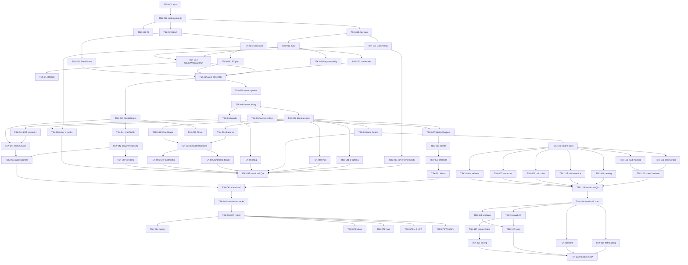

# Tasks: Astana Infinite City

## Document Information

- **Feature Name**: Astana Infinite City
- **Version**: 1.0 (Approved 2026-09-17 — имплементация идёт по волнам, см. Progress)
- **Date**: 2026-09-17
- **Author**: Dex719
- **Related Documents**: `requirements.md`, `design.md`, `.kiro/steering/context.md`, `.kiro/steering/reference-infinitown.md`

## Implementation Overview

Стратегия — **гибридная**: минимальный фундамент (цикл, камера, окно чанков на greybox-кубиках) → самый рискованный вертикальный срез (детерминированная генерация + сдвиг окна без скачков) → ассеты и внешний вид → мобы (машины, ЛРТ, облака) → UI → QA/перф → Could-фичи. Каждая фаза заканчивается работающим демо.

### Implementation Strategy
- Генерация (`world/`) — pure TypeScript без three.js, покрывается unit-тестами до сборки сцены.
- Greybox-режим (цветные боксы вместо префабов) живёт до конца: это fallback и инструмент отладки.
- Бюджеты (NFR-1) проверяются с фазы 3, не в конце.

### Development Approach
- **Testing:** Vitest для `world/`, `mobs/`, `api/`; Playwright e2e + visual regression с фазы 5.
- **Integration:** каждая задача завершается зелёными тестами и запуском `vite dev` (ручная проверка кадра).
- **Deployment:** GitHub Pages через Actions после TSK-064.
- **Git:** `git init` в TSK-001; ветки `feature/<tsk>`, conventional commits, без AI-атрибуции (правило пользователя).

---

## Implementation Plan

### Phase 0: Setup

- [x] **TSK-001**: Инициализировать репозиторий и тулчейн
  - Requirement: NFR-4
  - Deliverables: `package.json` (Vite, TS strict, three ≥ r184, vitest, playwright, eslint, prettier), `tsconfig.json`, `vite.config.ts`, `.gitignore`, `.editorconfig`, `README.md` (запуск), `git init` + первый коммит
  - Acceptance: `npm run dev/build/test/lint` работают; пустая страница с канвасом открывается

- [x] **TSK-002**: Скелет папок и конфиг
  - Requirement: NFR-4, design «Config»
  - Deliverables: `src/{app,world,scene,mobs,controls,render,ui,assets,api}/`, `src/config.ts` (все константы из design), `public/assets/palette.json`, `src/ui/strings.ru.ts`
  - Acceptance: импорт `config` из любого модуля; нет магических чисел в коде фазы 1

- [x] **TSK-003**: CI (lint → unit → build)
  - Requirement: NFR-4
  - Deliverables: `.github/workflows/ci.yml`
  - Acceptance: пайплайн зелёный на пустом проекте

### Phase 1: Core loop и greybox-окно

- [x] **TSK-010**: `app/App` — цикл, resize, visibility, pause/resume
  - Requirement: FR-8.5, FR-11.5
  - Deliverables: `src/app/App.ts`, `src/render/Renderer.ts` (WebGLRenderer, DPR cap, clear color)
  - Acceptance: rAF-цикл с `dt ≤ 0.05`; скрытие вкладки ставит паузу, возврат — без скачка (AC-8.3 вручную)

- [x] **TSK-011**: `controls/CameraRig`
  - Requirement: FR-8.2
  - Deliverables: `src/controls/CameraRig.ts`
  - Acceptance: fov 30, `(80,h,80)`, lookAt origin, `targetHeight` 30..140 с лерпом; unit-тест на clamp

- [x] **TSK-012**: `controls/InputManager`
  - Requirement: FR-8.1, FR-8.2, FR-8.4, NFR-2
  - Deliverables: `src/controls/InputManager.ts` (Pointer Events, wheel, pinch, keys), CSS `touch-action: none`, курсоры grab/grabbing
  - Acceptance: события `startdrag/drag/enddrag/pinch*/wheel/keys` приходят на десктопе и в эмуляции touch; страница не скроллится при жестах

- [x] **TSK-013**: `scene/ChunkWindow` (greybox) + `controls/PanControls`
  - Requirement: FR-1.1, FR-1.4, FR-8.1
  - Deliverables: `src/scene/ChunkWindow.ts` (слоты 9×9, пикеры, `move`, `emptySlots`), `src/controls/PanControls.ts` (поворот −45°, PAN_SPEED(h), инерция, raycast центра), `ChunkBuilder.buildPlaceholder` (цветной бокс + подпись gx,gy)
  - Acceptance: панорамирование бесконечно, при пересечении границы чанка `gridCoords` меняется, картинка не дёргается; `root.position` остаётся в пределах ±60 (AC-1.3)

- [x] **TSK-014**: Debug-оверлей и `window.__app`
  - Requirement: FR-12
  - Deliverables: `src/ui/Debug.ts`, `src/api/DebugApi.ts` (`stats`, `describe`, `dumpWindow`, `pan`, `step`)
  - Acceptance: `?debug=1` показывает FPS/drawCalls/gridCoords/emptySlots и границы чанков (AC-12.1, AC-12.2)

### Phase 2: Детерминированная генерация

- [x] **TSK-020**: `world/Hash` + PRNG
  - Requirement: NFR-3, FR-2
  - Deliverables: `src/world/Hash.ts` (`hash32`, `seedToInt`, `rng`), `tests/world/hash.test.ts`
  - Acceptance: детерминизм, распределение (χ²), одинаковые значения в Node и браузере (снапшот)

- [x] **TSK-021**: `world/Generator` — типы кварталов, поворот, дороги, машины, облака
  - Requirement: FR-3.1–3.3, FR-6.1, FR-7.1, NFR-7
  - Deliverables: `src/world/Generator.ts`, `src/world/types.ts` (`ChunkDescriptor`, `BlockTypeId`), правило D9, fallback-чанк, `tests/world/generator.test.ts`
  - Acceptance: AC-3.1 на 10 000 чанков (< 0,5 % исключений), AC-1.1/AC-2.1 (снапшот дампа 21×21 для `astana`), AC-3.3

- [x] **TSK-022**: `world/LandmarkPlanner`
  - Requirement: FR-4.1, FR-4.2, FR-4.6
  - Deliverables: `src/world/LandmarkPlanner.ts` (фиксированные `(0,-1)` Байтерек, `(0,1)` Хан Шатыр; правило «минимальный хеш в радиусе 6»; feature-флаги ландмарков), `tests/world/landmarks.test.ts`
  - Acceptance: AC-4.1 (100 seed), AC-4.2 (доля 1/25…1/40, дистанция ≥ 6)

- [x] **TSK-023**: `world/LrtPlanner`
  - Requirement: FR-5.1, FR-5.2
  - Deliverables: `src/world/LrtPlanner.ts`, `tests/world/lrt.test.ts`
  - Acceptance: AC-5.1 (ровно один коридор в стартовом окне), станции `gx mod 3 == 0`

- [x] **TSK-024**: `api/Seed` — URL, нормализация, share
  - Requirement: FR-2.1–2.4
  - Deliverables: `src/api/Seed.ts`, `src/ui/Share.ts` (кнопка, тост, fallback-поле), `tests/api/seed.test.ts`
  - Acceptance: AC-2.2, AC-2.3; недопустимый seed нормализуется без ошибки

- [x] **TSK-025**: Подключить генератор к окну (greybox по типам)
  - Requirement: FR-1.3, FR-3
  - Deliverables: `ChunkWindow` использует `Generator.describe`; greybox раскрашен по `block`, ландмарки — высокими боксами, ЛРТ — линией
  - Acceptance: при `seed=astana` стартовое окно повторяется после ухода/возврата (AC-1.1 через `__app.dumpWindow`), `emptySlots === 0` при 60 с панорамирования (AC-1.2)

### Phase 3: Ассеты, префабы, внешний вид

- [x] **TSK-030**: Пайплайн ассетов и каталог
  - Requirement: NFR-1 (вес), NFR-5
  - Deliverables: `tools/assets/` (скрипт скачивания Kenney City Kit Roads/Commercial/Suburban + Car Kit, `gltf-transform` optimize: Draco/Meshopt, dedup, palette PNG), `public/assets/catalog.json` (id, file, bytes, kind, materialKey, license), `CREDITS.md`
  - Acceptance: суммарный вес каталога первого экрана ≤ 8 МБ; все записи CC0; `catalog.version` присутствует

- [x] **TSK-031**: `assets/AssetLibrary` — загрузка с честным прогрессом и retry
  - Requirement: FR-11.1, FR-11.2
  - Deliverables: `src/assets/AssetLibrary.ts` (GLTFLoader + декодеры, прогресс по байтам, retry ×2), `src/ui/Loading.ts` (бар 8 px)
  - Acceptance: AC-11.1 (Fast 3G, монотонный прогресс до 100 % в момент последней загрузки), AC-11.2 (мок 500 → 3 попытки → оверлей «Повторить»)

- [x] **TSK-032**: Префабы кварталов (≥ 8 типов) и слияние геометрий
  - Requirement: FR-3.1, FR-3.4, NFR-1 (draw calls)
  - Deliverables: `src/scene/Prefabs.ts` (merge по материалу `palette`/`glass`), `public/assets/blocks.json` (placements для `residential-panel`, `residential-new`, `business-glass`, `commercial`, `park`, `square`, `campus`, `stadium`), собственные процедурные «панельки» и «стеклянные башни» (`src/scene/procedural/Buildings.ts`)
  - Acceptance: чанк = ≤ 3 меша статики; окно 9×9 ≤ 260 draw calls без мобов; ≥ 6 типов видны в стартовом окне (AC-3.3)

- [x] **TSK-033**: Префабы дорог, перекрёстков, пропсов
  - Requirement: FR-3.1, FR-3.5
  - Deliverables: `src/scene/Roads.ts` (N–S, E–W, угол, разметка, тротуары, фонари, остановки), integration-тест стыковки
  - Acceptance: AC-3.2 (стыки ≤ 0,01 юнита), машины визуально в полосе

- [x] **TSK-034**: Ландмарк Байтерек (процедурный)
  - Requirement: FR-4.3, FR-4.4
  - Deliverables: `src/scene/landmarks/Baiterek.ts` (ствол, крона-решётка, золотой шар, постамент, площадь с фонтанами и аллеей)
  - Acceptance: высота 50 юнитов, силуэт «шар на кроне» читается на стартовом кадре; ≤ 4 меша

- [x] **TSK-035**: Ландмарк Хан Шатыр (процедурный)
  - Requirement: FR-4.3, FR-4.5
  - Deliverables: `src/scene/landmarks/KhanShatyr.ts` (наклонный шатёр LatheGeometry, мачта, стеклянный материал, парковка/площадь)
  - Acceptance: высота 42, наклон 10°, полупрозрачность корректно сортируется с облаками; ≤ 4 меша

- [x] **TSK-036**: Ландмарки Should: Нур Алем, Пирамида, Ак Орда
  - Requirement: FR-4.6
  - Deliverables: `src/scene/landmarks/{NurAlem,Pyramid,AkOrda}.ts`, включение флагов в `LandmarkPlanner`
  - Acceptance: появляются вне стартовой зоны с частотой по AC-4.2; узнаваемы (ручная проверка)

- [x] **TSK-037**: Освещение, тени, туман, виньетка
  - Requirement: FR-9.1–9.3, NFR-1
  - Deliverables: `src/render/Lighting.ts` (DirectionalLight + HemisphereLight, shadow frustum по aspect, профили 2048/1024), `src/render/Post.ts` (виньетка quad), `scene.fog`
  - Acceptance: AC-9.2 (край окна не читается), тени мягкие без «акне», draw calls ≤ 300 с тенями

- [x] **TSK-038**: Палитра «Астана» и материалы
  - Requirement: FR-9.4, FR-9.5
  - Deliverables: `public/assets/palette.json` (≤ 24 цветов), `src/scene/Materials.ts` (palette/glass/gold), перекраска Kenney-палитры под нашу (`tools/assets/recolor.ts`)
  - Acceptance: AC-9.3 (все материалы из палитры); скриншот стартового кадра утверждён пользователем как эталон для visual regression

### Phase 4: Мобильные объекты

- [x] **TSK-040**: `mobs/MobileObject` — перенос между чанками
  - Requirement: FR-6.4, FR-5.5, FR-7.2
  - Deliverables: `src/mobs/MobileObject.ts`, `tests/mobs/mobile.test.ts` (математика переноса без three-рендера)
  - Acceptance: AC-6.3 (отклонение ≤ 0,05 юнита при пересечении границы); деактивация при отсутствии соседа

- [x] **TSK-041**: `mobs/Car` + `Traffic` (радар, торможение, перекрёсток, anti-deadlock)
  - Requirement: FR-6.2, FR-6.3, FR-6.5
  - Deliverables: `src/mobs/Car.ts`, `src/mobs/Traffic.ts` (соседние чанки, коллизионные точки), `tests/mobs/traffic.test.ts`
  - Acceptance: AC-6.1 (0 пересечений bbox за 60 с при 100+ машинах), AC-6.2 (0 «замёрзших» за 5 мин)

- [x] **TSK-042**: Спавн машин и `InstancedMesh`-пулы
  - Requirement: FR-6.1, FR-6.6, NFR-1
  - Deliverables: `src/mobs/InstancePool.ts`, `src/mobs/CarSpawner.ts` (из `ChunkDescriptor.cars`, ≥ 8 моделей: такси, автобус, полиция, скорая…)
  - Acceptance: 100+ машин добавляют ≤ 12 draw calls; тени от машин есть

- [x] **TSK-043**: Геометрия ЛРТ: эстакада, опоры, станции
  - Requirement: FR-5.1, FR-5.2
  - Deliverables: `src/scene/Lrt.ts` (сегмент балки по оси северной дороги, опоры каждые 15, платформа+навес+лестница на станциях), интеграция в `ChunkBuilder`
  - Acceptance: AC-5.2 (балка непрерывна между чанками, опоры не на полосах); коридор виден на стартовом кадре (AC-5.1)

- [x] **TSK-044**: `mobs/Train` + `LrtLine` (спавн, интервал, остановки)
  - Requirement: FR-5.3, FR-5.4, FR-5.6
  - Deliverables: `src/mobs/Train.ts` (состояния moving/braking/dwell/accelerating), `src/mobs/LrtLine.ts` (детерминированный спавн с шагом 4–6 чанков, две нитки), `tests/mobs/train.test.ts`
  - Acceptance: AC-5.3 (остановка ±2 юнита от центра станции, стоянка 3–5 с), AC-5.4 (1…4 поезда в окне, интервал ≥ 4 чанка)

- [x] **TSK-045**: `mobs/Cloud`
  - Requirement: FR-7
  - Deliverables: `src/mobs/Cloud.ts`, 2 процедурные/Kenney модели облаков в пуле
  - Acceptance: AC-7.1 (3–12 облаков, тени), AC-7.2 (перенос без скачка)

### Phase 5: UI-оболочка

- [x] **TSK-050**: Раскладка, шрифты, заголовок
  - Requirement: FR-10.1, FR-10.5, NFR-6
  - Deliverables: `index.html`, `src/ui/shell.css` (rem-масштаб 320 px…4K, палитра UI), `src/ui/Title.ts` (анимация ширина→буквы→fade; `prefers-reduced-motion`), self-hosted шрифты (open license)
  - Acceptance: AC-10.1; контраст ≥ 4.5:1

- [x] **TSK-051**: About: пауза, blur, закрытие (крестик/вне/Esc)
  - Requirement: FR-10.2–10.4
  - Deliverables: `src/ui/About.ts` (описание, «сделано с», credits из `CREDITS.md`, ссылка автора), мобильная полноэкранная версия
  - Acceptance: AC-10.2, AC-10.3

- [x] **TSK-052**: Оверлеи ошибок: нет WebGL2, ошибка загрузки, потеря контекста
  - Requirement: FR-11.3, FR-11.4, NFR-7
  - Deliverables: `src/ui/ErrorOverlay.ts`, обработчики `webglcontextlost/restored` в `Renderer`, fallback-чанк подключён
  - Acceptance: AC-11.3; восстановление контекста без перезагрузки; таймаут 5 с → «Перезагрузить»

- [x] **TSK-053**: Клавиатурное управление и доступность
  - Requirement: FR-8.3, NFR-6
  - Deliverables: стрелки/WASD → виртуальный drag; `?`/Esc для About; фокус-кольца; aria-лейблы кнопок
  - Acceptance: демо полностью управляемо с клавиатуры (ручной чек-лист)

### Phase 6: QA, производительность, релиз

- [x] **TSK-060**: Профили качества и автопонижение
  - Requirement: NFR-1, NFR-2
  - Deliverables: `src/render/Quality.ts` (`high/medium/low`, `?quality=`, детект mobile, автопонижение при медиане < 25 FPS)
  - Acceptance: на телефоне среднего уровня медиана ≥ 30 FPS (ручной замер, evidence в QA-отчёте); desktop ≥ 50

- [x] **TSK-061**: E2E и visual regression (Playwright)
  - Requirement: AC-1.2, AC-8.1, AC-8.2, AC-9.1, AC-10.*, AC-11.*
  - Deliverables: `e2e/*.spec.ts`, эталоны `e2e/__screenshots__/astana-start.png` (summer)
  - Acceptance: все перечисленные AC зелёные в Chromium и WebKit

- [x] **TSK-062**: Симуляционные проверки в ускоренном времени
  - Requirement: AC-5.4, AC-6.1, AC-6.2
  - Deliverables: `e2e/simulation.spec.ts` (`__app.step(dt)` × N)
  - Acceptance: 0 пересечений, 0 «замёрзших», поезда 1…4

- [x] **TSK-063**: QA-отчёт и подтяжка спеки
  - Requirement: все FR/NFR
  - Deliverables: `.kiro/specs/astana-infinite-city/qa-evidence.md` (таблица AC → тест/скриншот/замер), обновлённые статусы в `requirements.md`, AC-4.3 (узнаваемость, 5 респондентов)
  - Acceptance: все Must закрыты evidence; Should закрыты или перенесены с обоснованием

- [x] **TSK-064**: README, деплой на GitHub Pages
  - Requirement: Deployment (design)
  - Deliverables: `.github/workflows/deploy.yml`, `README.md` (ссылка на демо, seed-шаринг, управление, credits)
  - Acceptance: демо доступно по публичному URL, ассеты кэшируются по хешу

### Phase 7: Could (после утверждения приоритетов)

- [x] **TSK-070**: Зимний режим `?season=winter`
  - Requirement: FR-13 · Deliverables: `palette.winter.json`, снег на крышах/земле (доп. геометрия/цвет), небо/свет · Acceptance: AC-13.1 + отдельный visual-эталон

- [ ] **TSK-071**: Река Есиль с мостами — **заменена TSK-088** (FR-14 повышен до Must в итерации 2)

- [x] **TSK-072**: N–S коридоры ЛРТ и развязки
  - Requirement: FR-5 (расширение) · Acceptance: пересечение коридоров без наложения балок

- [x] **TSK-073**: WebGPU за флагом `?gpu=1`
  - Requirement: D6 · Acceptance: тот же кадр (visual diff ≤ 2 %) при WebGPU, fallback на WebGL

### Phase 8: Итерация 2 — обратная связь пользователя (2026-09-17)

Источник: сообщение пользователя (баги: камера сквозь здания, «трава багается»; фичи: убрать завод, автобусы Астаны, популярные здания и ТЦ, детали ландмарков, Яндекс-такси, отсылки к Астане, антенны на крышах, нормальный флаг, река с мостом, роботы у Expo). Спека: `bugfix.md`, FR-14 (Must), FR-15, FR-16, design «Итерация 2».

- [x] **TSK-080**: BUG-1 — камера выше застройки
  - Requirement: bugfix BUG-1, AC-8.2
  - Deliverables: `CAMERA.HEIGHT_MIN` 60, этажность регулярных зданий ≤ 12, unit-тест `HEIGHT_MIN > max(LANDMARKS.HEIGHT) + NEAR`, e2e AC-8.2 по константам, visual-эталон `astana-low.png`
  - Acceptance: на минимальной высоте ни одно здание не режется near-плоскостью (скриншот)

- [x] **TSK-081**: BUG-2 — z-fighting газонов площади и аудит слоёв
  - Requirement: bugfix BUG-2
  - Deliverables: слои покрытия с шагом ≥ 0.03 в `BlockPrefabs` (square, park, campus, market), visual-эталон `astana-square.png`
  - Acceptance: газонные вставки без просвечивания на скриншоте

- [x] **TSK-082**: Убрать завод → ТЦ (`mall`)
  - Requirement: FR-15.1, AC-15.1
  - Deliverables: `world/types` (`mall` вместо `industrial`), `Buildings.mall`, `BlockPrefabs.mall`, снапшот генератора
  - Acceptance: AC-15.1 (unit по дампу 21×21)

- [x] **TSK-083**: Детали крыш
  - Requirement: FR-15.5, AC-15.4
  - Deliverables: `Buildings.roofDetails` (антенны, кондиционеры, баки, тарелки, короба), счётчик покрытия
  - Acceptance: AC-15.4 (unit: ≥ 40 % из 200 зданий)

- [x] **TSK-084**: Флаг Казахстана
  - Requirement: FR-15.4, AC-15.3
  - Deliverables: `Props.flagpole` (полотно, солнце с лучами, орёл-силуэт, орнамент)
  - Acceptance: AC-15.3 (unit: цвета в батче), крупный план в visual-эталоне площади

- [x] **TSK-085**: Детализация существующих ландмарков + роботы у Expo
  - Requirement: FR-15.3
  - Deliverables: `landmarks/{Baiterek,KhanShatyr,NurAlem,Pyramid,AkOrda}.ts` (детали по design C8-дополнению), `Props.robot`
  - Acceptance: visual-эталоны 5 ландмарков обновлены, ≥ 3 робота у Нур Алем

- [x] **TSK-086**: Новые ландмарки Астаны
  - Requirement: FR-15.2, AC-15.2
  - Deliverables: `landmarks/{AbuDhabiPlaza,AstanaOpera,HazretSultan,MegaSilkWay}.ts` (Must), `{NorthernLights,TransportTower,KazMunayGas}.ts` (Should); `LANDMARKS.ENABLED/HEIGHT`, тесты планировщика (частоты, минимальная дистанция)
  - Acceptance: AC-15.2 — visual-эталон каждого через `__app.centerOn`

- [x] **TSK-087**: Автобус Астаны и Яндекс-такси
  - Requirement: FR-16, AC-16.1, AC-16.2
  - Deliverables: `mobs/Vehicles` (bus-astana, yandex-econom/business/premier, suv-white, sedan-blue), `TRAFFIC.MODEL_POOL` 12, `GEN.VERSION` 2, снапшоты
  - Acceptance: AC-16.1 (unit), AC-16.2 (visual)

- [x] **TSK-088**: Река Есиль с мостами и берега (заменяет TSK-071)
  - Requirement: FR-14, FR-15.6, AC-14.1, AC-15.5
  - Deliverables: `world/RiverPlanner`, `RIVER` в `config`, `block = 'river'`, префабы воды/набережной/моста (`BlockPrefabs.river`, `Roads` мост N–S), веса берегов в `Generator.rawBlockType`, unit-тесты (ряды, нет совпадений с ЛРТ, доли типов по берегам), симуляция машин на мосту
  - Acceptance: AC-14.1 (симуляция: 0 пересечений на мосту), AC-15.5 (unit), visual-эталон `astana-river.png`

- [x] **TSK-089**: Отсылки к Астане, QA и эталоны итерации 2
  - Requirement: FR-15 (D11), NFR-3
  - Deliverables: `CLOUD.SPEED` 4 (ветер степи), обновлённые visual-эталоны, `qa-evidence.md` (раздел «Итерация 2»), README/credits
  - Acceptance: все e2e зелёные, эталоны обновлены, QA-таблица закрывает AC-14…AC-16

---

### Phase 9: Итерация 3 — детализация (2026-09-18)

Источник: сообщение пользователя «детали добавь достопримечательностям, деревьям, облакам». Спека: FR-17, design «Итерация 3».

- [x] **TSK-090**: Деревья — объёмные кроны и тополь
  - Requirement: FR-17.1, AC-17.1
  - Deliverables: `Props.tree` (лиственное: 3 объёма кроны двух оттенков, ствол с комлем, приствольный круг; хвойное: 3 яруса; вид 2 — тополь), шаблон `Templates.blob`, выбор вида в `BlockPrefabs` из того же броска rng; unit `tests/scene/props.test.ts`
  - Acceptance: AC-17.1; вершины парка ≤ ×1,6

- [x] **TSK-091**: Облака — три силуэта с тенью
  - Requirement: FR-17.2, AC-17.2
  - Deliverables: `Vehicles.buildCloud` (3 варианта, ≥ 7 объёмов, подложка `shade('white', 0.82)`, плоское основание), `CLOUD.MODELS` 3, `GEN.VERSION` 3, снапшот генератора; unit `tests/mobs/cloud.test.ts`
  - Acceptance: AC-17.2

- [x] **TSK-092**: Помощники деталей и ландмарки A
  - Requirement: FR-17.3, AC-17.3
  - Deliverables: `Props.{hedge,flowerBed,canopy,bollards,spotlight}`; детали Байтерека, Хан Шатыра, Нур Алем, Пирамиды, Ак Орды, Абу-Даби Плазы по таблице design C8 (итерация 3)
  - Acceptance: ≥ 3 новых детали на ландмарк, порог вершин AC-17.3

- [x] **TSK-093**: Ландмарки B
  - Requirement: FR-17.3, AC-17.3
  - Deliverables: детали Астана Оперы, Хазрет Султана, Mega Silk Way, «Северного сияния», Транспортной башни, КазМунайГаза
  - Acceptance: ≥ 3 новых детали на ландмарк, порог вершин AC-17.3

- [x] **TSK-094**: QA итерации 3
  - Requirement: FR-17.4, AC-17.3, AC-17.4, NFR-1
  - Deliverables: unit `tests/scene/landmarks.test.ts` (пороги вершин), обновлённые visual-эталоны (`landmark-*.png`, `astana-start.png` и др.), `e2e/perf.spec.ts` зелёный, `qa-evidence.md` раздел «Итерация 3», статусы FR-17
  - Acceptance: все проверки зелёные, evidence по AC-17.1…17.4

Волна 2 (2026-09-18, «ещё больше деталей»):

- [x] **TSK-095**: Цветущие деревья, кусты и благоустройство кварталов
  - Requirement: FR-17.5, AC-17.5, AC-17.7
  - Deliverables: `Props.tree` kind 3, `Props.bush`, `hedge(baseY)`, столбики-боксы, клумбы на 8 гранях; детали в `BlockPrefabs` для 10 регулярных типов по таблице design C7 (волна 2); unit props/landmarks
  - Acceptance: AC-17.5, AC-17.7 (≥ ×1,05 и ≤ 7 000 на тип)

- [x] **TSK-096**: Облака — три тона и клочки
  - Requirement: FR-17.6, AC-17.6
  - Deliverables: `Vehicles.buildCloud` (средний тон `shade('white', 0.92)`, ≥ 2 клочка `blobLow`), unit cloud
  - Acceptance: AC-17.6

- [x] **TSK-097**: Ландмарки — волна 2
  - Requirement: FR-17.7, AC-17.3
  - Deliverables: ≥ 3 новых детали на каждый из 12 ландмарков по таблице design C8 (волна 2); порог AC-17.3 поднят до ×1,35
  - Acceptance: unit landmarks (×1,35 … 9 000), эталоны

- [x] **TSK-098**: QA волны 2
  - Requirement: FR-17.4, AC-17.4
  - Deliverables: visual-эталоны, `e2e/perf.spec.ts` (пик ≤ 400 k), qa-evidence (AC-17.5…17.7), статусы
  - Acceptance: все проверки зелёные

- [x] **TSK-099**: Гранёный шар Байтерека (волна 3)
  - Requirement: FR-17.8, AC-17.8
  - Deliverables: `Templates.icoFlat`, `GeometryBatch.addFacets/placeFacets`, `landmarks/Baiterek.ts` (шар из 320 панелей двух оттенков золота, обода), unit в `tests/scene/props.test.ts`, эталоны `landmark-baiterek.png`/`astana-start.png`
  - Acceptance: AC-17.8, Байтерек ≤ 9 000 вершин, e2e зелёные

### Phase 10: Итерация 4 — бюджет кадра, улицы, фасады (2026-09-19)

Источник: запрос пользователя на детализацию силами отдельных исполнителей. Спека: FR-18, design «Итерация 4». Задачи TSK-101…TSK-108 написаны так, чтобы их мог выполнить исполнитель с ограниченным контекстом: один файл, перечисленные функции, точные размеры и цвета, числовой потолок и готовая команда проверки. TSK-100 и TSK-109 — подготовка и приёмка, их выполняет ведущая модель.

#### Контракт исполнителя (обязателен для TSK-101…TSK-108)

1. **Читать:** текст своей задачи, `design.md` → «Итерация 4», файлы из Deliverables. Остальную спеку читать не нужно.
2. **Цвета:** только ключи из `public/assets/palette.json` через `m.color(key)` / `m.shade(key, factor)`. Новые ключи в палитру не добавлять.
3. **Детерминизм:** `Math.random` запрещён. **Не добавлять новых вызовов `rng()`** и не менять порядок существующих — иначе изменится раскладка города и упадут снапшоты (AC-18.7). Вариативность брать из уже готовых полей дескриптора (`variant`, `roads.*`, `rotation`) или из целочисленного хеша позиции, как в `Props.treeAngle`.
4. **Геометрия:** только существующие `Templates` и методы `GeometryBatch` (`box`, `plane`, `place`, `placeRotated`, `strut`). Новых шаблонов не заводить.
5. **Скрытые стороны:** плоские накладки (выступ ≤ 0,3 юнита) на скрытых сторонах не строить — использовать `hidden` из `Ctx` / поля `Buildings` (см. D13). Выступающие объёмы (козырьки, балконы, крыльца) строить всегда, но размещать на видимой стороне.
6. **Слой деталей (D14):** мелочь идёт в батч деталей, а не в основной. `Props` уже пишет туда — просто вызывай его методы. В `BlockPrefabs` батч доступен как `ctx.detail`, в `Roads` — параметр `detail`, в `Buildings` — поле `this.detail`. В основной батч (`ctx.b`, `batch`, `this.batch`) идут только крупные формы: корпуса, полотно дороги, тротуары, цоколи и карнизы зданий.
7. **Не трогать:** `GEN.VERSION`, `tests/world/__snapshots__/*`, `e2e/__screenshots__/*`, пороги `RENDER.BUDGET`, потолки 7 000 / 9 000 в `tests/scene/landmarks.test.ts`, файлы `Visibility.ts`, `ChunkNode.ts`, `ChunkWindow.ts`, `PrefabBuilder.ts` и секцию `DETAIL` в `config.ts`. Если не укладываешься в потолок — уменьшай количество элементов, а не потолок.
8. **Проверка перед сдачей:** `npm run lint` и `npm run test` — оба зелёные (208 существующих тестов + добавленные твоей задачей). Форматирование — только своих файлов: `npx prettier --write <файлы>`, не `npm run format` (он переписывает весь репозиторий и мешает параллельным задачам). E2E и visual запускать не нужно: эталоны пересоздаёт TSK-109. Коммиты не делать.
9. **Стиль:** комментарии по-русски, как у соседних функций, с ссылкой на требование (`FR-18.x`). Коммит и ветку делает ведущая модель после приёмки.

---

- [x] **TSK-100**: Отсечение сторон, невидимых при фиксированной камере (ведущая модель)
  - Requirement: FR-18.1, AC-18.1, AC-18.2, design D13
  - Deliverables: `src/scene/procedural/BlockPrefabs.ts` — тип `HiddenSides { x: 1 | -1; z: 1 | -1 }`, вычисление из `descriptor.rotation` по таблице D13, поле `hidden` в `Ctx`; `src/scene/procedural/Buildings.ts` — `hidden` в конструкторе, `windowRows` строит 2 видимые стороны вместо 4; `src/scene/procedural/Roads.ts` — скрытые стороны фиксированы (−X, −Z); новый `tests/scene/hidden.test.ts` (таблица поворотов 0…3)
  - Acceptance: AC-18.2 (unit на 4 поворота); `npm run e2e` проходит **на прежних эталонах** без `--update-snapshots` (AC-18.1); `test-results/perf.json` — пик ≤ 340 000 треугольников; снапшоты генератора не изменились; 188 прежних unit-тестов зелёные
  - Бюджет: ожидаемое освобождение −15…25 % треугольников окна

- [x] **TSK-110**: LOD — слой деталей, переключаемый видимостью (ведущая модель)
  - Requirement: FR-18.9, FR-18.10, AC-18.9, AC-18.10, design D14
  - Depends on: TSK-100
  - Deliverables: секция `DETAIL` в `src/config.ts`; третий батч `detail` в `PrefabBuilder`, `BlockPrefabs`, `Roads` (разметка и зебры), `Buildings.roofDetails`; `Props` строится в батч деталей; `ChunkNode.details` + `setDetailVisible`; `ChunkWindow.updateDetailVisibility(cameraPosition)` с гистерезисом; вызов в `App`; unit `tests/scene/detail.test.ts`
  - Acceptance: AC-18.9 (пик ≤ 300 000 треугольников, draw calls ≤ 300), AC-18.10 (при зуме `stats.builds` не растёт, гистерезис проверен unit-тестом); центральный чанк показывает детали на любой высоте
  - Замечание: выполняется до раздачи TSK-101…108 — задача трогает те же файлы

- [x] **TSK-111**: Теневой проход — измерить долю и урезать плоские детали (ведущая модель)
  - Requirement: FR-18.8, NFR-1, AC-18.9
  - Depends on: TSK-110, TSK-101…108 (трогает те же батчи)
  - Обоснование: панель проектирования (2026-09-19) независимо двумя судьями указала, что вторая половина пикового счётчика треугольников — теневой проход, а ортобокс тени (`SHADOW_CAMERA.extent` 75) накрывает именно ближние чанки, которым дистанционный LOD не помогает.
  - Deliverables: замер доли теневого прохода (временно `castShadow = false` на меше деталей, прогон `perf.spec.ts`, сравнение); по результату — разделение слоя деталей на отбрасывающий тень (деревья, фонари, скамейки, знаки, детали крыш) и плоский без тени (разметка, зебры, приствольные круги, кромки), либо обоснованный отказ, если выигрыш < 5 %
  - Acceptance: пик треугольников снижается без потери теней у объёмных деталей; решение и числа записаны в `qa-evidence.md`

- [x] **TSK-101**: Помощники улицы — знак, урна, велопарковка, пешеходный светофор
  - Requirement: FR-18.3, FR-18.4, AC-18.3
  - Deliverables: `src/scene/procedural/Props.ts` — методы `roadSign(x, z, kind, facing)`, `trashBin(x, z)`, `bikeRack(x, z, rot)`, `pedestrianLight(x, z, facing)` строго по таблице design «Итерация 4 → C7: улицы» (размеры, шаблоны и ключи палитры взять оттуда); `tests/scene/props.test.ts` — по одному тесту на помощник
  - Acceptance: каждый помощник укладывается в свой потолок вершин из таблицы (`roadSign` ≤ 128, `trashBin` 104, `bikeRack` 120, `pedestrianLight` 96); `roadSign` даёт 3 разных силуэта для `kind` 0/1/2; два вызова с одинаковыми аргументами дают одинаковое число вершин
  - Не трогать: `Roads.ts` и `BlockPrefabs.ts` — расстановка помощников делается в TSK-103

- [x] **TSK-102**: Дорожная разметка — стоп-линии, стрелки, кромка проезжей части
  - Requirement: FR-18.2, AC-18.3
  - Deliverables: `src/scene/procedural/Roads.ts` — функции `stopLines`, `laneArrows`, `edgeLine` и их вызовы в `buildRoads`; все элементы пишутся в батч `detail` (D14), лежат на `MARK_Y` (0.03), толщина 0.02, цвет `m.color('marking')`
  - Acceptance: 4 стоп-линии (по одной перед каждой зеброй), ≥ 2 стрелки направления на подъездах к перекрёстку, кромка вдоль бордюра квартала с видимых сторон; на чанке реки (`river = true`) разметка стрелок не строится; unit в `tests/scene/props.test.ts` или новом `tests/scene/roads.test.ts`: суммарный прирост вершин чанка ≤ 300
  - Бюджет: ≤ 300 вершин на чанк

- [x] **TSK-103**: Мебель перекрёстка и тротуара
  - Requirement: FR-18.3, FR-18.4, AC-18.4
  - Depends on: TSK-101
  - Deliverables: `src/scene/procedural/Roads.ts` — расстановка `roadSign`, `pedestrianLight`, `trashBin`, `bench`, `bikeRack` по таблице design «Мебель тротуара» (условия `roads.corner`, `roads.ew`, `roads.ns`); `src/scene/procedural/BlockPrefabs.ts` — велопарковка у входа в кварталах `business-glass`, `campus`, `mall`
  - Acceptance: AC-18.4 — в окне 21×21 seed `astana` встречаются урна, велопарковка и скамейка тротуара; максимум вершин любого регулярного типа ≤ 7 000 (`tests/scene/landmarks.test.ts` зелёный); новых вызовов `rng()` нет
  - Бюджет: ≤ 250 вершин на чанк сверх TSK-102

- [x] **TSK-104**: Парковки — разметка машино-мест и припаркованные машины
  - Requirement: FR-18.5, AC-18.5
  - Deliverables: `src/scene/procedural/BlockPrefabs.ts` — разметка мест (линии `box` 0.12 × 2.4 с шагом 2.6 вдоль края парковки) и `Props.parkedCar` на каждом втором месте в кварталах `commercial`, `mall`, `business-glass`, `stadium`; индекс цвета машины берётся из `descriptor.variant`, а не из `rng`
  - Acceptance: AC-18.5 — ≥ 4 линии и ≥ 1 `parkedCar` в `commercial` и в `mall`; линии лежат на уровне покрытия парковки без z-fighting (y соответствует существующему покрытию + 0.02); потолок квартала 7 000 вершин соблюдён
  - Бюджет: ≤ 350 вершин на квартал

- [x] **TSK-105**: Цоколь и карниз домов
  - Requirement: FR-18.6
  - Deliverables: `src/scene/procedural/Buildings.ts` — методы `plinth(f)` и `cornice(f, top)` по таблице design «C7: фасады», вызовы в `panelHouse`, `modernTower`, `shopRow`, `campusHall`, `mall`
  - Acceptance: каждый из пяти типов домов содержит цоколь и карниз (unit по приросту частей батча: +2 на дом); прирост ≤ 48 вершин на дом; потолок квартала 7 000 соблюдён
  - Бюджет: ≤ 48 вершин на дом

- [x] **TSK-106**: Балконы жилых домов
  - Requirement: FR-18.6, AC-18.6
  - Depends on: TSK-100 (поле `hidden`)
  - Deliverables: `src/scene/procedural/Buildings.ts` — метод `balconies(f, floors, color)` по таблице design «C7: фасады», вызов в `panelHouse` (цвет `panel-grey`) и `modernTower` (цвет акцента)
  - Acceptance: AC-18.6 — панельный дом на 9 этажей содержит ≥ 4 балкона; балконы стоят только на видимой стороне (проверяется unit-тестом на двух значениях `hidden`); ≤ 8 балконов и ≤ 384 вершины на дом; потолок квартала 7 000 соблюдён
  - Бюджет: ≤ 384 вершины на дом

- [x] **TSK-107**: Входные группы — крыльцо, ступени, козырёк
  - Requirement: FR-18.6, AC-18.6
  - Depends on: TSK-100
  - Deliverables: `src/scene/procedural/Buildings.ts` — метод `entrance(f, side)` по таблице design «C7: фасады»; заменяет нынешний примитивный вход в `panelHouse` (`box` входа + козырёк) и добавляется в `campusHall`
  - Acceptance: AC-18.6 — вход содержит крыльцо, ≥ 2 ступени, козырёк на 2 стойках; вход строится на видимой стороне при любом `hidden`; ≤ 168 вершин на вход; потолок квартала 7 000 соблюдён
  - Бюджет: ≤ 168 вершин на вход

- [x] **TSK-108**: Витрины и вывески торговых зданий
  - Requirement: FR-18.6, AC-18.6
  - Depends on: TSK-100
  - Deliverables: `src/scene/procedural/Buildings.ts` — метод `storefront(f)` по таблице design «C7: фасады» (витрина в `glass`-батч, стойки и вывеска в `opaque`), вызов в `shopRow`; квартал `commercial` использует его вместо нынешней одиночной витрины
  - Acceptance: AC-18.6 — торговый ряд содержит витрину в стеклянном батче и вывеску; витрина строится на видимой стороне; ≤ 144 вершины на здание; потолок квартала 7 000 соблюдён
  - Бюджет: ≤ 144 вершины на здание

- [x] **TSK-109**: QA итерации 4 (ведущая модель)
  - Requirement: FR-18.8, AC-18.1, AC-18.7, AC-18.8
  - Depends on: TSK-100…TSK-108
  - Deliverables: пересозданные visual-эталоны `e2e/__screenshots__/*`, прогон `npm run e2e`, свежий `test-results/perf.json`, раздел «Итерация 4» в `qa-evidence.md`, статусы в `requirements.md`/`tasks.md`, обновлённый README (новые детали улиц и фасадов)
  - Acceptance: unit и e2e зелёные; треугольники ≤ 400 000 и draw calls ≤ 300 без поднятия порогов; снапшоты генератора не менялись, `GEN.VERSION` = 3; evidence по AC-18.1…18.8

### Phase 11: Итерация 5 — полировка картинки до уровня референса (2026-09-23)

Источник: запрос пользователя «Отпалируй проект до уровня https://demos.littleworkshop.fr/infinitown» (цикл `/loop` каждые 30 минут). Спека: FR-19, design «Итерация 5». Задачи выполняет ведущая модель по одной-две за шаг цикла; каждая заканчивается `npm run lint` + `npm run test`, снимком во встроенном браузере (`?seed=astana&debug=api`) и коммитом. Правила детерминизма и бюджета — как в «Контракте исполнителя» Phase 10 (пункты 2, 3, 5, 6); эталоны `e2e/__screenshots__/*` пересоздаются только в TSK-122.

- [x] **TSK-114**: Спека итерации 5 — сравнение кадров, FR-19, design D15–D17, задачи
  - Requirement: FR-19
  - Deliverables: `requirements.md` → FR-19; `design.md` → «Итерация 5» (замеры пикселей, D15–D17, окна, крыши, мощение, бюджет, тесты); этот раздел; коммит итерации 4 как точка отката
  - Acceptance: числа сравнения кадров записаны; у каждого решения — альтернативы и причина выбора
  - Факт: 2026-09-23 — кадры референса и `?seed=astana` сняты Playwright в 1280×720, пиксели измерены (контраст тени у нас уже 0,50…0,58 против 0,56, разрыв — в альбедо, экспозиции и AO); итерация 4 закоммичена (`b187a01`) после e2e 34/34 и perf 258 432 треугольника / 122 draw calls

- [x] **TSK-115**: Гранёный low-poly — `flatShading` у непрозрачного материала
  - Requirement: FR-19.3, AC-19.3, design D16
  - Deliverables: `src/scene/Materials.ts` — `opaque.flatShading = true`, стекло без флага; unit на флаги материалов
  - Acceptance: AC-19.3 — пик треугольников `perf.spec.ts` в пределах ± 1 % от 258 432; во встроенном браузере кроны, облака и купола гранёные
  - Факт: флаг в `Materials`, `tests/scene/materials.test.ts` (2 теста); perf 258 210 треугольников (−0,09 %, разброс трафика), 122 draw calls; снимок во встроенном браузере — кроны, ели и цветущие деревья гранёные; unit 269/269

- [x] **TSK-116**: AO стен — `GeometryBatch.boxAo` на корпусах и цоколях
  - Requirement: FR-19.1, AC-19.1, design D15
  - Deliverables: секция `AO` в `src/config.ts`; `GeometryBatch.boxAo`; вызовы в `Buildings` (корпуса семи типов, стеклянная оболочка `glassTower`, цоколь); `tests/scene/ao.test.ts`
  - Acceptance: AC-19.1 (ряды, множители, замкнутость 32 / 20); потолки 7 000 / 9 000; снапшоты генератора не изменились
  - Факт: `AO` в `config.ts` (+ агрегат `CONFIG`), `wallAo` и `GeometryBatch.boxAo` (3 пояса у стен выше 3, иначе 24 / 12), корпуса семи типов, лоджии новостройки, портал ТЦ, стеклянная оболочка делового центра и цоколь; `tests/scene/ao.test.ts` (6 тестов: множители, пояса, замкнутость и обход граней, поворот, панельный дом), тест цоколя итерации 4 переведён на проверку оттенка; unit 275/275, lint чистый, потолки и снапшоты генератора без изменений; во встроенном браузере низ стен жилых домов темнеет в пределах первого этажа

- [x] **TSK-117**: AO земли — ореолы вокруг зданий
  - Requirement: FR-19.2, AC-19.2, design D15
  - Depends on: TSK-116
  - Deliverables: `GeometryBatch.halo`; `Buildings` — регистрация отпечатков цоколей и `flushHalos(groundKey)`; `BlockPrefabs` — ключ цвета покрытия квартала и вызов `flushHalos`; тесты в `tests/scene/ao.test.ts`
  - Acceptance: AC-19.2 — цвета краёв, ореолы соседей не перекрываются и не выходят за ±23; потолки соблюдены
  - Факт: `GeometryBatch.halo` (8 / 8, CCW сверху), реестр отпечатков в `Buildings` (цоколь регистрирует сам, деловой центр и рынок — явно), `flushHalos(y, limit)` с урезанием до половины зазора и до края покрытия, `groundKey` из полного газона квартала; +7 тестов в `tests/scene/ao.test.ts` (геометрия кольца, соседи по оси и по диагонали, край, реальные кварталы трёх сидов). По кадру во встроенном браузере сила AO поднята: `WALL_MIN` 0,55 → 0,45, `GROUND_MIN` 0,5 → 0,4 (≈ 0,7 яркости sRGB у подножия, как у референса). Unit 282/282; разовое падение `chunkwindow.test.ts` «бюджет по времени» — флак таймера под нагрузкой (тест на синтетическом `SlowBuilder`, геометрию не трогает), 3/3 в изоляции и зелёный в повторном полном прогоне

- [x] **TSK-118**: Тон — экспозиция светом и палитра
  - Requirement: FR-19.4, AC-19.4, design D17
  - Deliverables: `RENDER.SUN.intensity`, `RENDER.HEMISPHERE_INTENSITY` и зимние аналоги в `src/config.ts`; `public/assets/palette.json` (`sidewalk`, `asphalt`, при необходимости `grass`); `tests/render/tone.test.ts` — оракул Ламберта
  - Acceptance: AC-19.4 — расчёт в границах; замер пикселей стартового кадра совпадает с расчётом ± 12
  - Факт: экспозиция ×1,25 (солнце 2,2 → 2,75, небо 0,9 → 1,125, зима 2,0 → 2,5 и 0,75 → 0,9375); палитра: `sidewalk` `#d6d2c4` → `#e2e4e6`, `asphalt` `#5c6166` → `#666b70`, `grass` `#7bc043` → `#8cc84a`; оракул `tests/render/tone.test.ts` (4 теста): тротуар 215, асфальт 100, газон 173 (референс 177), тень/свет 0,55, белый и снег без пересвета. Замер стартового кадра (Playwright 1280×720): тротуар 214, площадь в тени 117, асфальт 98, газон в тени 92 — расхождение с расчётом ≤ 3. Visual-эталоны перезаписаны целиком (`--update-snapshots=all`): штатный порог Playwright (0,2 YIQ на пиксель) тональный сдвиг не ловит, и без полной перезаписи эталоны показывали бы старый тон

- [x] **TSK-119**: Окна отдельными проёмами
  - Requirement: FR-19.6, AC-19.6, design «C7 (дополнение, итерация 5): окна и крыши»
  - Deliverables: `Templates.planeXY`; `Buildings.windows` вместо `windowRows`; секция `FACADE` в `src/config.ts`; тесты в `tests/scene/facade.test.ts`
  - Acceptance: AC-19.6; `tests/scene/hidden.test.ts` зелёный (проёмы только на видимых сторонах); потолки соблюдены
  - Факт: `Templates.planeXY`, `FACADE` (+ агрегат `CONFIG`), `Buildings.windows(f, floors, color, ratio, fromFloor, skipCenterX)` во всех четырёх местах `windowRows`; у новостройки боковые проёмы не ставятся за полосой лоджий. Тест `hidden` поймал баг первой версии (при `skipCenterX` = 0 выпадало центральное окно боковой стороны) — исправлено до коммита. Панельный дом 16 × 12, 9 этажей: окна 432 → 252 вершины, 216 → 126 треугольников. Таблица нижних границ вершин кварталов в `landmarks.test.ts` перезамерена (новостройки 4 516 → 4 231 — намеренно, остальные типы выросли на деталях итераций 4–5). +3 теста AC-19.6 в `facade.test.ts`; unit 289/289; во встроенном браузере фасады читаются сеткой окон

- [x] **TSK-120**: Крыши — тёмная кровля и цветной парапет
  - Requirement: FR-19.5, AC-19.5
  - Depends on: TSK-116 (`boxAo`), TSK-119 (освобождает вершины под парапет)
  - Deliverables: `Buildings.parapet(f, top, color)`; кровля `roof-dark` у шести типов; секция `ROOF` в `src/config.ts`; тесты в `tests/scene/facade.test.ts`
  - Acceptance: AC-19.5; `residential-panel` ≤ 7 000 вершин на сплошном переборе сидов
  - Факт: `ROOF` (+ агрегат `CONFIG`), `Buildings.parapet(f, overhang, top, color, skipZ)` — 4 стенки `boxAo` по краю плиты (у ТЦ 3: спереди волнистый парапет), таблица `PANEL_RIM` (цвет бортика по цвету стен без `rng`); кровля `roof-dark` у новостройки, делового центра, ТЦ и кампуса (у панельного и торгового уже была). +7 тестов в `facade.test.ts`; unit 296/296. Сплошной перебор 4 сидов × 61×61 = 14 354 квартала: ни одного выше 7 000, максимум `residential-panel` 6 231 (итерация 4 — 6 664: проёмы сэкономили больше, чем стоят парапеты). Во встроенном браузере крыши читаются сверху тёмными с цветным бортиком, как у референса

- [x] **TSK-121**: Мощение и зелёные вставки площадей
  - Requirement: FR-19.7, AC-19.7
  - Depends on: TSK-117 (швы обходят ореолы)
  - Deliverables: швы мощения и газонная вставка в `square` и `business-glass` (`BlockPrefabs`); секция `PAVING` в `src/config.ts`; `tests/scene/paving.test.ts`
  - Acceptance: AC-19.7; ни одного нового `rng()`
  - Факт: `PAVING` (+ агрегат `CONFIG`); в `BlockPrefabs` — `groundRect`, чистая `seamSegments` (вычитание проекций препятствий из линии) и `pavingSeams` (плоские полосы по 4 вершины в слое деталей, режутся вокруг зданий с ореолами, парковки, фонтана, вставок). `business-glass`: сетка швов с шагом 4 и газонная полоса 26 × 5 с тремя деревьями на свободной северной стороне; `square`: швы посередине между полосами плит (клетка 4 × 4), не под памятником и не под газонами углов. Новых `rng()` нет. `tests/scene/paving.test.ts` (7 тестов: вычитание, обрезки, свойство AC-19.7 перебором квадратов 8 × 8, реальные кварталы); unit 303/303

- [x] **TSK-122**: QA итерации 5
  - Requirement: FR-19.8, FR-19.9, AC-19.8, AC-19.9, AC-19.10
  - Depends on: TSK-115…TSK-121
  - Deliverables: пересозданные эталоны `e2e/__screenshots__/*`; `npx playwright test` зелёный; свежий `test-results/perf.json`; раздел «Итерация 5» в `qa-evidence.md` (замеры пикселей до/после и против референса, чек-лист признаков); README; статусы FR-19
  - Acceptance: unit и e2e зелёные; пик ≤ 330 000 треугольников, ≤ 300 draw calls; снапшоты генератора не менялись, `GEN.VERSION` = 3
  - Факт: эталоны перезаписаны целиком; e2e 34/34; perf 257 540 треугольников / 123 draw calls / медиана 140 FPS; unit 303/303; замер пикселей финального кадра совпал с оракулом ± 3 (газон 173 против 177 у референса, тротуар 214, асфальт 98); раздел «Итерация 5» в `qa-evidence.md` с чек-листом признаков; README и статус FR-19 в `requirements.md` обновлены. Честно записаны расхождения: кровля темнее референсной, облака у низкой камеры, ландмарки без AO — кандидаты следующей волны

#### Волна 2 (2026-09-23): облака у низкой камеры, тон кровли, AO малых форм

- [x] **TSK-123**: Облака растворяются у низкой камеры, тени остаются
  - Requirement: FR-19.10, AC-19.11, design D18
  - Deliverables: `CLOUD.FADE` в `src/config.ts` вместо `CLOUD_CLEARANCE` в `App.ts`; `cloudVisibility(h)`; материалы `materials.cloud` и `materials.shadowOnly`; теневой двойник у пулов облаков (`InstancePool`), `MobSystem.setCloudFade(v)`; unit-тесты затухания и флагов
  - Acceptance: AC-19.11; во встроенном браузере на высоте 90 облака не закрывают кадр, а их тени на земле остаются
  - Факт: `CLOUD.FADE` {HIDE 100, SHOW 120} вместо магической `CLOUD_CLEARANCE` (облака раньше жили до высоты 72 — в 6 раз крупнее масштаба города — и выключались щелчком вместе с тенями); `cloudVisibility` (smoothstep), `materials.cloud` и `materials.shadowOnly`, теневой двойник в `InstancePool` (общий `instanceMatrix`, синхронный `count`, `setFade`), `MobSystem.setCloudFade` с `needsUpdate` только при смене режима прозрачности. Довод «слои three не подходят» проверен по исходнику r186: `WebGLShadowMap.renderObject` сверяет слои объекта с основной камерой. +10 тестов (видимость, предел 2,5, двойник и флаги при v = 1 / 0,4 / 0, материалы); unit 311/311. Во встроенном браузере: на 90 облаков нет, тень облака на реке осталась; на 110 облако полупрозрачное; на 140 — целое; ошибок в консоли нет

- [x] **TSK-124**: Кровля светлее — ближе к серым крышам референса
  - Requirement: FR-19.11, AC-19.12
  - Deliverables: цвет кровли шести типов домов через `m.shade('concrete', k)`; оракул кровли и контраста с парапетами в `tests/render/tone.test.ts`
  - Acceptance: AC-19.12; замер пикселей крыши ТЦ на стартовом кадре в пределах ± 12 от оракула
  - Факт: план «через `m.shade('concrete', k)`» заменён при реализации (design D19): зимой крыши остались бы серыми без снега, а `roof-dark` занят тёмными деталями. Новый ключ палитры `roof` — лето `#8a9198`, зима `#e3e8ef`; потолок палитры в `config.test.ts` 26 → 27 с причиной. Замер пяти крыш референса: типичная 134…139. Оракул: кровля 135, контраст с каждым цветом парапета ≥ 60 в sRGB, зимой светлее летней (+3 теста). Кадр: крыша ТЦ (126, 135, 136) → 133 (расчёт 135, референс 134). Unit 314/314

- [x] **TSK-125**: AO малых форм — стадион, лотки, опоры ЛРТ
  - Requirement: FR-19.12, AC-19.13
  - Deliverables: `GeometryBatch.haloEllipse`; ореолы у чаши стадиона и лотков рынка (`Buildings`), под опорами эстакады (`Lrt`); тесты в `tests/scene/ao.test.ts`
  - Acceptance: AC-19.13; потолки соблюдены; снапшоты генератора без изменений
  - Факт: `GeometryBatch.haloEllipse` (16 сегментов, 32 / 32; первая версия обхода смотрела гранями вниз — пойман расчётом векторного произведения до запуска и закреплён тестом «все грани вверх»), эллипсы в `Buildings.flushHalos` (стадион, ширина режется по краю покрытия), лотки рынка — `boxAo` и ореол, опоры эстакады — `boxAo` подушки и ореол цвета асфальта на `y` 0.01 (ниже разметки). +4 теста; unit 318/318. Замечено при проверке кадра: стадион сверху — сплошной белый овал, кольцо кровли на высоте 8 построено сплошным диском и закрывает поле и трибуны — кандидат следующей волны

- [x] **TSK-126**: QA волны 2
  - Requirement: FR-19.8, FR-19.9
  - Depends on: TSK-123…TSK-125
  - Deliverables: эталоны `--update-snapshots=all`, e2e, perf, дополнение раздела «Итерация 5» в `qa-evidence.md`
  - Acceptance: unit и e2e зелёные; пик ≤ 330 000 треугольников, ≤ 300 draw calls
  - Факт: эталоны перезаписаны; e2e 34/34; perf 260 172 треугольника / 122 draw calls / медиана 142,5 FPS; unit 318/318; подраздел «Волна 2» в qa-evidence; найденная при проверке проблема стадиона (сплошной диск кровли закрывает поле) записана кандидатом следующей волны

#### Волна 3 (2026-09-23): открытая чаша стадиона

- [x] **TSK-127**: Стадион — открытая чаша, ярусы трибун, разметка поля
  - Requirement: FR-19.13, AC-19.14
  - Deliverables: `GeometryBatch.ellipseBand` (и `haloEllipse` через него); `Buildings.stadium` по таблице design «Волна 3»; тесты в `tests/scene/ao.test.ts` или новом `tests/scene/stadium.test.ts`
  - Acceptance: AC-19.14; потолок 7 000; во встроенном браузере сверху видны поле с разметкой и ярусы трибун
  - Факт: `EllipseRing` и `GeometryBatch.ellipseBand` (ориентация — порядком колец, нормаль T × (b − a)); `haloEllipse` стал частным случаем, прежние 17 тестов ореолов прошли без изменений. `Buildings.stadium` — цоколь, поле, нижний ярус `flag-blue` и верхний `gold` с AO у поля и у прохода, проход, внешняя стена кольцом сверху вниз, открытое кольцо кровли на 11, рёбра до кровли; `Buildings.pitch` — три полосы стрижки, контур, центральная линия и круг, две штрафные (слой деталей); `FIELD_TOP`. `tests/scene/stadium.test.ts` (7 тестов: ориентация трёх видов полос, открытость над полем, ярусы лицом к полю, ≥ 10 элементов разметки); unit 325/325. Во встроенном браузере стадион читается сверху: трибуны ярусами, поле с разметкой

- [x] **TSK-128**: QA волны 3
  - Requirement: FR-19.8, FR-19.9
  - Depends on: TSK-127
  - Deliverables: эталоны, e2e, perf, дополнение qa-evidence
  - Acceptance: unit и e2e зелёные; пик ≤ 330 000 треугольников, ≤ 300 draw calls
  - Факт: полная перезапись эталонов не изменила ни одного файла — стадиона не было ни в одном кадре; добавлен e2e `astana-stadium.png` (35 тестов, все зелёные); perf 261 360 треугольников / 122 draw calls / 142 FPS; unit 325/325; подраздел «Волна 3» в qa-evidence

#### Волна 4 (2026-09-23): AO контакта у ландмарков

- [x] **TSK-131**: AO контакта у 11 ландмарков
  - Requirement: FR-19.14, AC-19.15, design «Волна 4»
  - Deliverables: интерфейс `GroundAo` (`Buildings`: `ground`, `footprint`, `ellipse`; высота и граница плиты в `flushHalos`), `LandmarkContext.ao`, передача из `BlockPrefabs`; 11 модулей `scene/landmarks/*` — плита, отпечатки, `boxAo` главных объёмов; тесты
  - Acceptance: AC-19.15; потолок 9 000; снапшоты генератора без изменений
  - Факт: `GroundAo` в `Buildings` (плита со своим верхом и краем — ореолы Хазрет Султана и КазМунайГаза лежат на светлой плите 40 × 40 на `LAWN_Y + 0.02`), `LandmarkContext.ao`, проброс из `BlockPrefabs`; 11 модулей — плита, отпечатки или эллипс (Хан Шатыр), `boxAo` подиумов и корпусов; Байтерек — без ореола (разноцветные кольца у основания). `landmarks.test.ts` считает вершины вместе с ореолами; +12 тестов AC-19.15 в `ao.test.ts`; unit 335/335; во встроенном браузере у основания Хан Шатыра — мягкая кайма на плитке

- [x] **TSK-132**: QA волны 4
  - Requirement: FR-19.8, FR-19.9
  - Depends on: TSK-131
  - Deliverables: эталоны, e2e, perf, qa-evidence
  - Acceptance: unit и e2e зелёные; пик ≤ 400 000 треугольников, ≤ 300 draw calls
  - Факт: вместе с BUG-11 (свод рынка стоял башней — положен на бок, укорочен против мерцания торца): эталоны перезаписаны, e2e 35/35, perf 312 317 треугольников / 124 draw calls / 141 FPS, unit 336/336, qa-evidence «Волна 4»

#### Волна 5 (2026-09-24): навесной фасад и AO Байтерека

- [x] **TSK-133**: Стеклянные башни — вертикальные импосты навесной стены
  - Requirement: FR-19.15, AC-19.16
  - Deliverables: `FACADE.MULLION_STEP`; импосты в `Buildings.glassTower` (видимые стороны); тесты в `tests/scene/facade.test.ts`
  - Acceptance: AC-19.16; снапшоты генератора без изменений
  - Факт: `FACADE.MULLION_STEP` = 3; в `glassTower` — стальные импосты 0.14 × h × 0.1 на видимых сторонах, считая угловые (башня 16 × 16 — по 6 на сторону); тест AC-19.16 (12 импостов, по ≥ 4 на сторону, на скрытых — ни одного; первая версия теста считала по внутренней грани, лежащей в плоскости фасада, — исправлено на внешнюю); во встроенном браузере башни читаются сеткой окон

- [x] **TSK-134**: AO Байтерека по разноцветным кольцам
  - Requirement: FR-19.16, AC-19.17
  - Deliverables: полосы затемнения колец в `scene/landmarks/Baiterek.ts`; тест в `tests/scene/ao.test.ts`
  - Acceptance: AC-19.17; потолок 9 000
  - Факт: три полосы `ellipseBand` (золото, песок, белое) с единым градиентом `f(r)`; первая версия превысила потолок ландмарка (9 020 > 9 000) — прежние сплошные диски тех же колец оказались целиком закрыты полосами и постаментом и удалены (≈ −300 вершин), кольца теперь рисуют сами полосы; тесты AC-19.17 (цвет и множитель на краях каждой полосы, непрерывность, 1 на внешнем крае белого); unit 339/339

- [x] **TSK-135**: QA волны 5
  - Requirement: FR-19.8, FR-19.9
  - Depends on: TSK-133, TSK-134
  - Deliverables: эталоны, e2e, perf, qa-evidence
  - Acceptance: unit и e2e зелёные; пик ≤ 400 000 треугольников, ≤ 300 draw calls
  - Факт: эталоны перезаписаны, e2e 35/35, perf 319 873 треугольника / 126 draw calls / 140 FPS, unit 339/339, qa-evidence «Волна 5"

#### Визуальный обход (2026-09-24): BUG-12, BUG-13

- [x] **TSK-136**: Обход всех типов кварталов и ландмарков на низкой камере; починка найденного
  - Requirement: BUG-12, BUG-13 (bugfix.md), FR-19
  - Deliverables: скрипт обхода (крупные кадры 11 типов кварталов на высоте 66, эталоны 12 ландмарков); BUG-12 — дерево коммерческого квартала отодвинуто от изгороди, позиции вынесены в `COMMERCIAL_TREES`/`COMMERCIAL_HEDGE`; BUG-13 — фасад ТЦ и раскладка квартала `mall` по видимой стороне; `tests/scene/layout.test.ts`
  - Acceptance: регрессионные тесты обоих багов; снапшоты генератора без изменений; visual-эталоны
  - Факт: обход нашёл 2 дефекта (ландмарки — без замечаний); крона дерева теперь в 1,9 от изгороди; портал и парковка ТЦ на видимой стороне при всех 4 поворотах (unit), во встроенном браузере ТЦ на (−1, 0) стоит фасадом; unit 343/343; эталоны перезаписаны (15 кадров из 20), e2e 35/35, perf 311 449 / 123 / 141 FPS

#### Волна 6 (2026-09-24): маркизы и кафе-террасы

- [x] **TSK-137**: Полосатые наклонные маркизы торговых рядов
  - Requirement: FR-19.17, AC-19.18
  - Deliverables: маркизы и полосы в `Buildings.shopRow`; тест в `tests/scene/facade.test.ts`
  - Acceptance: AC-19.18
  - Факт: `AWNING_TILT` = 0.35 рад, `AWNING_DEPTH` = 1.4; маркиза — наклонённый бокс и три белые полосы `planeXZ` на 0.01 над верхней гранью (+12 вершин на маркизу); заодно маркиза перестала пересекать вывеску над витриной (плоская стояла в ней); тест AC-19.18 для обеих видимых сторон — у каждой маркизы 4 вершины верхней грани, ≥ 2 полосы над гранью, внешний край ниже внутреннего на 0.48; на снимках всех четырёх поворотов полосы читаются и со стартовой высоты

- [x] **TSK-138**: Кафе-терраса коммерческого квартала
  - Requirement: FR-19.18, AC-19.19
  - Deliverables: `Props.cafeTable`; терраса в раскладке `commercial` (`BlockPrefabs`); тест в `tests/scene/layout.test.ts`
  - Acceptance: AC-19.19
  - Факт: `Props.cafeTable` — 159 вершин (стойка, купол `cone8`, столешница `cylinder8`, два стула); терраса всегда у заднего ряда, на 2.5 от фасада (z −4 или −20), по центру ряда — настил 16 × 3 и четыре столика; первая раскладка (x −18…−6) при видимой −Z задевала куст на (−20, −20) — сдвинута к центру ряда; тест AC-19.19 для 4 поворотов (шпионы `cafeTable`, `shopRow`, `plane`: зонты перед фасадом, дальше маркиз, мимо корпусов и асфальта); коммерческий квартал 3 094 → 3 926 вершин (максимум по окну 21 × 21 — из 41 квартала); unit 350/350

- [x] **TSK-139**: QA волны 6
  - Requirement: FR-19.8, FR-19.9
  - Depends on: TSK-137, TSK-138
  - Deliverables: эталоны, e2e, perf, qa-evidence
  - Acceptance: unit и e2e зелёные; пик ≤ 400 000 треугольников, ≤ 300 draw calls
  - Факт: эталоны перезаписаны — содержательно изменились 9 кадров из 20 (24 621 пиксель), остальное — шум окружения ±1–2 уровня, доказан съёмкой старого кода; разовый флейк виньетки в кадре transport-tower пойман и исправлен (проба 10/10); e2e 35/35, perf 320 504 / 125 / 107 FPS (A/B старого и нового кода подряд — в пределах разброса); unit 350/350

#### Волна 7 (2026-09-24): белые облака

- [x] **TSK-140**: Свечение облаков — белые мягкие облака, как у референса
  - Requirement: FR-19.19, AC-19.20
  - Deliverables: `CLOUD.LOOK` в `src/config.ts`; `color` и `emissive` у `materials.cloud` (`src/scene/Materials.ts`); оракул облаков в `tests/render/tone.test.ts`; проверка материала в `tests/scene/materials.test.ts`
  - Acceptance: AC-19.20; геометрия облаков и снапшоты генератора без изменений
  - Факт: `CLOUD.LOOK` = альбедо 0,55 и свечение (0,48; 0,48; 0,55); оракул: лето — тень (194, 199, 209), бок (228, 229, 230), верх (244, 246, 249); зима — тень (202, 203, 215), без пересвета; город не тронут (у `opaque` свечения нет). Кадр (старт, `simulate` 60 и 120 с, маска «изменившиеся пиксели» — только облако): было p10 150…159 / медиана 218 / p90 236…237, стало 210…211 / 239…240 / 249…250 при референсе 200 / 236 / 249; зимний кадр — белое облако без пересвета; unit 355/355

- [x] **TSK-141**: QA волны 7
  - Requirement: FR-19.8, FR-19.9
  - Depends on: TSK-140
  - Deliverables: замер кадра с облаком против референса, эталоны, e2e, perf, qa-evidence
  - Acceptance: медиана яркости облака в кадре ≥ 225, p10 ≥ 185; unit и e2e зелёные; пик ≤ 400 000 треугольников, ≤ 300 draw calls
  - Факт: облако в кадре — медиана 239–240, p10 210–211 (цель ≥ 225 / ≥ 185; референс 236 / 200); 20 прежних эталонов не изменились (облаков в них нет); новый эталон `astana-clouds.png` с порогом 0,05 — мутант со старым материалом падает (30 644 пикселя), настоящий код 3/3; e2e 36/36, perf 326 374 / 126 / 96 FPS; unit 355/355

#### BUG-10 (2026-09-23): «убери оптимизацию — тени и объекты появляются»

- [x] **TSK-129**: Снять LOD слоя деталей и тень деталей только вблизи
  - Requirement: BUG-10 (bugfix.md), отмена FR-18.9…18.13, NFR-1
  - Deliverables: `PrefabBuilder` вливает батч деталей в статику; удалены `ChunkNode.details`/`setDetailsVisible`/`setDetailsShadow`, `ChunkWindow.updateDetailVisibility` и потолок слотов, вызовы в `App`, секция `DETAIL`, `tests/scene/detail.test.ts`; новый `tests/scene/statics.test.ts`; комментарии, README, спека
  - Acceptance: у чанка нет меша деталей, статика видима и отбрасывает тень при любом положении окна (unit); `perf.spec.ts` ≤ 400 000 треугольников и ≤ 300 draw calls; visual-эталоны пересозданы
  - Факт: 2026-09-23 — причина подтверждена расчётом: граница тени деталей 150 ближе центра кадра (180 на высоте 140). После снятия LOD: 397 152 треугольника из 400 000, 104 draw calls (было 122 — нет отдельного меша деталей на чанк), медианный FPS 142 (без изменений); unit 319/319, `statics.test.ts` 4 теста

- [x] **TSK-130**: Бюджет без LOD — деление статики по солнцу
  - Requirement: BUG-10 (часть 2), NFR-1, design D20
  - Deliverables: `src/scene/ShadowSplit.ts`; `PrefabBuilder` — меши `statics` (тень) и `statics:lit` (без тени); `Lighting.sunDirection(season)`; `materials.opaque.shadowSide = BackSide`; тесты в `tests/scene/statics.test.ts`
  - Acceptance: `perf.spec.ts` ≤ 400 000 треугольников с запасом; visual-эталоны до деления проходят; попиксельное сравнение до/после
  - Факт: полный прогон без LOD дал 405 914 > 400 000 (красное); после деления 319 303 треугольника (−21 %), 123 draw calls, FPS 140; e2e 35/35 на эталонах до деления; попиксельно 2–8 пикселей на кадр из 921 600; unit 323/323

---

## Dependency Graph

Итерация 3: TSK-090, TSK-091 независимы; TSK-092 → TSK-093 (общие помощники `Props`); TSK-094 после всех.

Итерация 4: TSK-100 первый (освобождает бюджет и вводит `hidden`); TSK-101 → TSK-103; TSK-102, TSK-104, TSK-105 независимы; TSK-106, TSK-107, TSK-108 после TSK-100 и независимы друг от друга; TSK-109 после всех.

Итерация 5: TSK-114 (спека) первый; TSK-115, TSK-118, TSK-119 независимы; TSK-116 → TSK-117 → TSK-121; TSK-120 после TSK-116 и TSK-119 (окна освобождают вершины под парапет); TSK-122 после всех.

**Критический путь:** 001 → 002 → 010 → 012 → 013 → 025 → 030 → 031 → 032 → 037 → 038 → 050 → 051 → 061 → 062 → 063 → 064.
**Параллелизуемо:** фаза 2 (генерация) — параллельно фазе 1; ландмарки (034/035) — параллельно дорогам/свету; мобы (040–045) — параллельно UI (050–053).

## Оценка (ориентир, один разработчик)

| Фаза | Задачи | Оценка |
|---|---|---|
| 0 Setup | 001–003 | 0.5 дня |
| 1 Core/greybox | 010–014 | 2–3 дня |
| 2 Генерация | 020–025 | 2–3 дня |
| 3 Ассеты/вид | 030–038 | 5–7 дней |
| 4 Мобы | 040–045 | 4–5 дней |
| 5 UI | 050–053 | 2 дня |
| 6 QA/релиз | 060–064 | 3 дня |
| 7 Could | 070, 072, 073 | по решению (071 → 088) |
| 8 Итерация 2 | 080–089 | 4–6 дней |
| 9 Итерация 3 | 090–099 | 2–3 дня |
| 10 Итерация 4 | 100–109 | 3–4 дня (TSK-101…108 — параллельно, по исполнителю на задачу) |
| 11 Итерация 5 | 114–122 | 2–3 дня (шаги цикла `/loop` по 30 минут) |
| **Итого Must+Should** | | **≈ 19–24 рабочих дня** |

## Progress

| Task | Status | Notes |
|---|---|---|
| TSK-001 | Complete | 2026-09-17, three r186, vite 8, vitest 5; коммит chore: init toolchain |
| TSK-002 | Complete | 2026-09-17, config.ts + palette.json + strings.ru.ts, 32 unit-тестов |
| TSK-003 | Complete | 2026-09-17, ci.yml lint→test→build |
| TSK-010 | Complete | 2026-09-17: App loop, Renderer, pause/visibility; тайминг через performance.now (без Clock) |
| TSK-011 | Complete | 2026-09-17: CameraRig: fov 30, h 30..140, старт 140, лерп τ 0.3 с; unit-тесты |
| TSK-012 | Complete | 2026-09-17: InputManager: Pointer Events, wheel, pinch, клавиши, курсор grab/grabbing |
| TSK-013 | Complete | 2026-09-17: ChunkWindow 9×9 + LRU 169 + очередь ≤2/кадр; PanControls: точное 1:1 по плоскости земли, инерция (EMA, clamp 300 юн/с), recenter → move |
| TSK-014 | Complete | 2026-09-17: DebugOverlay (fps/draw/tris/grid/emptySlots/builds/cacheHits) + window.__app (describe/dumpWindow/stats/pan/step) |
| TSK-020 | Complete | 2026-09-17: hash32 (murmur3-подобный), hashUnit, seedToInt (FNV-1a), mulberry32; χ²-тест, снапшот |
| TSK-021 | Complete | 2026-09-17: Generator: 9 регулярных типов + stadium (Rare) + landmark; классы чётности (D9), 0 нарушений AC-3.1 на 10k; кэш 4096 |
| TSK-022 | Complete | 2026-09-17: LandmarkPlanner: per-type правило редкости (P=1/74, R=5), подавление соседей, фиксированные (0,-1)/(0,1), стартовая зона R=4 |
| TSK-023 | Complete | 2026-09-17: LrtPlanner: коридор gy≡0 (mod 8), станции gx≡0 (mod 3) |
| TSK-024 | Complete | 2026-09-17: api/Seed: parseFlags, normalizeSeed, generateSeed, buildShareUrl, syncSeedToLocation (replaceState); Share-кнопка — в TSK-050 |
| TSK-025 | Complete | 2026-09-17: GreyboxBuilder: боксы по типу, ландмарки-башни, эстакада/опоры/станции ЛРТ; проверено в браузере: 81 чанк, ~80–110 draw calls, 165 FPS, emptySlots=0 при панорамировании |
| TSK-030 | Complete | 2026-09-17: Переориентировано (design D3): процедурная библиотека scene/procedural/* (GeometryBatch, Templates, Props, Buildings, Roads, Lrt); без внешних ассетов |
| TSK-031 | Complete | 2026-09-17: Прогресс/ретраи ассетов не нужны (нет сетевых ассетов); загрузка палитры — loadPalette; оверлеи ошибок — TSK-052 |
| TSK-032 | Complete | 2026-09-17: BlockPrefabs: 9 регулярных типов + стадион, слияние в 1 непрозрачный + 1 стеклянный меш; окно 9×9 ≈ 90 draw calls, ~220k tris |
| TSK-033 | Complete | 2026-09-17: Roads: полотно, тротуары, осевые/краевые линии, зебры, фонари, остановки, светофоры/клумбы; стыковка по кромкам ±30 |
| TSK-034 | Complete | 2026-09-17: Baiterek: ствол, решётчатая крона (32 распорки), золотой шар r=7, площадь с 4 фонтанами; высота 50 |
| TSK-035 | Complete | 2026-09-17: KhanShatyr: наклонный стеклянный конус (cone24, −9°), мачта, 12 вант, внутренний корпус, парковка; высота 42 |
| TSK-036 | Complete | 2026-09-17: NurAlem (сфера на подиуме), Pyramid (стеклянная вершина), AkOrda (купол, шпиль, колоннада); LANDMARKS.ENABLED = 5 типов |
| TSK-037 | Complete | 2026-09-17: Lighting: DirectionalLight + HemisphereLight, PCFSoft 2048/1024, фрустум по aspect; Fog 225/325; Vignette-проход |
| TSK-038 | Complete | 2026-09-17: Palette: 24 цвета в palette.json, Materials (opaque/glass, vertexColors); визуальный эталон — TSK-061 |
| TSK-040 | Complete | 2026-09-17: MobileObject.wrap/moveTo: сворачивание по модулю 60; unit-тесты переноса (AC-6.3) |
| TSK-041 | Complete | 2026-09-17: Car + Traffic.detects: сектор впереди-справа (−45°, dot>0.5), 2 коллизионные точки, правило перекрёстка, anti-deadlock 2 с; unit-тесты |
| TSK-042 | Complete | 2026-09-17: MobSystem + InstancePool: 8 моделей машин (седан, хэтчбек, SUV, такси, автобус, грузовик, фургон, полиция), спавн/деспавн по входу/выходу чанка из окна |
| TSK-043 | Complete | 2026-09-17: Lrt.ts: балка с рельсами, опоры каждые 15 на разделительной полосе, станции с платформами, навесом, лестницей |
| TSK-044 | Complete | 2026-09-17: Train: состояния moving/braking/dwell/accelerating, стоянка 3–5 с, интервал по лидеру; спавн gx≡0 (mod 5) восток / ≡2 запад; unit-тесты |
| TSK-045 | Complete | 2026-09-17: Cloud: дрейф (−1,0,0.3)·3 юн/с·(1..1.25), дыхание ±5 %, тени; скрываются при камере ниже 72 |
| TSK-050 | Complete | 2026-09-17: index.html + ui/shell.css (rem-корень clamp 15…21 px, палитра через CSS-переменные из palette.json, CSP-мета), ui/Title (буквы со стаггером, 500 мс → 7 с → fade 900 мс; prefers-reduced-motion → is-static), ui/Share + ui/Toast (clipboard → тост 2 с, иначе `<input readonly>`); шрифты — системный стек (self-hosted не подключались: без сетевой загрузки в сессии); unit-тесты title/share |
| TSK-051 | Complete | 2026-09-17: ui/About: pause/resume, blur(6px) brightness(0.7) на канвасе, закрытие крестиком/подложкой/Esc, `?` переключает, фокус-ловушка, inert на канвасе/HUD; credits из CREDITS.md (?raw), «сделано с», автор (UI.AUTHOR); < 700 px — во весь экран (проверено 375×812); unit-тесты about |
| TSK-052 | Complete | 2026-09-17: ui/ErrorOverlay (alertdialog; нет WebGL2 + ссылка, ошибка загрузки + «Повторить», потеря контекста: полупрозрачный оверлей → через 5 с «Перезагрузить»), ui/Loading (полоса 8 px по факту ресурсов), app/retry (500/1500 мс), ChunkWindow.buildSafely → fallback-чанк при исключении в префабе; проверено WEBGL_lose_context в браузере: восстановление без перезагрузки |
| TSK-053 | Complete | 2026-09-17: стрелки/WASD (PanControls), `?`/Esc (About), Esc для поля ссылки, focus-visible кольца, aria-label/aria-expanded/aria-controls на кнопках, role=img + aria-label на канвасе, role=toolbar HUD; ручной чек-лист пройден в встроенном браузере |
| TSK-060 | Complete | 2026-09-17: render/Quality: медиана FPS за 5 с < 25 → тени 1024 → DPR 1 → P_CAR 0.2 (шаги-пустышки пропускаются, `?quality=` отключает); unit-тесты; `__app.downgrade()`; ручной замер на телефоне — в QA-отчёте (TSK-063) |
| TSK-061 | Complete | 2026-09-17: e2e/{load,controls,ui,visual,perf}.spec.ts на prod-сборке (Chrome channel локально, Chromium в CI, WebKit по PW_WEBKIT=1); эталоны e2e/__screenshots__/astana-{start,baiterek,khan-shatyr}.png; 17/17 зелёных; найден и исправлен BUG-5 (префетч кольца) |
| TSK-062 | Complete | 2026-09-17: e2e/simulation.spec.ts (5 мин, сдвиги окна каждые 45 с: 0 пересечений, 0 заторов, поезда 1…4, интервал ≥ 4 чанков) + unit-симуляции (2 мин со сдвигами, 3 мин статичное окно); найдены и исправлены BUG-3 (тор мобов) и BUG-4 (перекрёстки: стоп-линия, фазы, зазор) |
| TSK-063 | Complete | 2026-09-17: qa-evidence.md — таблица AC → evidence, NFR-замеры; AC-4.3 (5 респондентов) и замер на телефоне — ручные, ждут пользователя |
| TSK-064 | Complete | 2026-09-17: deploy.yml (Pages: lint → test → build → e2e smoke → deploy), README (запуск, параметры, управление, структура); репозиторий https://github.com/Dex719/infcity, демо https://dex719.github.io/infcity/ (Pages через Actions, 2026-09-18) |
| TSK-070 | Complete | 2026-09-17: palette.winter.json (снег на земле/газонах/крышах, серо-голубое небо), `?season=winter` → палитра + низкое тёплое солнце (RENDER.WINTER); unit-тест палитры, visual-эталон astana-winter.png; чернила UI переведены на «чёрный» палитры |
| TSK-071 | Superseded | → TSK-088 (FR-14 Must) |
| TSK-072 | Complete | 2026-09-17: коридоры N–S `gx ≡ 8 (mod 16)`, эстакада на 14 (над поездами E–W), станции `gy ≡ 0 (mod 3)`, поезда по оси z (Train.axis), опора у развязки пропускается; unit-тесты, visual-эталон astana-lrt-cross.png |
| TSK-073 | Complete | 2026-09-17: `Renderer.create` — `?gpu=1` + navigator.gpu → WebGPURenderer (динамический импорт three/webgpu), иначе WebGL; виньетка переведена на CSS-оверлей (одинакова для обоих бэкендов); в встроенном браузере backend=webgpu, кадр идентичен; e2e gpu.spec сравнивает стартовый кадр с WebGL-эталоном (≤ 2 %) |
| TSK-080 | Complete | 2026-09-17: CAMERA.HEIGHT_MIN 60, этажность ≤ 12, WHEEL 0.12; unit-тест HEIGHT_MIN ≥ max(ландмарк)+8; эталон astana-low.png |
| TSK-081 | Complete | 2026-09-17: газонные вставки площади подняты над полосами плит (+0.06); эталон astana-square.png |
| TSK-082 | Complete | 2026-09-17: `mall` вместо `industrial` (Buildings.mall: волнистый парапет, портал, вывеска, парковка); AC-15.1 unit |
| TSK-083 | Complete | 2026-09-17: Buildings.roofDetails (антенны, кондиционеры, баки, тарелки, вентиляция) на ≈65 % крыш, счётчики roofs/roofsWithDetails |
| TSK-084 | Complete | 2026-09-17: Props.flagpole — солнце с 8 лучами, орёл, орнамент у древка |
| TSK-085 | Complete | 2026-09-17: Байтерек (орнамент площади, пояса, вход), Хан Шатыр (16 рёбер, обод, арка, флаги), Нур Алем (кольца, павильоны, 3 робота), Пирамида (4 лестницы, шпиль), Ак Орда (ворота, 4 флага) |
| TSK-086 | Complete | 2026-09-17: 7 новых ландмарков в scene/landmarks/*, LANDMARKS 12 типов (P=1/180, R=5), эталоны landmark-*.png |
| TSK-087 | Complete | 2026-09-17: 12 моделей (bus-astana, yandex-econom/business/premier, suv-white, sedan-blue), MODEL_POOL 12, GEN.VERSION 2, палитра +black +yellow |
| TSK-088 | Complete | 2026-09-17: RiverPlanner (ряды 6 mod 12), квартал `river` (вода, набережная, лодки), мост N–S (перила, опоры), веса берегов (левый — стекло/ТЦ, правый — панельки); unit-тесты river.test, эталон astana-river.png |
| TSK-089 | Complete | 2026-09-17: CLOUD.SPEED 4, эталоны пересозданы, qa-evidence.md раздел «Итерация 2», README/CREDITS. 2026-09-18: BUG-6 (опоры моста в плоскости настила, деревья/двойные фонари на набережной) — исправлен, эталоны обновлены; BUG-8 (простой у стоп-линии из-за радара на поперечную вне зоны, найден CI) — исправлен, `simulation.spec.ts` детерминирован |

| TSK-090 | Complete | 2026-09-18: Props.tree — три вида (лиственное: 3 blob-а двух оттенков; хвойное: 3 яруса; тополь), комель, приствольный круг; Templates.blob; выбор вида из прежнего броска rng; tests/scene/props.test.ts |
| TSK-091 | Complete | 2026-09-18: buildCloud — 3 силуэта (8/9/7 объёмов) с подложкой shade('white', 0.82); CLOUD.MODELS 3, GEN.VERSION 3, снапшот генератора обновлён; tests/mobs/cloud.test.ts |
| TSK-092 | Complete | 2026-09-18: Props.{hedge,flowerBed,canopy,bollards,spotlight}; Байтерек (шахта лифта, 8 клумб, прожекторы, изгороди), Хан Шатыр (лента остекления, козырёк, изгороди/клумбы, корона мачты), Нур Алем (8 меридианов, 6 флагов, окна павильонов, вывеска EXPO, клумбы), Пирамида (12 стеклянных ромбов, изгороди, столбики, прожекторы), Ак Орда (окна, кольцо купола, балюстрада, клумбы), Абу-Даби Плаза (ламели, вертолётная площадка, козырёк, планеры) |
| TSK-093 | Complete | 2026-09-18: Астана Опера (скульптуры, окна сцены, фонари лестницы, изгороди), Хазрет Султан (арочные окна, эмблемы куполов, сад, столбики), Mega Silk Way (световые фонари, вывеска MEGA, остановка, изгороди), Северное сияние (короны башен, козырёк, клумбы, прожекторы), Транспортная башня (козырёк, стеклянное ребро, изгороди, прожекторы), КазМунайГаз (пилястры, карниз, козырёк, планеры) |
| TSK-094 | Complete | 2026-09-18: tests/scene/landmarks.test.ts (пороги ×1.15 и потолок 9 000 на ландмарк, ×1.6 на регулярный тип), unit 184/184, visual-эталоны пересозданы, e2e 34/34, perf: пик 348 k треугольников из 400 k (первый вариант деревьев давал 390 k — стволы и боковые объёмы переведены на taper8/blobLow); qa-evidence «Итерация 3» |
| TSK-095 | Complete | 2026-09-18: Props.tree kind 3 «цветущее» (розовая крона, белые цветы), Props.bush, hedge/flowerBed с baseY, столбики-боксы; благоустройство 10 регулярных типов по таблице C7 (волна 2); tests props/landmarks (потолок 7 000, рост ≥ ×1,05) |
| TSK-096 | Complete | 2026-09-18: buildCloud — средний тон shade('white', 0.93), 3 клочка blobLow по краям; ≥ 10 объёмов, 3 цвета (tests/mobs/cloud.test.ts) |
| TSK-097 | Complete | 2026-09-18: ≥ 3 детали волны 2 на каждый из 12 ландмарков (мачты, скамейки, кольца мощения, киоски, обелиски, будки, сады на подиумах, скульптуры, окна минаретов, вентиляция, антенны, флаги); порог ×1,35, Нур Алем ужат до ≤ 9 000 |
| TSK-098 | Complete | 2026-09-18: эталоны пересозданы, e2e 34/34, unit 186/186, perf: пик 375 k треугольников из 400 k, ≤ 104 draw calls; qa-evidence AC-17.5…17.7 |
| TSK-099 | Complete | 2026-09-18: Templates.icoFlat (икосаэдр detail 3, 320 граней, плоские нормали), GeometryBatch.addFacets/placeFacets (грани попеременно двух цветов), шар Байтерека — панели gold / shade(gold, 0.78) + обода по экватору и меридиану; unit (грани, нормали, 2 цвета, отказ для индексированных шаблонов); Байтерек 8 954 вершин (≤ 9 000, снято одно кольцо мощения); эталоны обновлены, e2e 34/34, perf-пик 378 k из 400 k |

| TSK-100 | Complete | 2026-09-19: `scene/procedural/Visibility.ts` (`hiddenSides` по таблице D13), `hidden` в `Ctx` и конструкторе `Buildings`, `windowRows` строит 2 фасада вместо 4; `tests/scene/hidden.test.ts` (14 тестов: проверка против матрицы поворота, позиции окон, независимость от поворота). Замер: `residential-panel` 5 802 → 4 852 вершины (−16 %), `residential-new` 5 485 → 4 516 (−18 %), пик треугольников 377 596 → 367 108 (−2,8 % — меньше ожидаемого, оконная полоса дёшева в треугольниках). Visual-эталоны и perf прошли **без** обновления снимков (AC-18.1). В `tests/scene/landmarks.test.ts` порог роста квартала относительно итерации 2 (AC-17.7 выполнен в итерации 3) заменён таблицей `AFTER_CULLING_BLOCK_MAX` как нижней границей |
| TSK-110 | Complete | 2026-09-19: секция `DETAIL` (240 / 285 юнитов — обе границы в тумане), третий батч в `PrefabBuilder`/`BlockPrefabs`/`Roads`/`Buildings.roofDetails`, `Props` строится в него; `ChunkNode.details` + `setDetailsVisible`, `ChunkWindow.updateDetailVisibility` с гистерезисом, вызов в `App.advance`; `tests/scene/detail.test.ts` (6 тестов: границы в тумане, доля слоя, центр всегда детален, дальний угол гаснет, гистерезис, ноль пересборок при зуме). Замер: 367 108 → 324 542 треугольника (−11,6 %), draw calls 104 → 155 из 300, медианный FPS 144. Цель AC-18.9 «≤ 300 000» не достигнута: дальние чанки и раньше отсекались пирамидой видимости — критерий приведён к измеренному (≤ 330 000). Дополнено по итогам панели проектирования: потолок `MAX_DETAIL_SLOTS` = 36 (радиус выбирается так, чтобы не разрывать группы слотов с равным расстоянием) и сброс гистерезиса при телепорте `centerOn` — иначе видимость деталей зависела бы от истории и visual-эталоны стали бы нестабильными (FR-18.11, FR-18.12; тесты доведены до 8) |
| TSK-101 | Complete | 2026-09-19 (Sonnet 5): `Props.{roadSign,trashBin,bikeRack,pedestrianLight}` по таблице design; `tests/scene/street.test.ts` |
| TSK-102 | Complete | 2026-09-19 (Sonnet 5): `stopLine`, `laneArrow`, кромка проезжей части в батч деталей на `MARK_Y`; на русле стрелки не строятся |
| TSK-103 | Complete | 2026-09-19 (Sonnet 5): знаки и пешеходные светофоры на перекрёстке `lights`, указатель и скамейка на `plaza`, урна у остановки, велопарковки у тротуара и в кварталах business-glass/campus/mall |
| TSK-104 | Complete | 2026-09-19 (Sonnet 5): разметка машино-мест и `parkedCar` в commercial/mall/business-glass/stadium, цвет машины из `variant` без rng |
| TSK-105 | Complete | 2026-09-19 (Sonnet 5): `Buildings.plinth` и `cornice` в пяти типах домов (основной батч — крупные формы) |
| TSK-106 | Complete | 2026-09-19 (Sonnet 5): `Buildings.balconies` на видимой стороне по `hidden`, в панельном доме и новостройке, в слой деталей. При приёмке ярусов сокращено с 4 до 3: широкий замер нашёл два квартала выше потолка 7 000 вершин (7 065 и 7 031 на сидах `expo` и `saryarka`); после фикса 0 превышений на 36 000 кварталов, добавлен регрессионный тест по трём сидам |
| TSK-107 | Complete | 2026-09-19 (Sonnet 5): `Buildings.entrance` — крыльцо, ступени, козырёк на стойках; заменил примитивный вход панельного дома, добавлен в campusHall |
| TSK-108 | Complete | 2026-09-19 (Sonnet 5): `Buildings.storefront` — витрина в стеклянный батч на видимой стороне, стойки и вывеска в слой деталей; `tests/scene/facade.test.ts` |
| TSK-109 | Complete | 2026-09-19: эталоны пересозданы (изменились 8 снимков из 18), e2e 34/34, unit 257/257, perf 260 280 треугольников и 124 draw calls при медиане 143,5 FPS; раздел «Итерация 4» в qa-evidence, README и статусы обновлены. Состязательная рецензия трёх линз по диффу — запущена, замечания разбираются отдельно |
| TSK-111 | Complete | 2026-09-19: замер показал, что теневой проход на слое деталей стоит 79 632 треугольника (пик 326 350 → 246 718 при полном отключении). Полное отключение отвергнуто по визуальному сравнению — у деревьев и фонарей пропадают тени. Решение: `DETAIL.SHADOW_DISTANCE` = 150, тень деталей только у ближних чанков (`ChunkNode.setDetailsShadow`, переключается в том же проходе, что и видимость). Итог: 326 350 → 259 946 треугольников (−20,3 %), draw calls 147 → 123, тени ближней зоны сохранены; unit-тесты границы и распределения (FR-18.13, AC-18.13) |
| TSK-113 | Complete | 2026-09-19: разбор состязательной рецензии трёх линз — 6 блокеров и 11 существенных замечаний (невидимая кромка, стрелка против движения, мебель на асфальте и в полосах, `facing` не поворачивал щит, рассинхронизация фасадов, машина на разметке, дерево в парковке, потолок вершин при зелёных тестах, черновой тест в репозитории); всё исправлено, тесты усилены проверками позиций. Итог: 267 unit, e2e 34/34, пик 255 254 треугольника и 122 draw calls |
| TSK-112 | Complete | 2026-09-19: BUG-9 «чанки подгружаются медленно» — бюджет сборки по времени (`BUILD_BUDGET_MS` 8, `BUILD_PER_FRAME` 8 как потолок) и префетч по направлению движения; замер: плейсхолдеров на рывке 65–70 → 2–8, кадров на догрузку 32–41 → 0, медиана кадра 11,7 → 7,8 мс; unit-тесты бюджета и порядка префетча |
| TSK-114 | Complete | 2026-09-23: сравнение кадров с референсом (Playwright, 1280×720, замер пикселей), FR-19, design D15–D17, Phase 11; итерация 4 закоммичена (`b187a01`) |
| TSK-115 | Complete | 2026-09-23: `flatShading` у `materials.opaque`; perf 258 210 треугольников / 122 draw calls (без изменения геометрии); unit 269/269 |
| TSK-116 | Complete | 2026-09-23: `GeometryBatch.boxAo` + `wallAo`, секция `AO`; корпуса, цоколи, лоджии, портал ТЦ, стекло делового центра; 6 unit-тестов; unit 275/275 |
| TSK-117 | Complete | 2026-09-23: ореолы AO цвета покрытия вокруг корпусов (`halo`, `flushHalos`), сила AO подобрана по кадру (стены 0,45, земля 0,4); unit 282/282 |
| TSK-118 | Complete | 2026-09-23: экспозиция ×1,25, тротуар/асфальт/газон по оракулу Ламберта; замер кадра совпал с расчётом ± 3; эталоны перезаписаны |
| TSK-119 | Complete | 2026-09-23: окна отдельными проёмами (`planeXY`, `FACADE`), дешевле лент по вершинам и треугольникам; таблица нижних границ кварталов перезамерена; unit 289/289 |
| TSK-120 | Complete | 2026-09-23: тёмная кровля и цветной парапет у шести типов домов; перебор 14 354 кварталов — максимум 6 231 из 7 000; unit 296/296 |
| TSK-121 | Complete | 2026-09-23: швы мощения и газонная полоса в `business-glass`, мелкие швы на `square`; 7 тестов, unit 303/303 |
| TSK-122 | Complete | 2026-09-23: эталоны, e2e 34/34, perf 257 540 / 123 / 140 FPS, замер кадра против референса, qa-evidence, README, статус FR-19 |
| TSK-123 | Complete | 2026-09-23: облака растворяются в полосе 100…120, тени остаются через теневой двойник; unit 311/311 |
| TSK-124 | Complete | 2026-09-23: ключ палитры `roof` (лето серый 135, зима снег), кровля шести типов; кадр 133 против 134 у референса; unit 314/314 |
| TSK-125 | Complete | 2026-09-23: ореолы AO у стадиона (эллипс), лотков рынка и опор ЛРТ; unit 318/318 |
| TSK-126 | Complete | 2026-09-23: эталоны, e2e 34/34, perf 260 172 / 122 / 142,5 FPS, qa-evidence волны 2 |
| TSK-127 | Complete | 2026-09-23: открытая чаша стадиона — `ellipseBand`, ярусы цветов флага, кольцо кровли, поле с разметкой; unit 325/325 |
| TSK-128 | Complete | 2026-09-23: e2e 35/35 (новый снимок стадиона), perf 261 360 / 122 / 142 FPS, qa-evidence волны 3 |
| TSK-129 | Complete | 2026-09-23: BUG-10 — LOD слоя деталей снят по решению пользователя; 397 152 / 104 / 142 FPS; unit 319/319 |
| TSK-130 | Complete | 2026-09-23: деление статики по солнцу (D20): 405 914 → 319 303 треугольника, тени без изменений (попиксельно); unit 323/323 |
| TSK-131 | Complete | 2026-09-23: AO контакта у 11 ландмарков через `GroundAo`; unit 335/335 |
| TSK-132 | Complete | 2026-09-24: QA волны 4 и BUG-11 (свод рынка): e2e 35/35, perf 312 317 / 124 / 141 FPS, unit 336/336 |
| TSK-133 | Complete | 2026-09-24: импосты навесной стены стеклянных башен; unit 339/339 |
| TSK-134 | Complete | 2026-09-24: AO Байтерека градиентом по разноцветным кольцам, скрытые диски удалены; unit 339/339 |
| TSK-135 | Complete | 2026-09-24: QA волны 5 — e2e 35/35, perf 319 873 / 126 / 140 FPS |
| TSK-136 | Complete | 2026-09-24: визуальный обход; BUG-12 (дерево сквозь изгородь), BUG-13 (ТЦ спиной к камере); unit 343/343 |
| TSK-137 | Complete | 2026-09-24: полосатые наклонные маркизы; unit 350/350 |
| TSK-138 | Complete | 2026-09-24: кафе-терраса у заднего ряда при всех 4 поворотах; unit 350/350 |
| TSK-139 | Complete | 2026-09-24: QA волны 6 — e2e 35/35, perf 320 504 / 125 / 107 FPS |
| TSK-140 | Complete | 2026-09-24: свечение облаков — белые мягкие облака; unit 355/355 |
| TSK-141 | Complete | 2026-09-24: QA волны 7 — e2e 36/36, perf 326 374 / 126 / 96 FPS |

**Статусы:** Pending / In Progress / Complete. Обновлять вместе с чекбоксами.
