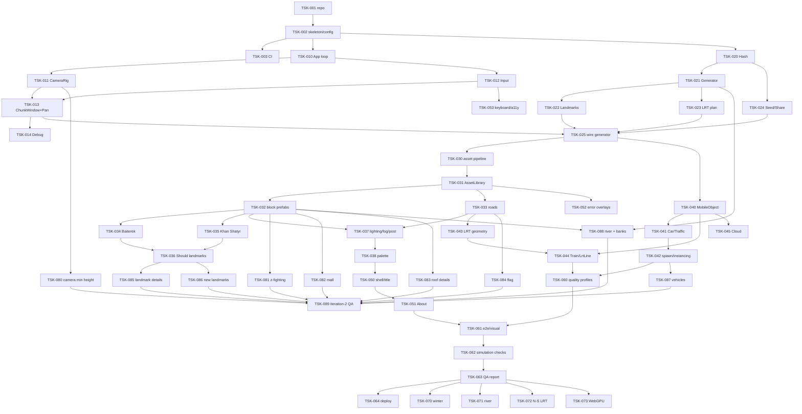

# Tasks: Astana Infinite City

## Document Information

- **Feature Name**: Astana Infinite City
- **Version**: 1.0 (Approved 2026-09-17 — имплементация идёт по волнам, см. Progress)
- **Date**: 2026-09-17
- **Author**: r.madiyev
- **Related Documents**: `requirements.md`, `design.md`, `.kiro/steering/context.md`, `.kiro/steering/reference-infinitown.md`

## Implementation Overview

Стратегия — **гибридная**: минимальный фундамент (цикл, камера, окно чанков на greybox-кубиках) → самый рискованный вертикальный срез (детерминированная генерация + сдвиг окна без скачков) → ассеты и внешний вид → мобы (машины, ЛРТ, облака) → UI → QA/перф → Could-фичи. Каждая фаза заканчивается работающим демо.

### Implementation Strategy
- Генерация (`world/`) — pure TypeScript без three.js, покрывается unit-тестами до сборки сцены.
- Greybox-режим (цветные боксы вместо префабов) живёт до конца: это fallback и инструмент отладки.
- Бюджеты (NFR-1) проверяются с фазы 3, не в конце.

### Development Approach
- **Testing:** Vitest для `world/`, `mobs/`, `api/`; Playwright e2e + visual regression с фазы 5.
- **Integration:** каждая задача завершается зелёными тестами и запуском `vite dev` (ручная проверка кадра).
- **Deployment:** GitHub Pages через Actions после TSK-064.
- **Git:** `git init` в TSK-001; ветки `feature/<tsk>`, conventional commits, без AI-атрибуции (правило пользователя).

---

## Implementation Plan

### Phase 0: Setup

- [x] **TSK-001**: Инициализировать репозиторий и тулчейн
  - Requirement: NFR-4
  - Deliverables: `package.json` (Vite, TS strict, three ≥ r184, vitest, playwright, eslint, prettier), `tsconfig.json`, `vite.config.ts`, `.gitignore`, `.editorconfig`, `README.md` (запуск), `git init` + первый коммит
  - Acceptance: `npm run dev/build/test/lint` работают; пустая страница с канвасом открывается

- [x] **TSK-002**: Скелет папок и конфиг
  - Requirement: NFR-4, design «Config»
  - Deliverables: `src/{app,world,scene,mobs,controls,render,ui,assets,api}/`, `src/config.ts` (все константы из design), `public/assets/palette.json`, `src/ui/strings.ru.ts`
  - Acceptance: импорт `config` из любого модуля; нет магических чисел в коде фазы 1

- [x] **TSK-003**: CI (lint → unit → build)
  - Requirement: NFR-4
  - Deliverables: `.github/workflows/ci.yml`
  - Acceptance: пайплайн зелёный на пустом проекте

### Phase 1: Core loop и greybox-окно

- [x] **TSK-010**: `app/App` — цикл, resize, visibility, pause/resume
  - Requirement: FR-8.5, FR-11.5
  - Deliverables: `src/app/App.ts`, `src/render/Renderer.ts` (WebGLRenderer, DPR cap, clear color)
  - Acceptance: rAF-цикл с `dt ≤ 0.05`; скрытие вкладки ставит паузу, возврат — без скачка (AC-8.3 вручную)

- [x] **TSK-011**: `controls/CameraRig`
  - Requirement: FR-8.2
  - Deliverables: `src/controls/CameraRig.ts`
  - Acceptance: fov 30, `(80,h,80)`, lookAt origin, `targetHeight` 30..140 с лерпом; unit-тест на clamp

- [x] **TSK-012**: `controls/InputManager`
  - Requirement: FR-8.1, FR-8.2, FR-8.4, NFR-2
  - Deliverables: `src/controls/InputManager.ts` (Pointer Events, wheel, pinch, keys), CSS `touch-action: none`, курсоры grab/grabbing
  - Acceptance: события `startdrag/drag/enddrag/pinch*/wheel/keys` приходят на десктопе и в эмуляции touch; страница не скроллится при жестах

- [x] **TSK-013**: `scene/ChunkWindow` (greybox) + `controls/PanControls`
  - Requirement: FR-1.1, FR-1.4, FR-8.1
  - Deliverables: `src/scene/ChunkWindow.ts` (слоты 9×9, пикеры, `move`, `emptySlots`), `src/controls/PanControls.ts` (поворот −45°, PAN_SPEED(h), инерция, raycast центра), `ChunkBuilder.buildPlaceholder` (цветной бокс + подпись gx,gy)
  - Acceptance: панорамирование бесконечно, при пересечении границы чанка `gridCoords` меняется, картинка не дёргается; `root.position` остаётся в пределах ±60 (AC-1.3)

- [x] **TSK-014**: Debug-оверлей и `window.__app`
  - Requirement: FR-12
  - Deliverables: `src/ui/Debug.ts`, `src/api/DebugApi.ts` (`stats`, `describe`, `dumpWindow`, `pan`, `step`)
  - Acceptance: `?debug=1` показывает FPS/drawCalls/gridCoords/emptySlots и границы чанков (AC-12.1, AC-12.2)

### Phase 2: Детерминированная генерация

- [x] **TSK-020**: `world/Hash` + PRNG
  - Requirement: NFR-3, FR-2
  - Deliverables: `src/world/Hash.ts` (`hash32`, `seedToInt`, `rng`), `tests/world/hash.test.ts`
  - Acceptance: детерминизм, распределение (χ²), одинаковые значения в Node и браузере (снапшот)

- [x] **TSK-021**: `world/Generator` — типы кварталов, поворот, дороги, машины, облака
  - Requirement: FR-3.1–3.3, FR-6.1, FR-7.1, NFR-7
  - Deliverables: `src/world/Generator.ts`, `src/world/types.ts` (`ChunkDescriptor`, `BlockTypeId`), правило D9, fallback-чанк, `tests/world/generator.test.ts`
  - Acceptance: AC-3.1 на 10 000 чанков (< 0,5 % исключений), AC-1.1/AC-2.1 (снапшот дампа 21×21 для `astana`), AC-3.3

- [x] **TSK-022**: `world/LandmarkPlanner`
  - Requirement: FR-4.1, FR-4.2, FR-4.6
  - Deliverables: `src/world/LandmarkPlanner.ts` (фиксированные `(0,-1)` Байтерек, `(0,1)` Хан Шатыр; правило «минимальный хеш в радиусе 6»; feature-флаги ландмарков), `tests/world/landmarks.test.ts`
  - Acceptance: AC-4.1 (100 seed), AC-4.2 (доля 1/25…1/40, дистанция ≥ 6)

- [x] **TSK-023**: `world/LrtPlanner`
  - Requirement: FR-5.1, FR-5.2
  - Deliverables: `src/world/LrtPlanner.ts`, `tests/world/lrt.test.ts`
  - Acceptance: AC-5.1 (ровно один коридор в стартовом окне), станции `gx mod 3 == 0`

- [x] **TSK-024**: `api/Seed` — URL, нормализация, share
  - Requirement: FR-2.1–2.4
  - Deliverables: `src/api/Seed.ts`, `src/ui/Share.ts` (кнопка, тост, fallback-поле), `tests/api/seed.test.ts`
  - Acceptance: AC-2.2, AC-2.3; недопустимый seed нормализуется без ошибки

- [x] **TSK-025**: Подключить генератор к окну (greybox по типам)
  - Requirement: FR-1.3, FR-3
  - Deliverables: `ChunkWindow` использует `Generator.describe`; greybox раскрашен по `block`, ландмарки — высокими боксами, ЛРТ — линией
  - Acceptance: при `seed=astana` стартовое окно повторяется после ухода/возврата (AC-1.1 через `__app.dumpWindow`), `emptySlots === 0` при 60 с панорамирования (AC-1.2)

### Phase 3: Ассеты, префабы, внешний вид

- [x] **TSK-030**: Пайплайн ассетов и каталог
  - Requirement: NFR-1 (вес), NFR-5
  - Deliverables: `tools/assets/` (скрипт скачивания Kenney City Kit Roads/Commercial/Suburban + Car Kit, `gltf-transform` optimize: Draco/Meshopt, dedup, palette PNG), `public/assets/catalog.json` (id, file, bytes, kind, materialKey, license), `CREDITS.md`
  - Acceptance: суммарный вес каталога первого экрана ≤ 8 МБ; все записи CC0; `catalog.version` присутствует

- [x] **TSK-031**: `assets/AssetLibrary` — загрузка с честным прогрессом и retry
  - Requirement: FR-11.1, FR-11.2
  - Deliverables: `src/assets/AssetLibrary.ts` (GLTFLoader + декодеры, прогресс по байтам, retry ×2), `src/ui/Loading.ts` (бар 8 px)
  - Acceptance: AC-11.1 (Fast 3G, монотонный прогресс до 100 % в момент последней загрузки), AC-11.2 (мок 500 → 3 попытки → оверлей «Повторить»)

- [x] **TSK-032**: Префабы кварталов (≥ 8 типов) и слияние геометрий
  - Requirement: FR-3.1, FR-3.4, NFR-1 (draw calls)
  - Deliverables: `src/scene/Prefabs.ts` (merge по материалу `palette`/`glass`), `public/assets/blocks.json` (placements для `residential-panel`, `residential-new`, `business-glass`, `commercial`, `park`, `square`, `campus`, `stadium`), собственные процедурные «панельки» и «стеклянные башни» (`src/scene/procedural/Buildings.ts`)
  - Acceptance: чанк = ≤ 3 меша статики; окно 9×9 ≤ 260 draw calls без мобов; ≥ 6 типов видны в стартовом окне (AC-3.3)

- [x] **TSK-033**: Префабы дорог, перекрёстков, пропсов
  - Requirement: FR-3.1, FR-3.5
  - Deliverables: `src/scene/Roads.ts` (N–S, E–W, угол, разметка, тротуары, фонари, остановки), integration-тест стыковки
  - Acceptance: AC-3.2 (стыки ≤ 0,01 юнита), машины визуально в полосе

- [x] **TSK-034**: Ландмарк Байтерек (процедурный)
  - Requirement: FR-4.3, FR-4.4
  - Deliverables: `src/scene/landmarks/Baiterek.ts` (ствол, крона-решётка, золотой шар, постамент, площадь с фонтанами и аллеей)
  - Acceptance: высота 50 юнитов, силуэт «шар на кроне» читается на стартовом кадре; ≤ 4 меша

- [x] **TSK-035**: Ландмарк Хан Шатыр (процедурный)
  - Requirement: FR-4.3, FR-4.5
  - Deliverables: `src/scene/landmarks/KhanShatyr.ts` (наклонный шатёр LatheGeometry, мачта, стеклянный материал, парковка/площадь)
  - Acceptance: высота 42, наклон 10°, полупрозрачность корректно сортируется с облаками; ≤ 4 меша

- [x] **TSK-036**: Ландмарки Should: Нур Алем, Пирамида, Ак Орда
  - Requirement: FR-4.6
  - Deliverables: `src/scene/landmarks/{NurAlem,Pyramid,AkOrda}.ts`, включение флагов в `LandmarkPlanner`
  - Acceptance: появляются вне стартовой зоны с частотой по AC-4.2; узнаваемы (ручная проверка)

- [x] **TSK-037**: Освещение, тени, туман, виньетка
  - Requirement: FR-9.1–9.3, NFR-1
  - Deliverables: `src/render/Lighting.ts` (DirectionalLight + HemisphereLight, shadow frustum по aspect, профили 2048/1024), `src/render/Post.ts` (виньетка quad), `scene.fog`
  - Acceptance: AC-9.2 (край окна не читается), тени мягкие без «акне», draw calls ≤ 300 с тенями

- [x] **TSK-038**: Палитра «Астана» и материалы
  - Requirement: FR-9.4, FR-9.5
  - Deliverables: `public/assets/palette.json` (≤ 24 цветов), `src/scene/Materials.ts` (palette/glass/gold), перекраска Kenney-палитры под нашу (`tools/assets/recolor.ts`)
  - Acceptance: AC-9.3 (все материалы из палитры); скриншот стартового кадра утверждён пользователем как эталон для visual regression

### Phase 4: Мобильные объекты

- [x] **TSK-040**: `mobs/MobileObject` — перенос между чанками
  - Requirement: FR-6.4, FR-5.5, FR-7.2
  - Deliverables: `src/mobs/MobileObject.ts`, `tests/mobs/mobile.test.ts` (математика переноса без three-рендера)
  - Acceptance: AC-6.3 (отклонение ≤ 0,05 юнита при пересечении границы); деактивация при отсутствии соседа

- [x] **TSK-041**: `mobs/Car` + `Traffic` (радар, торможение, перекрёсток, anti-deadlock)
  - Requirement: FR-6.2, FR-6.3, FR-6.5
  - Deliverables: `src/mobs/Car.ts`, `src/mobs/Traffic.ts` (соседние чанки, коллизионные точки), `tests/mobs/traffic.test.ts`
  - Acceptance: AC-6.1 (0 пересечений bbox за 60 с при 100+ машинах), AC-6.2 (0 «замёрзших» за 5 мин)

- [x] **TSK-042**: Спавн машин и `InstancedMesh`-пулы
  - Requirement: FR-6.1, FR-6.6, NFR-1
  - Deliverables: `src/mobs/InstancePool.ts`, `src/mobs/CarSpawner.ts` (из `ChunkDescriptor.cars`, ≥ 8 моделей: такси, автобус, полиция, скорая…)
  - Acceptance: 100+ машин добавляют ≤ 12 draw calls; тени от машин есть

- [x] **TSK-043**: Геометрия ЛРТ: эстакада, опоры, станции
  - Requirement: FR-5.1, FR-5.2
  - Deliverables: `src/scene/Lrt.ts` (сегмент балки по оси северной дороги, опоры каждые 15, платформа+навес+лестница на станциях), интеграция в `ChunkBuilder`
  - Acceptance: AC-5.2 (балка непрерывна между чанками, опоры не на полосах); коридор виден на стартовом кадре (AC-5.1)

- [x] **TSK-044**: `mobs/Train` + `LrtLine` (спавн, интервал, остановки)
  - Requirement: FR-5.3, FR-5.4, FR-5.6
  - Deliverables: `src/mobs/Train.ts` (состояния moving/braking/dwell/accelerating), `src/mobs/LrtLine.ts` (детерминированный спавн с шагом 4–6 чанков, две нитки), `tests/mobs/train.test.ts`
  - Acceptance: AC-5.3 (остановка ±2 юнита от центра станции, стоянка 3–5 с), AC-5.4 (1…4 поезда в окне, интервал ≥ 4 чанка)

- [x] **TSK-045**: `mobs/Cloud`
  - Requirement: FR-7
  - Deliverables: `src/mobs/Cloud.ts`, 2 процедурные/Kenney модели облаков в пуле
  - Acceptance: AC-7.1 (3–12 облаков, тени), AC-7.2 (перенос без скачка)

### Phase 5: UI-оболочка

- [x] **TSK-050**: Раскладка, шрифты, заголовок
  - Requirement: FR-10.1, FR-10.5, NFR-6
  - Deliverables: `index.html`, `src/ui/shell.css` (rem-масштаб 320 px…4K, палитра UI), `src/ui/Title.ts` (анимация ширина→буквы→fade; `prefers-reduced-motion`), self-hosted шрифты (open license)
  - Acceptance: AC-10.1; контраст ≥ 4.5:1

- [x] **TSK-051**: About: пауза, blur, закрытие (крестик/вне/Esc)
  - Requirement: FR-10.2–10.4
  - Deliverables: `src/ui/About.ts` (описание, «сделано с», credits из `CREDITS.md`, ссылка автора), мобильная полноэкранная версия
  - Acceptance: AC-10.2, AC-10.3

- [x] **TSK-052**: Оверлеи ошибок: нет WebGL2, ошибка загрузки, потеря контекста
  - Requirement: FR-11.3, FR-11.4, NFR-7
  - Deliverables: `src/ui/ErrorOverlay.ts`, обработчики `webglcontextlost/restored` в `Renderer`, fallback-чанк подключён
  - Acceptance: AC-11.3; восстановление контекста без перезагрузки; таймаут 5 с → «Перезагрузить»

- [x] **TSK-053**: Клавиатурное управление и доступность
  - Requirement: FR-8.3, NFR-6
  - Deliverables: стрелки/WASD → виртуальный drag; `?`/Esc для About; фокус-кольца; aria-лейблы кнопок
  - Acceptance: демо полностью управляемо с клавиатуры (ручной чек-лист)

### Phase 6: QA, производительность, релиз

- [x] **TSK-060**: Профили качества и автопонижение
  - Requirement: NFR-1, NFR-2
  - Deliverables: `src/render/Quality.ts` (`high/medium/low`, `?quality=`, детект mobile, автопонижение при медиане < 25 FPS)
  - Acceptance: на телефоне среднего уровня медиана ≥ 30 FPS (ручной замер, evidence в QA-отчёте); desktop ≥ 50

- [x] **TSK-061**: E2E и visual regression (Playwright)
  - Requirement: AC-1.2, AC-8.1, AC-8.2, AC-9.1, AC-10.*, AC-11.*
  - Deliverables: `e2e/*.spec.ts`, эталоны `e2e/__screenshots__/astana-start.png` (summer)
  - Acceptance: все перечисленные AC зелёные в Chromium и WebKit

- [x] **TSK-062**: Симуляционные проверки в ускоренном времени
  - Requirement: AC-5.4, AC-6.1, AC-6.2
  - Deliverables: `e2e/simulation.spec.ts` (`__app.step(dt)` × N)
  - Acceptance: 0 пересечений, 0 «замёрзших», поезда 1…4

- [ ] **TSK-063**: QA-отчёт и подтяжка спеки
  - Requirement: все FR/NFR
  - Deliverables: `.kiro/specs/astana-infinite-city/qa-evidence.md` (таблица AC → тест/скриншот/замер), обновлённые статусы в `requirements.md`, AC-4.3 (узнаваемость, 5 респондентов)
  - Acceptance: все Must закрыты evidence; Should закрыты или перенесены с обоснованием

- [ ] **TSK-064**: README, деплой на GitHub Pages
  - Requirement: Deployment (design)
  - Deliverables: `.github/workflows/deploy.yml`, `README.md` (ссылка на демо, seed-шаринг, управление, credits)
  - Acceptance: демо доступно по публичному URL, ассеты кэшируются по хешу

### Phase 7: Could (после утверждения приоритетов)

- [ ] **TSK-070**: Зимний режим `?season=winter`
  - Requirement: FR-13 · Deliverables: `palette.winter.json`, снег на крышах/земле (доп. геометрия/цвет), небо/свет · Acceptance: AC-13.1 + отдельный visual-эталон

- [ ] **TSK-071**: Река Есиль с мостами — **заменена TSK-088** (FR-14 повышен до Must в итерации 2)

- [ ] **TSK-072**: N–S коридоры ЛРТ и развязки
  - Requirement: FR-5 (расширение) · Acceptance: пересечение коридоров без наложения балок

- [ ] **TSK-073**: WebGPU за флагом `?gpu=1`
  - Requirement: D6 · Acceptance: тот же кадр (visual diff ≤ 2 %) при WebGPU, fallback на WebGL

### Phase 8: Итерация 2 — обратная связь пользователя (2026-09-17)

Источник: сообщение пользователя (баги: камера сквозь здания, «трава багается»; фичи: убрать завод, автобусы Астаны, популярные здания и ТЦ, детали ландмарков, Яндекс-такси, отсылки к Астане, антенны на крышах, нормальный флаг, река с мостом, роботы у Expo). Спека: `bugfix.md`, FR-14 (Must), FR-15, FR-16, design «Итерация 2».

- [ ] **TSK-080**: BUG-1 — камера выше застройки
  - Requirement: bugfix BUG-1, AC-8.2
  - Deliverables: `CAMERA.HEIGHT_MIN` 60, этажность регулярных зданий ≤ 12, unit-тест `HEIGHT_MIN > max(LANDMARKS.HEIGHT) + NEAR`, e2e AC-8.2 по константам, visual-эталон `astana-low.png`
  - Acceptance: на минимальной высоте ни одно здание не режется near-плоскостью (скриншот)

- [ ] **TSK-081**: BUG-2 — z-fighting газонов площади и аудит слоёв
  - Requirement: bugfix BUG-2
  - Deliverables: слои покрытия с шагом ≥ 0.03 в `BlockPrefabs` (square, park, campus, market), visual-эталон `astana-square.png`
  - Acceptance: газонные вставки без просвечивания на скриншоте

- [ ] **TSK-082**: Убрать завод → ТЦ (`mall`)
  - Requirement: FR-15.1, AC-15.1
  - Deliverables: `world/types` (`mall` вместо `industrial`), `Buildings.mall`, `BlockPrefabs.mall`, снапшот генератора
  - Acceptance: AC-15.1 (unit по дампу 21×21)

- [ ] **TSK-083**: Детали крыш
  - Requirement: FR-15.5, AC-15.4
  - Deliverables: `Buildings.roofDetails` (антенны, кондиционеры, баки, тарелки, короба), счётчик покрытия
  - Acceptance: AC-15.4 (unit: ≥ 40 % из 200 зданий)

- [ ] **TSK-084**: Флаг Казахстана
  - Requirement: FR-15.4, AC-15.3
  - Deliverables: `Props.flagpole` (полотно, солнце с лучами, орёл-силуэт, орнамент)
  - Acceptance: AC-15.3 (unit: цвета в батче), крупный план в visual-эталоне площади

- [ ] **TSK-085**: Детализация существующих ландмарков + роботы у Expo
  - Requirement: FR-15.3
  - Deliverables: `landmarks/{Baiterek,KhanShatyr,NurAlem,Pyramid,AkOrda}.ts` (детали по design C8-дополнению), `Props.robot`
  - Acceptance: visual-эталоны 5 ландмарков обновлены, ≥ 3 робота у Нур Алем

- [ ] **TSK-086**: Новые ландмарки Астаны
  - Requirement: FR-15.2, AC-15.2
  - Deliverables: `landmarks/{AbuDhabiPlaza,AstanaOpera,HazretSultan,MegaSilkWay}.ts` (Must), `{NorthernLights,TransportTower,KazMunayGas}.ts` (Should); `LANDMARKS.ENABLED/HEIGHT`, тесты планировщика (частоты, минимальная дистанция)
  - Acceptance: AC-15.2 — visual-эталон каждого через `__app.centerOn`

- [ ] **TSK-087**: Автобус Астаны и Яндекс-такси
  - Requirement: FR-16, AC-16.1, AC-16.2
  - Deliverables: `mobs/Vehicles` (bus-astana, yandex-econom/business/premier, suv-white, sedan-blue), `TRAFFIC.MODEL_POOL` 12, `GEN.VERSION` 2, снапшоты
  - Acceptance: AC-16.1 (unit), AC-16.2 (visual)

- [ ] **TSK-088**: Река Есиль с мостами и берега (заменяет TSK-071)
  - Requirement: FR-14, FR-15.6, AC-14.1, AC-15.5
  - Deliverables: `world/RiverPlanner`, `RIVER` в `config`, `block = 'river'`, префабы воды/набережной/моста (`BlockPrefabs.river`, `Roads` мост N–S), веса берегов в `Generator.rawBlockType`, unit-тесты (ряды, нет совпадений с ЛРТ, доли типов по берегам), симуляция машин на мосту
  - Acceptance: AC-14.1 (симуляция: 0 пересечений на мосту), AC-15.5 (unit), visual-эталон `astana-river.png`

- [ ] **TSK-089**: Отсылки к Астане, QA и эталоны итерации 2
  - Requirement: FR-15 (D11), NFR-3
  - Deliverables: `CLOUD.SPEED` 4 (ветер степи), обновлённые visual-эталоны, `qa-evidence.md` (раздел «Итерация 2»), README/credits
  - Acceptance: все e2e зелёные, эталоны обновлены, QA-таблица закрывает AC-14…AC-16

---

## Dependency Graph

**Критический путь:** 001 → 002 → 010 → 012 → 013 → 025 → 030 → 031 → 032 → 037 → 038 → 050 → 051 → 061 → 062 → 063 → 064.
**Параллелизуемо:** фаза 2 (генерация) — параллельно фазе 1; ландмарки (034/035) — параллельно дорогам/свету; мобы (040–045) — параллельно UI (050–053).

## Оценка (ориентир, один разработчик)

| Фаза | Задачи | Оценка |
|---|---|---|
| 0 Setup | 001–003 | 0.5 дня |
| 1 Core/greybox | 010–014 | 2–3 дня |
| 2 Генерация | 020–025 | 2–3 дня |
| 3 Ассеты/вид | 030–038 | 5–7 дней |
| 4 Мобы | 040–045 | 4–5 дней |
| 5 UI | 050–053 | 2 дня |
| 6 QA/релиз | 060–064 | 3 дня |
| 7 Could | 070, 072, 073 | по решению (071 → 088) |
| 8 Итерация 2 | 080–089 | 4–6 дней |
| **Итого Must+Should** | | **≈ 19–24 рабочих дня** |

## Progress

| Task | Status | Notes |
|---|---|---|
| TSK-001 | Complete | 2026-09-17, three r186, vite 8, vitest 5; коммит chore: init toolchain |
| TSK-002 | Complete | 2026-09-17, config.ts + palette.json + strings.ru.ts, 32 unit-тестов |
| TSK-003 | Complete | 2026-09-17, ci.yml lint→test→build |
| TSK-010 | Complete | 2026-09-17: App loop, Renderer, pause/visibility; тайминг через performance.now (без Clock) |
| TSK-011 | Complete | 2026-09-17: CameraRig: fov 30, h 30..140, старт 140, лерп τ 0.3 с; unit-тесты |
| TSK-012 | Complete | 2026-09-17: InputManager: Pointer Events, wheel, pinch, клавиши, курсор grab/grabbing |
| TSK-013 | Complete | 2026-09-17: ChunkWindow 9×9 + LRU 169 + очередь ≤2/кадр; PanControls: точное 1:1 по плоскости земли, инерция (EMA, clamp 300 юн/с), recenter → move |
| TSK-014 | Complete | 2026-09-17: DebugOverlay (fps/draw/tris/grid/emptySlots/builds/cacheHits) + window.__app (describe/dumpWindow/stats/pan/step) |
| TSK-020 | Complete | 2026-09-17: hash32 (murmur3-подобный), hashUnit, seedToInt (FNV-1a), mulberry32; χ²-тест, снапшот |
| TSK-021 | Complete | 2026-09-17: Generator: 9 регулярных типов + stadium (Rare) + landmark; классы чётности (D9), 0 нарушений AC-3.1 на 10k; кэш 4096 |
| TSK-022 | Complete | 2026-09-17: LandmarkPlanner: per-type правило редкости (P=1/74, R=5), подавление соседей, фиксированные (0,-1)/(0,1), стартовая зона R=4 |
| TSK-023 | Complete | 2026-09-17: LrtPlanner: коридор gy≡0 (mod 8), станции gx≡0 (mod 3) |
| TSK-024 | Complete | 2026-09-17: api/Seed: parseFlags, normalizeSeed, generateSeed, buildShareUrl, syncSeedToLocation (replaceState); Share-кнопка — в TSK-050 |
| TSK-025 | Complete | 2026-09-17: GreyboxBuilder: боксы по типу, ландмарки-башни, эстакада/опоры/станции ЛРТ; проверено в браузере: 81 чанк, ~80–110 draw calls, 165 FPS, emptySlots=0 при панорамировании |
| TSK-030 | Complete | 2026-09-17: Переориентировано (design D3): процедурная библиотека scene/procedural/* (GeometryBatch, Templates, Props, Buildings, Roads, Lrt); без внешних ассетов |
| TSK-031 | Complete | 2026-09-17: Прогресс/ретраи ассетов не нужны (нет сетевых ассетов); загрузка палитры — loadPalette; оверлеи ошибок — TSK-052 |
| TSK-032 | Complete | 2026-09-17: BlockPrefabs: 9 регулярных типов + стадион, слияние в 1 непрозрачный + 1 стеклянный меш; окно 9×9 ≈ 90 draw calls, ~220k tris |
| TSK-033 | Complete | 2026-09-17: Roads: полотно, тротуары, осевые/краевые линии, зебры, фонари, остановки, светофоры/клумбы; стыковка по кромкам ±30 |
| TSK-034 | Complete | 2026-09-17: Baiterek: ствол, решётчатая крона (32 распорки), золотой шар r=7, площадь с 4 фонтанами; высота 50 |
| TSK-035 | Complete | 2026-09-17: KhanShatyr: наклонный стеклянный конус (cone24, −9°), мачта, 12 вант, внутренний корпус, парковка; высота 42 |
| TSK-036 | Complete | 2026-09-17: NurAlem (сфера на подиуме), Pyramid (стеклянная вершина), AkOrda (купол, шпиль, колоннада); LANDMARKS.ENABLED = 5 типов |
| TSK-037 | Complete | 2026-09-17: Lighting: DirectionalLight + HemisphereLight, PCFSoft 2048/1024, фрустум по aspect; Fog 225/325; Vignette-проход |
| TSK-038 | Complete | 2026-09-17: Palette: 24 цвета в palette.json, Materials (opaque/glass, vertexColors); визуальный эталон — TSK-061 |
| TSK-040 | Complete | 2026-09-17: MobileObject.wrap/moveTo: сворачивание по модулю 60; unit-тесты переноса (AC-6.3) |
| TSK-041 | Complete | 2026-09-17: Car + Traffic.detects: сектор впереди-справа (−45°, dot>0.5), 2 коллизионные точки, правило перекрёстка, anti-deadlock 2 с; unit-тесты |
| TSK-042 | Complete | 2026-09-17: MobSystem + InstancePool: 8 моделей машин (седан, хэтчбек, SUV, такси, автобус, грузовик, фургон, полиция), спавн/деспавн по входу/выходу чанка из окна |
| TSK-043 | Complete | 2026-09-17: Lrt.ts: балка с рельсами, опоры каждые 15 на разделительной полосе, станции с платформами, навесом, лестницей |
| TSK-044 | Complete | 2026-09-17: Train: состояния moving/braking/dwell/accelerating, стоянка 3–5 с, интервал по лидеру; спавн gx≡0 (mod 5) восток / ≡2 запад; unit-тесты |
| TSK-045 | Complete | 2026-09-17: Cloud: дрейф (−1,0,0.3)·3 юн/с·(1..1.25), дыхание ±5 %, тени; скрываются при камере ниже 72 |
| TSK-050 | Complete | 2026-09-17: index.html + ui/shell.css (rem-корень clamp 15…21 px, палитра через CSS-переменные из palette.json, CSP-мета), ui/Title (буквы со стаггером, 500 мс → 7 с → fade 900 мс; prefers-reduced-motion → is-static), ui/Share + ui/Toast (clipboard → тост 2 с, иначе `<input readonly>`); шрифты — системный стек (self-hosted не подключались: без сетевой загрузки в сессии); unit-тесты title/share |
| TSK-051 | Complete | 2026-09-17: ui/About: pause/resume, blur(6px) brightness(0.7) на канвасе, закрытие крестиком/подложкой/Esc, `?` переключает, фокус-ловушка, inert на канвасе/HUD; credits из CREDITS.md (?raw), «сделано с», автор (UI.AUTHOR); < 700 px — во весь экран (проверено 375×812); unit-тесты about |
| TSK-052 | Complete | 2026-09-17: ui/ErrorOverlay (alertdialog; нет WebGL2 + ссылка, ошибка загрузки + «Повторить», потеря контекста: полупрозрачный оверлей → через 5 с «Перезагрузить»), ui/Loading (полоса 8 px по факту ресурсов), app/retry (500/1500 мс), ChunkWindow.buildSafely → fallback-чанк при исключении в префабе; проверено WEBGL_lose_context в браузере: восстановление без перезагрузки |
| TSK-053 | Complete | 2026-09-17: стрелки/WASD (PanControls), `?`/Esc (About), Esc для поля ссылки, focus-visible кольца, aria-label/aria-expanded/aria-controls на кнопках, role=img + aria-label на канвасе, role=toolbar HUD; ручной чек-лист пройден в встроенном браузере |
| TSK-060 | Complete | 2026-09-17: render/Quality: медиана FPS за 5 с < 25 → тени 1024 → DPR 1 → P_CAR 0.2 (шаги-пустышки пропускаются, `?quality=` отключает); unit-тесты; `__app.downgrade()`; ручной замер на телефоне — в QA-отчёте (TSK-063) |
| TSK-061 | Complete | 2026-09-17: e2e/{load,controls,ui,visual,perf}.spec.ts на prod-сборке (Chrome channel локально, Chromium в CI, WebKit по PW_WEBKIT=1); эталоны e2e/__screenshots__/astana-{start,baiterek,khan-shatyr}.png; 17/17 зелёных; найден и исправлен BUG-5 (префетч кольца) |
| TSK-062 | Complete | 2026-09-17: e2e/simulation.spec.ts (5 мин, сдвиги окна каждые 45 с: 0 пересечений, 0 заторов, поезда 1…4, интервал ≥ 4 чанков) + unit-симуляции (2 мин со сдвигами, 3 мин статичное окно); найдены и исправлены BUG-3 (тор мобов) и BUG-4 (перекрёстки: стоп-линия, фазы, зазор) |
| TSK-063 | In Progress | qa-evidence.md пишется после фазы 8 (эталоны и AC итерации 2) |
| TSK-064 | In Progress | deploy.yml готов (Pages: lint → test → build → e2e smoke → deploy); README/ссылка на демо — после фазы 8 |
| TSK-070 | Pending | Could |
| TSK-071 | Superseded | → TSK-088 (FR-14 Must) |
| TSK-072 | Pending | Could |
| TSK-073 | Pending | Could |
| TSK-080 | Pending | BUG-1 |
| TSK-081 | Pending | BUG-2 |
| TSK-082 | Pending | |
| TSK-083 | Pending | |
| TSK-084 | Pending | |
| TSK-085 | Pending | |
| TSK-086 | Pending | |
| TSK-087 | Pending | |
| TSK-088 | Pending | заменяет TSK-071 |
| TSK-089 | Pending | |

**Статусы:** Pending / In Progress / Complete. Обновлять вместе с чекбоксами.
