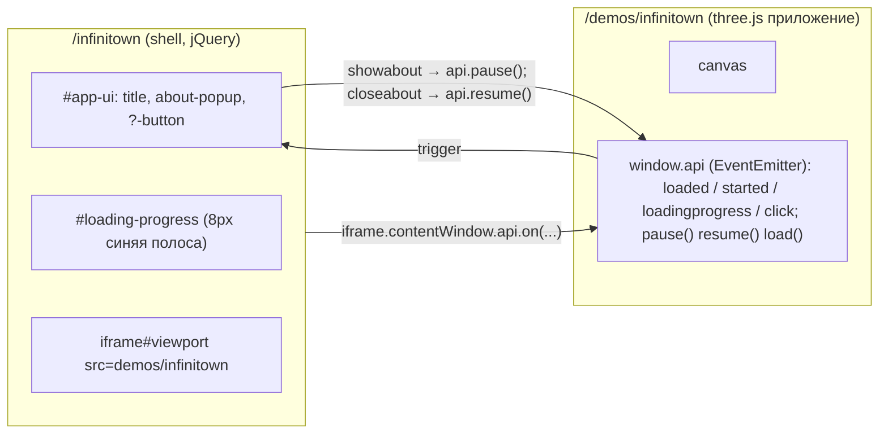
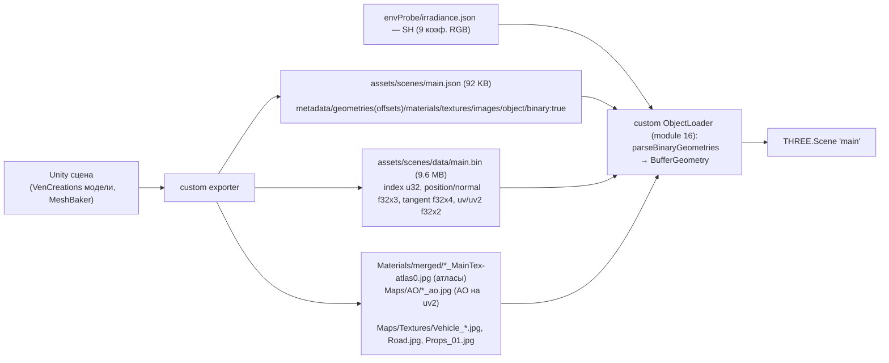
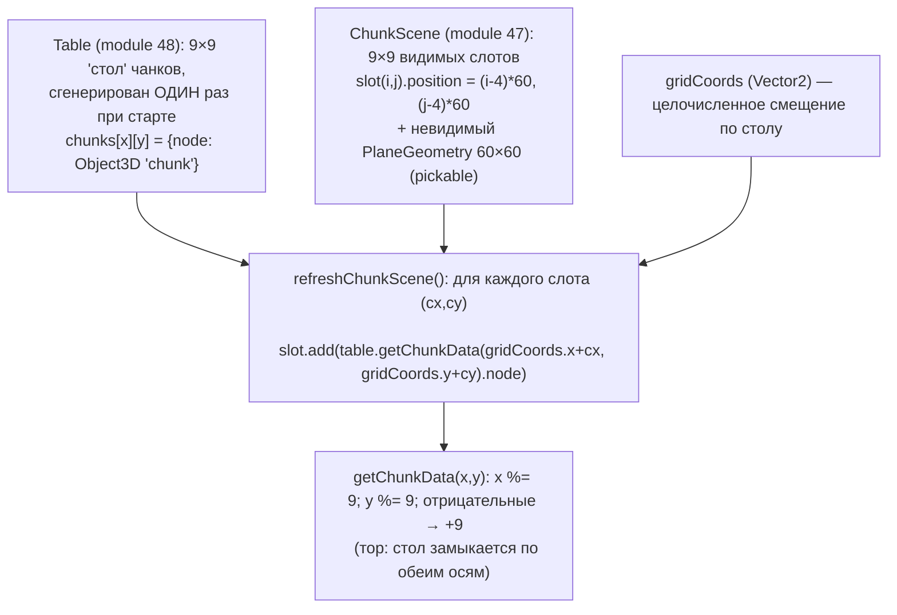

# Reference: Infinitown (Little Workshop, 2016–2018) — разбор кода и дизайна

Источник: https://demos.littleworkshop.fr/infinitown
Дата разбора: 2026-09-17. Метод: живой сайт во встроенном браузере (network, DOM, runtime-хуки в THREE), скачанные бандлы (деобфусцированы js-beautify), scene JSON, GLSL.
Извлечённые исходники лежат в `research/infinitown/` (см. раздел 10).

---

## 1. Что это

Процедурный «бесконечный» низкополигональный город: камера в псевдо-изометрии (перспектива, 45° по yaw, высота 30–140), drag-панорамирование, машины ездят по дорогам и тормозят друг перед другом, облака плывут. Стек: **Three.js (кастомный билд ~r80–r83, 2016)**, jQuery 3.2.1, Browserify. Модели: VenCreations (Unity Asset Store), сцена собрана в **Unity** и экспортирована собственным экспортером в JSON+bin, чистка в Blender.

Главная идея (из About): *«генерируем конечную сетку случайных кварталов, затем точка обзора заворачивается по этой сетке — получается иллюзия бесконечного города»*.

---

## 2. Архитектура страницы: shell + iframe

- **Shell** (`/js/main.min.js`, 7 модулей): jquery-touch-events (tap), underscore, jquery.easing, `demos.json`-конфиг (name/summary/description/twitter), EventEmitter, класс `App` (loadDemo/onDemoLoaded/showAbout/animateTitle), entry.
- Демо выбирается по последнему сегменту URL (`location.href` после `/`), грузится в iframe `demos/<slug>`; iframe при загрузке отдаёт `window.api`, shell подписывается на события и вызывает `api.load()`.
- **App** внутри iframe: `js/lib/three.min.js` (516 KB, кастомный, `THREE.REVISION` вырезан) + `js/main.min.js` (268 KB, Browserify, 60 модулей). Если `window.parent === window` — стартует сам (можно открыть iframe отдельно).

---

## 3. Пайплайн ассетов (Unity → JSON+bin → three.js)

- `main.json` — формат three.js ObjectLoader, но геометрии описаны **смещениями в один бинарник** (`offsets: {index:[a,b], position:[..], normal, tangent, uv, uv2}`), `"binary": true`. Загрузчик режет `ArrayBuffer.slice`, index → `Uint32Array`, остальное → `Float32Array`.
- Материалы: **все 38 — `customType: "PBRMaterial"`** (`color, map, aoMap, metalFactor 0, glossFactor 0.5, aoFactor 1, environment: "envProbe", exposure 1, occludeSpecular`). `THREE.MaterialLoader.prototype.parse` перехвачен (module 13) и создаёт кастомный `PBRMaterial` (module 22) с шейдерами `pbr.vs/pbr.fs`.
- Сцена: 29 геометрий (13 кварталов ~30–65k вершин каждый, 2 дороги, 3 перекрёстка, гидрант, 9 машин ~5k вершин, 2 облака), 50 текстур, 0 анимаций. Узлы `bakers/*_baker/MeshBaker` и `CombinedMesh-MeshBaker-mesh` — следы Unity **Mesh Baker**: каждый квартал заранее слит в **1 меш + 1 атлас + 1 AO-карта = 1 draw call**.
- Текстуры: атласы — плоские цветовые заливки с вывесками (CLOTHING, SHOES, PIZZA, Fried Chicken…), AO-карты запечены в Unity (uv2). Служебные: `white.png`, `normal.png` (1×1 заглушки), `vignetting.png` (512², белый центр → тёмные углы).
- Освещение окружения: только **SH-иррадианс** (`irradiance.json`, 27 float, домножаются на SH-константы в module 12); спекулярных cubemap/panorama **не грузят** (в шейдере отражения заменены константой).

---

## 4. Механика «бесконечности» (ядро)

**Пошагово (modules 43, 47, 48, 57):**

1. `Table._generate()` заполняет 9×9 клеток: в каждую — случайный квартал (`_getRandomBlockAt`), который **не совпадает с соседями** (8 соседей через `_forEachNeighboringChunk`, до 100 попыток), стадион (`block_8_merged`) — максимум один на стол. Квартал поворачивается на случайный угол `k·90°`.
2. В чанк (`Object3D name="chunk"`, 60×60 юнитов) добавляются: квартал в (0,0,0); **4 полосы дорог**, клонированные и слитые в одну геометрию (`geometry.join`, кастомный метод) по краям x=-30 / z=-30; случайный **перекрёсток** в (-30, 0, 30). Т.е. чанк = квартал + дорога с двух сторон + угол.
3. На каждую из 4 полос с вероятностью **0.35** (мобилки 0.2) ставится машина (`Car`, module 46); с вероятностью 0.35 — облако (`Cloud`, module 49) на высоте y=60.
4. `ChunkScene` — 9×9 пустых слотов + невидимые плоскости-пикеры; `refreshChunkScene()` кладёт в слот узел чанка из стола по адресу `gridCoords + слот`. Поскольку **один и тот же Object3D нельзя иметь в двух родителях**, при 9×9 стола и 9×9 окна каждый чанк виден ровно один раз — размер стола = размер окна не случаен.
5. **Панорамирование** (`Controls`, module 57): drag → `offset` (px) → поворот на **-45°** (камера стоит по диагонали) → умножение на `PAN_SPEED` (0.1; мобилки 0.4) → лерп 0.05 → `chunkScene.position = sceneOffset + worldOffset`. Каждый кадр **raycast из центра экрана** по пикерам: если под центром оказался не центральный слот, `sceneOffset` сдвигается на `centeredX*60, centeredY*60` (сцена «перепрыгивает» обратно на чанк) и `trigger("move", dx, dy)` → `gridCoords += (dx,dy)` → `refreshChunkScene()`. Визуально ничего не дёргается: содержимое слотов переназначено ровно на тот же мировой сдвиг.
6. **Мобильные объекты** (`MobileObject`, module 55): машина/облако живут внутри чанка; каждый кадр считается «табличная позиция» (`chunk.tableX*60 + local`), через `euclideanModulo(pos+40, 540)` определяется чанк стола, в котором объект должен находиться; если он другой — `newChunk.add(this)` и локальная позиция сворачивается по модулю 60. Так машина, уехавшая за край стола 9×9, появляется с противоположной стороны и продолжает движение в правильном чанке (тор).

**Параметры** (`config`, module 50):

| Ключ | Значение |
|---|---|
| TABLE_SIZE / CHUNK_COUNT / CHUNK_SIZE | 9 / 9 / 60 |
| PAN_SPEED | 0.1 (mobile 0.4) |
| FOG_NEAR / FOG_FAR / FOG_COLOR | 225 / 325 / `#a2e8ff` |
| SHADOWMAP_RESOLUTION / TYPE | 2048 (mobile 1024) / PCF |
| MAX_PIXEL_RATIO | 1.25 (mobile ≤1.5) |
| RANDOM_SEED | "infinitown" (seedrandom), **выключен** — Math.random |
| CAMERA_ANGLE | 0.5 (не используется) |

---

## 5. Машины и облака (жизнь города)

**Car** (module 46, наследует MobileObject):
- Ставится на полосу: копирует позицию/поворот полосы, смещение ±3.4 по оси полосы, случайное направление (50% — разворот на 180°). `direction` округляется до осевого вектора.
- `maxSpeed 0.25` юнита/кадр, ускорение/торможение `0.0075`/кадр.
- **Радар**: радиус 20; `collisionPoints` — 2 точки на bbox меша (перед/зад); соседняя машина «видна», если она в радиусе и `dot(dir повернутый на -45°, toOther) > 0.5` (конус впереди-справа, правостороннее движение). Опрашиваются машины своего чанка и 8 соседних (`getNeighboringCars`).
- Пропуск на перекрёстке: если я на перекрёстке (`x,z ∈ (-40,-20)`), а другая нет и направления разные — не тормозим.
- Deadlock-защита: при полной остановке через 2 с `minSpeed = 0.25*maxSpeed` (ползёт).
- Позиция округляется до 2 знаков (`roundVector`) — стабильность модульной арифметики.

**Cloud** (module 49): позиция случайная в чанке, y=60, направление (-1, 0, 0.3), скорость 0.05·(1..1.25), «дыхание» масштаба ±5% по sin, не получает тени (receiveShadow off), но отбрасывает.

Наблюдённый runtime: **81 чанк, 514 мешей, 107 машин, 25 облаков, 189 уникальных геометрий, 38 материалов, ~242 draw calls/кадр** (включая shadow pass) при 2048² карте теней.

---

## 6. Камера, ввод, рендер

- **Камера** (module 58): `PerspectiveCamera(fov 30, aspect, near 10, far 400)`, `position (80, 200→140, 80)`, `lookAt(0,0,0)` каждый кадр; высота — `targetHeight` 30..140, колесо/пинч меняют «t» (0..1000) → `mapLinear` → плавно `y += 0.05*(target - y)`. Малый FOV + далёкая камера = почти ортографический «изометрический» вид.
- **InputManager** (module 52): mouse down/up/move/leave, touch (1 палец — drag, 2 — pinch), `jquery-mousewheel`; события `startdrag/drag/enddrag/pinchstart/pinchchange/pinchend/mousewheel`. Курсор: `grab` → `grabbing` (класс на body).
- **Renderer** (module 1, базовый `App`): `WebGLRenderer({alpha, antialias, canvas})`, `autoClear:false`, pixelRatio ≤ 1.25, clearColor = FOG_COLOR, `shadowMap PCFSoft` (в шейдере — PCF), Page Visibility API → pause/resume, TWEEN.update, свой Clock. Кадр: `clear()` → `render(scene, camera)` → **виньетка** (module 60: full-screen quad 2×2 с `MeshBasicMaterial{map: vignetting.png, transparent, opacity 0.25}` через ortho-камеру).
- **Солнце** (module 43): `DirectionalLight(#fff5da, 1.25)` в (100,150,-40), тень: `mapSize 2048`, `bias -0.001`, `radius 1`, ortho-фрустум `near 50 / far 300`, ширина зависит от aspect: `i = 75*max(aspect,1.25)`, `left -0.9i, right 1.3i, top i, bottom -i` (пересчёт на resize).
- Материалы в чанках получают `defines: USE_FOG, USE_SHADOWMAP, SHADOWMAP_TYPE_PCF`, `receiveShadow` всем кроме облаков.

---

## 7. Шейдинг (pbr.vs / pbr.fs — 172 + 1134 строки)

Шейдер — производная от Sketchfab-подобного PBR (имена `sTextureAlbedoMap`, `uDiffuseSPH`, `uEnvironmentTransform`, `sSpecularPBR`, LUV/RGBM-декодеры, `uMode` debug-режимы 1..6), **урезанная под этот проект** (комментарии «Optimization just for this experiment»):

- `#define MOBILE`, `#define LUV`; ветки CUBEMAP/PANORAMA не активны.
- **Диффуз IBL** — `computeIBLDiffuseUE4(N, albedo, envTransform, uDiffuseSPH[9])` (SH второго порядка).
- **Спекуляр окружения** заменён константой `vec3(0.004, 0.004, 0.012)` («нет отражающих поверхностей и очень простое окружение»).
- **Солнце**: Lambert + GGX, но `prepGGX = vec4(0.251, 0.063, 0.125, 1.0)` захардкожен, а `dotNL`, `eyeLightDir`, `computeGGX` **посчитаны в вершинном шейдере** (нет normal map → можно) и переданы varying'ами.
- Тень: стандартный three.js `getShadow` (PCF 3×3 c `shadowRadius`), умножает только диффуз солнца.
- AO с `uv2`, `mix(1, ao, uAOPBRFactor)`; albedo sRGB→linear, вывод linear→sRGB; `uColor` умножается на карту; `uContrast 1.1` объявлен, но не применяется.
- Туман: `smoothstep(fogNear, fogFar, fogDepth)` → mix с `fogColor` (совпадает с clearColor → горизонт растворяется в небе).
- `ALPHATEST` → discard; облака `transparent, opacity 0.98`.

Итог: дёшево (1 направленный свет, SH, без env-спекуляра, без normal map), но выглядит «PBR-мягко» благодаря запечённому AO, SH-заливке и PCF-тени.

---

## 8. Дизайн UI и визуальный язык

**Визуал 3D**
- Low-poly, flat-shaded, пастельная палитра кварталов (кирпично-красный, оливковый, голубой, бежевый, серый), ярко-зелёные парки, светло-серый асфальт с белой разметкой, небо/туман светло-голубое `#a2e8ff`.
- Вид сверху под ~45°, кадр всегда заполнен; тени мягкие, длинные (солнце низко сбоку), AO в углах зданий; виньетка 25% по краям кадра; лёгкий туман скрывает край сетки 9×9 (540×540 юнитов, камера видит меньше).
- Движение: машины, облака (дрейф + пульсация масштаба) — «город живой», при этом нет людей/анимаций персонажей.

**UI (shell)**
- Шрифты: **Miso** (заголовки, uppercase, bold) + **Work Sans** (текст, 400/600). Root `font-size` масштабируется медиазапросами 10px (≤320) … 28px (≥2500) — весь UI в `em`.
- Цвета: текст `#303030`, акцент `#4d8be9` (ссылки, прогресс-бар), фон body `#303030`, попап белый.
- Заголовок `#main-title`: чёрная полупрозрачная плашка `rgba(0,0,0,.6)`, белый Miso 3em; анимация «печатной машинки»: ширина 0→W за 1 с `easeOutQuart`, затем буквы по одной 500 мс, через 7 с fadeOut 2 с.
- Кнопка «?» (`about.png`) справа сверху; попап About: `max-width 30em`, `padding 2.25em 3em`, `line-height 1.75`, появляется `scale(.75)→1 + opacity` 300 мс ease-out; одновременно iframe получает `filter: blur(5px) brightness(.5)` (transition 300 мс) и **демо ставится на паузу** (`api.pause()`); клик по канвасу закрывает попап. Мобильная версия — попап на весь экран, `font-size 150%`.
- Загрузка: 8px синяя полоса сверху, прогресс = `itemsLoaded / 57` (жёстко зашитое число ресурсов), по `loaded` — 100% и показ UI через 20 мс.
- Share: попап-окна `window.open` фикс. размеров (Twitter/Facebook/LinkedIn), иконки-спрайт `sharing.png` с opacity .25 → .8.

---

## 9. Карта модулей внутреннего бандла (Browserify, entry = 53)

| # | Назначение |
|---|---|
| 1 | Базовый `App`: WebGLRenderer, pixelRatio, Clock, rAF-цикл, pause/resume, FPS/DC-счётчики |
| 2 | FPS-счётчик |
| 3 | EventEmitter (on/off/trigger, Backbone-style) |
| 4 | Заглушки DataTexture (white/black/normal) |
| 5–6 | Таймеры на TWEEN |
| 7 | OrbitControls (в финале **не используется**) |
| 8 | GridHelper-обёртка (не используется) |
| 9, 11 | Загрузчики бинарных cubemap/panorama (не используются) |
| 10 | XHR ArrayBuffer loader (main.bin) |
| 12 | SH irradiance loader + домножение на SH-константы |
| 13 | Патч `MaterialLoader.parse`: PBRMaterial / MatcapMaterial / Skybox |
| 14 | Batch-загрузчик (`Promise.props` — bluebird) |
| 15 | Asset registry/кэш: пути, `loadScene/loadTextures/loadSH/loadGeometries`, `getTexture/getSH/getGeometry` |
| 16 | Кастомный ObjectLoader с `parseBinaryGeometries` |
| 17 | `loadScene`: камера из файла, GridHelper/AxisHelper (debug), фикс DirectionalLight, реестр материалов сцены |
| 18 | Полифиллы, `Function.prototype.inherit/mixin`, `window.isMobile/iOS`, underscore |
| 19 | TWEEN.js |
| 20–23 | MatcapMaterial, базовый ShaderMaterial с `onPropertyChange`, **PBRMaterial**, RawShaderMaterial |
| 24 | bluebird |
| 26–32 | path, process, es6-promise, url-join |
| 33 | jquery-mousewheel |
| 34 | underscore |
| 35–42 | seedrandom (+ alea, xor128, xorwow, xorshift7, xor4096, tychei) |
| **43** | **Infinitown App**: Table + ChunkScene + Controls + свет + виньетка, `refreshChunkScene` |
| 44 | GLSL: basic.vs/fs, pbr.vs/fs |
| 45 | Камера с OrbitControls (не используется) |
| **46** | **Car** (движение, радар, торможение) |
| **47** | **ChunkScene** (9×9 слотов + пикеры) |
| **48** | **Table** (генерация стола, чанки, машины, облака, соседи) |
| 49 | Cloud |
| 50 | config |
| 51 | список служебных текстур |
| 52 | InputManager (mouse/touch/pinch/wheel) |
| 53 | entry: загрузка (textures → SH → scene) → `App.start(scene)`, `window.api` |
| 54 | BasicMaterial (basic.vs/fs) |
| **55** | **MobileObject** — перенос между чанками по модулю |
| 56 | OrthographicCamera (не используется) |
| **57** | **Controls** — drag → offset, raycast центра, событие `move` |
| 58 | Камера с `targetHeight` |
| 59 | random (seedrandom/Math.random), `roundVector`, `getTablePosition` |
| 60 | Vignetting post-pass |

---

## 10. Извлечённые артефакты (`research/infinitown/`)

- `shell/` — index.html, main.css (полный UI-стайл), main.beautified.js, about.png
- `app/index.html`, `app/main.css`, `app/js/main.beautified.js` (9 877 строк), `app/js/main.min.js`, `app/js/lib/three.min.js` (кастомный билд)
- `app/shaders/{pbr.vs, pbr.fs, basic.vs, basic.fs}`
- `app/assets/scenes/main.json` + `main.summary.md` (таблица геометрий/материалов/дерева), `envProbe/irradiance.json`
- `app/textures/{white,normal,vignetting}.png`, `app/samples/` (атлас квартала, AO, дорога, такси)
- Не скачано: `main.bin` (9.6 MB) и остальные атласы — доступны по `https://demos.littleworkshop.fr/demos/infinitown/assets/...` (пути в `main.json → images[].url`).

---

## 11. Выводы для infcity (что повторять, что делать иначе)

**Повторить как есть (проверенные решения):**
1. Тор из конечного стола N×N чанков + окно N×N слотов + перепривязка по `gridCoords` и raycast центра — простая и дешёвая «бесконечность» без стриминга.
2. Один чанк = квартал + 2 дороги + перекрёсток; ограничение «не как у соседей» + уникальные объекты (стадион).
3. Предзапечённый контент: 1 квартал = 1 меш + 1 атлас + 1 AO → draw calls ≈ число чанков + машины.
4. Дешёвый шейдинг: SH-иррадианс + 1 солнце + PCF тень + AO + туман цвета неба + виньетка.
5. Поведение машин: радар-конус, плавное торможение, anti-deadlock, перенос между чанками по модулю.
6. UI-паттерн: shell с iframe-демо, About на паузе с blur, «печатный» заголовок, полоса загрузки.

**Осовременить:**
- three.js r16x+: `InstancedMesh` для машин/облаков/пропсов, glTF+Draco/KTX2 вместо JSON+bin+JPG, `MeshStandardMaterial`/`LightProbe` (в ядре есть SH) вместо кастомного PBR, `WebGLRenderer.shadowMap` VSM/PCFSoft, color management.
- Seeded random по чанку (сейчас `RANDOM_SEED_ENABLED: false`) → воспроизводимые города/шаринг по seed.
- Стол можно не хранить целиком: генерировать чанк детерминированно из `hash(x,y,seed)` — тогда мир действительно бесконечный, а не тор 9×9.
- Прогресс загрузки считать по фактическому числу ресурсов, а не константе 57.
